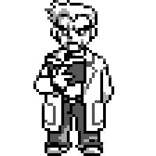
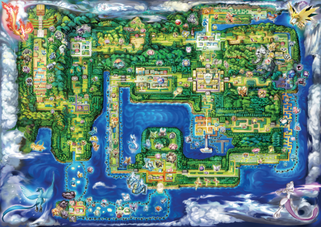

# Chapter 1: Pallet Town --- What Is Causal Inference?

<!-- FIG-CH01-OAK -->
<figure style="float:right; margin:0 0 12px 16px; max-width:140px;">

<figcaption style="font-size:0.85em; text-align:center;">Professor Oak</figcaption>
</figure>

<!-- FIG-CH01-MAP -->
<figure>

<figcaption>The Kanto region — your journey begins in Pallet Town.</figcaption>
</figure>

---

*You wake up in a small house at the edge of a quiet town. Sunlight filters through the curtains. Downstairs, your mother is watching the morning news --- something about a new discovery on Route 1. Today is the day you've been waiting for: Professor Oak has invited you to his laboratory to receive your first Pokemon. As you step outside, the cool Pallet Town air carries the sound of an argument drifting from the road ahead.*

*Two trainers stand nose to nose near the town gate. One insists that Charmander is the key to becoming Champion; the other swears that Squirtle guarantees more Gym Badges. A small crowd has gathered, each person armed with anecdotes and statistics pulled from the latest issue of* Pokemon Trainer Monthly.

*You make your way to the lab, where Professor Oak is calibrating a Pokedex. His grandson Blue is already there, arms crossed, leaning against the wall. "Professor," Blue says, "the data is clear. Trainers who pick Squirtle average 6.8 Gym Badges. Charmander trainers average only 5.9. Squirtle is obviously superior."*

*Oak sets down the Pokedex. He looks at you, then back at Blue. "Is it, though?" He pauses. "If I gave this young trainer Charmander instead of Squirtle, would their journey turn out differently? And how could we ever know?"*

*Blue rolls his eyes. Oak smiles. "That," the Professor says, "is the question that will occupy us for the rest of this book."*

---

## 1.1 Why Causation Matters More Than Correlation

### The Starter Debate

Every year, a new cohort of trainers walks into Professor Oak's lab and faces the same choice: Bulbasaur, Charmander, or Squirtle. And every year, the same debate rages in the streets of Pallet Town. One camp cites league records showing that Water-type starters are associated with higher badge counts. Another camp points to Championship rosters dominated by Fire-type starters. Both sides wave data. Neither side agrees.

What is going on? The trainers are confusing two fundamentally different ideas: **correlation** and **causation**. This confusion is not unique to Pallet Town. It is, arguably, the most pervasive error in all of human reasoning --- and the reason an entire field of study, causal inference, exists.

### Correlation: What We See

Let us start with what correlation actually means. Informally, two variables are correlated when knowing the value of one tells you something about the value of the other. If trainers who pick Squirtle tend to earn more badges, then starter choice and badge count are correlated.

> **Professor Oak Explains: Correlation**
>
> For two random variables $X$ and $Y$, the Pearson correlation coefficient is defined as:
>
> $$\rho_{XY} = \frac{\text{Cov}(X, Y)}{\sigma_X \sigma_Y} = \frac{E[(X - \mu_X)(Y - \mu_Y)]}{\sigma_X \sigma_Y}$$
>
> where $\text{Cov}(X,Y) = E[XY] - E[X]E[Y]$, and $\sigma_X, \sigma_Y$ are the standard deviations of $X$ and $Y$, respectively. A correlation of $\rho = 1$ indicates perfect positive linear association; $\rho = -1$ indicates perfect negative linear association; $\rho = 0$ indicates no linear association.

Correlation is a property of **observed data**. It tells you what patterns exist in the world as you find it. It does not, by itself, tell you what would happen if you intervened --- if you *changed* something.

Consider the following data, collected from the Kanto Trainer Registry:

| Starter Pokemon | Mean Badges Earned | Mean Battle Win Rate | $n$ |
|:---|:---:|:---:|:---:|
| Bulbasaur | 5.4 | 0.52 | 312 |
| Charmander | 5.9 | 0.56 | 287 |
| Squirtle | 6.8 | 0.61 | 301 |

Blue looks at this table and declares Squirtle the winner. But should he?

### Causation: What Would Happen If

Causation is a claim about what would happen under an **intervention**. To say "Choosing Squirtle *causes* you to earn more badges" is to claim that if we could take a trainer and *force* them to pick Squirtle rather than Charmander --- holding everything else constant --- that trainer would earn more badges.

This is a much stronger claim than correlation. Correlation says: "Trainers who pick Squirtle happen to earn more badges." Causation says: "If *you* picked Squirtle, *you* would earn more badges." The first is a statement about patterns in data. The second is a statement about a mechanism in the world.

### Spurious Associations and Confounders

Why might correlation fail to capture causation? The answer, in a word, is **confounders** --- variables that influence both the treatment (starter choice) and the outcome (badge count), creating a spurious association.

Suppose that trainers from Cerulean City --- a wealthy, water-themed city --- disproportionately choose Squirtle. Cerulean trainers also tend to come from families with more resources: better training equipment, access to expensive held items like Leftovers and Choice Bands, and private tutoring from retired Gym Leaders. These advantages help them earn more badges regardless of which starter they choose.

In this scenario, **wealth** (or equivalently, **hometown advantages**) is a confounder. It affects both starter choice (Cerulean kids pick Water types) and badge count (Cerulean kids have resources that help them win). The observed correlation between Squirtle and badges is partly --- perhaps entirely --- driven by this confounder.

> **Blue's Mistake**
>
> Blue points to the league data and says, "Squirtle trainers earn 0.9 more badges than Charmander trainers on average. Case closed." But Blue is ignoring a critical possibility: wealthy trainers from Cerulean City disproportionately pick Water types *and* buy better items, hire better tutors, and enter more competitions. The association between Squirtle and badges may have nothing to do with Squirtle itself. Blue has mistaken correlation for causation --- a mistake so common it has its own Latin phrase: *cum hoc ergo propter hoc* ("with this, therefore because of this").

This is not a contrived example. In observational studies across medicine, economics, and the social sciences, confounders routinely create misleading associations. The history of science is littered with confident causal claims that turned out to be confounded: hormone replacement therapy and heart disease, class size and student achievement, hospital quality and mortality rates.

### Pearl's Ladder of Causation

Judea Pearl, a computer scientist and philosopher who has done as much as anyone to formalize causal reasoning, proposed a useful hierarchy for thinking about different types of questions. He calls it the **Ladder of Causation** (Pearl, 2009), and it has three rungs.

**Rung 1: Association (Seeing).** Questions at this level ask about patterns in observed data. They are answered by conditional probabilities of the form $P(Y \mid X)$.

*Pokemon example:* "What is the average badge count among trainers who chose Squirtle?" This question can be answered by looking at the Kanto Trainer Registry. No intervention required. You simply filter the data to Squirtle trainers and compute the mean.

**Rung 2: Intervention (Doing).** Questions at this level ask what would happen if we actively *changed* something in the world. They are expressed using Pearl's *do*-operator: $P(Y \mid do(X = x))$.

*Pokemon example:* "If we *assigned* trainers to use Squirtle (regardless of their preferences), what would their average badge count be?" This question cannot be answered from observational data alone. It requires either an experiment (randomly assigning starters) or a set of causal assumptions strong enough to identify the interventional distribution from observational data.

The critical distinction is that $P(Y \mid X = x)$ conditions on *observing* $X = x$ (which may be confounded), while $P(Y \mid do(X = x))$ conditions on *setting* $X = x$ (which breaks the influence of confounders on $X$). In the language of graphical models, the $do$-operator "severs" all arrows pointing into $X$.

**Rung 3: Counterfactual (Imagining).** Questions at this level ask about what would have happened in a specific case under a different scenario. They take the form: "Given that we observed $X = x$ and $Y = y$, what would $Y$ have been if $X$ had been $x'$?"

*Pokemon example:* "Ash chose Charmander and earned 6 badges. How many badges *would* he have earned if he had chosen Bulbasaur instead?" This is the most demanding type of causal question. It requires reasoning about a specific individual in a specific counterfactual scenario --- not just average effects across a population.

Each rung of the ladder strictly subsumes the one below it. You cannot answer Rung 2 questions with Rung 1 data alone, and you cannot answer Rung 3 questions with Rung 2 information alone. This hierarchy explains why so many debates in science (and in Pallet Town) go in circles: people try to answer Rung 2 or Rung 3 questions using Rung 1 data.

### Why Causal Claims Need Assumptions Beyond Data

The central lesson of this section --- and, in many ways, of this entire book --- is that **data alone cannot establish causation**. No matter how large your dataset, no matter how sophisticated your statistical model, you cannot move from Rung 1 to Rung 2 without making assumptions about the underlying causal structure of the world.

This is not a failure of statistics. It is a fundamental feature of the problem. As Holland (1986) put it: "No causation without manipulation." And as Pearl (2009) has argued, causal assumptions are not testable from data alone --- they must come from domain knowledge, theory, or experimental design.

The good news is that we have powerful tools for making these assumptions explicit, checking their plausibility, and deriving their implications. That is what the rest of this book is about. We will learn to draw causal diagrams (Directed Acyclic Graphs), to identify when causal effects can be estimated from observational data, and to design experiments and quasi-experiments that allow us to make credible causal claims.

But first, we need to understand the fundamental challenge that makes all of this necessary.

> **Professor Oak Explains: The Core Insight**
>
> The distinction between correlation and causation is not merely philosophical. It has life-or-death practical consequences. Consider a Pokemon Center that notices trainers who use Hyper Potions have higher win rates than those who use regular Potions. Should the Center recommend Hyper Potions to all trainers?
>
> Not necessarily. Trainers who buy Hyper Potions may be wealthier, more experienced, or more dedicated. The observed correlation may reflect these underlying differences, not the effect of the potion itself. Recommending Hyper Potions based on this correlation alone could waste money without improving outcomes.
>
> To make a sound recommendation, the Center needs to estimate the **causal effect** of Hyper Potions on win rates --- which requires either a randomized experiment or a careful observational study with credible assumptions about the confounding structure.

---

## 1.2 The Fundamental Problem of Causal Inference

### Choosing Your Starter

You stand before three Poke Balls on Oak's table. Your hand hovers. You pick up the one on the left: Charmander. The little Fire-type lizard blinks up at you. Blue smirks and grabs Squirtle. "Good luck with that," he says on his way out.

Professor Oak watches you bond with Charmander. Then he says something that will stay with you for the entire journey: "You've made your choice. And now there is something you will never, ever know: what would have happened if you had chosen Bulbasaur."

This is not a limitation of technology or data. It is not something that could be solved with a better Pokedex or a larger survey. It is a **logical impossibility**. You cannot both choose Charmander and not choose Charmander at the same time. The moment you pick up that Poke Ball, the other two paths through reality cease to be observable.

### Holland's Dictum

Donald Rubin, in a series of papers beginning in 1974, formalized the potential outcomes framework that we will study in the next section. Paul Holland, in his landmark 1986 paper "Statistics and Causal Inference," crystallized the core difficulty:

> **The Fundamental Problem of Causal Inference:** It is impossible to observe *both* potential outcomes for the same unit. At most one potential outcome is ever observed; the other is forever missing.

Let us make this concrete. Suppose we want to know the causal effect of choosing Charmander (versus Bulbasaur) on the number of Gym Badges a trainer earns. For a specific trainer --- call them Ash --- there are two potential realities:

1. **Reality A:** Ash chooses Charmander and earns some number of badges. Call this $Y_{\text{Ash}}(\text{Charmander})$.
2. **Reality B:** Ash chooses Bulbasaur and earns some number of badges. Call this $Y_{\text{Ash}}(\text{Bulbasaur})$.

The **individual causal effect** for Ash is the difference:

$$\tau_{\text{Ash}} = Y_{\text{Ash}}(\text{Charmander}) - Y_{\text{Ash}}(\text{Bulbasaur})$$

The problem is that we can observe *at most one* of these two quantities. If Ash chooses Charmander, we observe $Y_{\text{Ash}}(\text{Charmander})$ but $Y_{\text{Ash}}(\text{Bulbasaur})$ is forever unknown. If he chooses Bulbasaur, the reverse is true. We can never observe both.

### The Missing Data Perspective

One powerful way to think about this is through the lens of **missing data**. Consider the following table of five trainers who each chose between Charmander and Bulbasaur:

| Trainer | Starter Chosen | Badges with Charmander | Badges with Bulbasaur | Individual Effect |
|:---|:---:|:---:|:---:|:---:|
| Ash | Charmander | 6 | ? | ? |
| Misty | Bulbasaur | ? | 7 | ? |
| Brock | Charmander | 8 | ? | ? |
| Gary | Bulbasaur | ? | 5 | ? |
| Erika | Charmander | 4 | ? | ? |

Every row has exactly one question mark in the potential outcomes columns. This is not an accident of data collection --- it is a structural feature of reality. Each trainer walked one path. The other path is counterfactual: it exists in the realm of "what might have been" but not in the realm of observable fact.

Because each individual causal effect $\tau_i$ requires both potential outcomes, and we can observe at most one, we can *never* compute individual causal effects from data. Every single entry in the "Individual Effect" column is unknowable.

### Why This Is Not Just a Practical Limitation

It is tempting to think that the fundamental problem is merely a practical inconvenience --- that with better technology, we could somehow observe both outcomes. But this is wrong. The problem is not that we lack instruments sensitive enough to measure counterfactual outcomes. The problem is that counterfactual outcomes *do not exist* as observable quantities. They are, by definition, events that did not occur.

You might protest: "Couldn't Ash simply choose Charmander, complete his journey, then go back in time and choose Bulbasaur?" Setting aside the physics, even this thought experiment fails. The Ash who returns to choose Bulbasaur is not the same Ash --- he now has memories and experience from his Charmander journey. The unit has changed.

Alternatively: "Couldn't Ash choose Charmander, then on a separate occasion choose Bulbasaur?" Perhaps, but the second journey occurs at a different time, in different conditions, with an older and more experienced trainer. The causal effect of starter choice at time $t$ for person $i$ cannot be identified by observing person $i$ at time $t' \neq t$.

This is why the fundamental problem is truly fundamental. It is not a gap in our data. It is a feature of the logical structure of causation itself.

### The Way Forward

If individual causal effects are unknowable, is the entire enterprise hopeless? No. The crucial insight --- which we will develop formally in the next section --- is that while **individual** causal effects are unidentifiable, **average** causal effects across populations can sometimes be identified under appropriate assumptions. The shift from individual effects to average effects, combined with assumptions about how treatment is assigned, is the foundation of modern causal inference.

When Professor Oak randomly assigns starters to trainers in a controlled experiment, something remarkable happens: the *average* of the missing potential outcomes in the treatment group equals (in expectation) the *average* of the observed outcomes in the control group. Randomization does not solve the fundamental problem for any individual, but it solves it *on average* --- and that turns out to be enough for science.

---

## 1.3 Potential Outcomes Framework (Rubin Causal Model)

### Setup and Notation

We are now ready to formalize the ideas from the previous sections. The framework we will use is the **Rubin Causal Model** (RCM), also known as the **potential outcomes framework**, developed by Donald Rubin (1974, 1978) and extended by many others including Holland (1986) and Imbens and Rubin (2015).

Consider a population of $N$ trainers, indexed by $i = 1, 2, \ldots, N$. Each trainer may or may not receive a binary treatment. For concreteness, suppose the treatment is the use of an **Exp. Share** --- an item that distributes experience points across a trainer's entire team.

Let $D_i \in \{0, 1\}$ denote the **treatment assignment indicator** for trainer $i$:

$$D_i = \begin{cases} 1 & \text{if trainer } i \text{ uses Exp. Share} \\ 0 & \text{if trainer } i \text{ does not use Exp. Share} \end{cases}$$

For each trainer $i$, we define two **potential outcomes**:

- $Y_i(1)$: the number of Gym Badges trainer $i$ would earn **if they used Exp. Share**
- $Y_i(0)$: the number of Gym Badges trainer $i$ would earn **if they did not use Exp. Share**

These potential outcomes exist conceptually for every trainer, regardless of whether they actually receive the treatment. They represent the outcomes that *would* obtain under each treatment condition.

> **Professor Oak Explains: Potential Outcomes**
>
> The notation $Y_i(d)$ for $d \in \{0,1\}$ denotes the outcome that unit $i$ would realize if assigned treatment status $d$. Critically, both $Y_i(1)$ and $Y_i(0)$ are defined for every unit $i$, but at most one of them is ever observed. The pair $(Y_i(0), Y_i(1))$ is sometimes called the **potential outcome pair** for unit $i$.
>
> Formally, a potential outcome is a mapping from the treatment space to the outcome space: for each unit $i$, $Y_i : \{0, 1\} \to \mathcal{Y}$, where $\mathcal{Y}$ is the set of possible outcomes (e.g., $\{0, 1, 2, \ldots, 8\}$ for Gym Badges in Kanto).

### Individual Treatment Effect

The **individual treatment effect** (ITE) for trainer $i$ is defined as:

$$\tau_i = Y_i(1) - Y_i(0)$$

This is the causal effect of Exp. Share for trainer $i$ specifically. As we discussed in Section 1.2, $\tau_i$ is never directly observable because we can only see one of $Y_i(1)$ and $Y_i(0)$.

### Causal Estimands

Since individual effects are unobservable, we turn to population-level summaries. The most common causal estimands are:

**Average Treatment Effect (ATE):**

$$\text{ATE} = E[Y_i(1) - Y_i(0)] = E[Y_i(1)] - E[Y_i(0)]$$

The ATE is the expected difference in potential outcomes across the entire population. It answers the question: "If we could give every trainer Exp. Share and also observe what would have happened without it, what would the average difference be?"

**Average Treatment Effect on the Treated (ATT):**

$$\text{ATT} = E[Y_i(1) - Y_i(0) \mid D_i = 1]$$

The ATT restricts attention to those who actually received treatment. It answers: "Among trainers who actually used Exp. Share, what was the average effect?"

**Average Treatment Effect on the Control (ATC):**

$$\text{ATC} = E[Y_i(1) - Y_i(0) \mid D_i = 0]$$

The ATC focuses on the untreated. It answers: "Among trainers who did *not* use Exp. Share, how much would they have benefited on average if they had?"

> **Professor Oak Explains: Why These Estimands Differ**
>
> In general, $\text{ATE} \neq \text{ATT} \neq \text{ATC}$. The three estimands coincide only when treatment effects are homogeneous (the same for everyone) or when treatment assignment is independent of potential outcomes.
>
> For example, suppose experienced trainers are more likely to use Exp. Share, and experienced trainers would earn more badges regardless. Then the ATT (average effect among experienced trainers who chose the item) might be smaller than the ATC (average effect among less experienced trainers who would benefit more from the extra experience points). The ATE would be a weighted average of the two.
>
> Formally, the ATE relates to the ATT and ATC as follows:
>
> $$\text{ATE} = P(D=1) \cdot \text{ATT} + P(D=0) \cdot \text{ATC}$$

### The Observed Outcome: The Switching Equation

In practice, we observe exactly one potential outcome for each trainer. The **observed outcome** is given by the switching equation:

$$Y_i^{\text{obs}} = D_i \cdot Y_i(1) + (1 - D_i) \cdot Y_i(0)$$

When $D_i = 1$, this reduces to $Y_i(1)$; when $D_i = 0$, it reduces to $Y_i(0)$. This equation links the theoretical potential outcomes to the data we actually observe.

### The Naive Estimator and Selection Bias

The most natural approach to estimating a causal effect is to compare mean outcomes between the treated and control groups:

$$\hat{\Delta}^{\text{naive}} = \bar{Y}_{\text{treated}} - \bar{Y}_{\text{control}} = E[Y_i^{\text{obs}} \mid D_i = 1] - E[Y_i^{\text{obs}} \mid D_i = 0]$$

Substituting the switching equation:

$$\hat{\Delta}^{\text{naive}} = E[Y_i(1) \mid D_i = 1] - E[Y_i(0) \mid D_i = 0]$$

Now, let us add and subtract $E[Y_i(0) \mid D_i = 1]$ --- the average outcome the treated group *would have had* without treatment:

$$\hat{\Delta}^{\text{naive}} = \underbrace{E[Y_i(1) \mid D_i = 1] - E[Y_i(0) \mid D_i = 1]}_{\text{ATT}} + \underbrace{E[Y_i(0) \mid D_i = 1] - E[Y_i(0) \mid D_i = 0]}_{\text{Selection Bias}}$$

> **Professor Oak Explains: The Selection Bias Decomposition**
>
> This is one of the most important equations in causal inference. It says:
>
> $$E[Y \mid D=1] - E[Y \mid D=0] = \text{ATT} + \text{Selection Bias}$$
>
> The naive comparison of means equals the causal effect of interest (ATT) **plus** a bias term. The selection bias term, $E[Y_i(0) \mid D_i = 1] - E[Y_i(0) \mid D_i = 0]$, measures the difference in **baseline** outcomes between the treated and control groups --- i.e., how different these groups would have been *even in the absence of treatment*.
>
> Selection bias is zero if and only if $E[Y_i(0) \mid D_i = 1] = E[Y_i(0) \mid D_i = 0]$ --- that is, the treatment and control groups have the same average potential outcome under control. This holds by construction in a randomized experiment, but it is often violated in observational data.

> **Blue's Mistake: Ignoring Selection Bias**
>
> Blue compares mean badge counts between trainers who use Exp. Share and those who don't: "Exp. Share users average 7.2 badges; non-users average 5.8 badges. That's a 1.4-badge effect!" But Blue fails to recognize that trainers who seek out and use Exp. Share are probably more dedicated, strategic, and experienced --- they would earn more badges *even without* the item. Part (perhaps all) of the 1.4-badge gap is selection bias, not a causal effect of the item.

### Worked Example: The Pallet Town Exp. Share Study

Let us work through a complete example. Professor Oak recruits six trainers and records their potential outcomes. (In reality, we could never observe both columns simultaneously; imagine Oak has access to a parallel-universe machine for pedagogical purposes.)

| Trainer | $D_i$ | $Y_i(1)$ (with Exp. Share) | $Y_i(0)$ (without) | $\tau_i = Y_i(1) - Y_i(0)$ |
|:---|:---:|:---:|:---:|:---:|
| Ash | 1 | 7 | 5 | 2 |
| Misty | 0 | 8 | 7 | 1 |
| Brock | 1 | 6 | 4 | 2 |
| Erika | 0 | 5 | 3 | 2 |
| Surge | 1 | 8 | 6 | 2 |
| Sabrina | 0 | 7 | 6 | 1 |

**Step 1: Compute the ATE.**

$$\text{ATE} = \frac{1}{6}\sum_{i=1}^{6} \tau_i = \frac{2 + 1 + 2 + 2 + 2 + 1}{6} = \frac{10}{6} \approx 1.67$$

**Step 2: Compute the ATT.**

The treated trainers are Ash, Brock, and Surge:

$$\text{ATT} = \frac{2 + 2 + 2}{3} = 2.00$$

**Step 3: Compute the ATC.**

The control trainers are Misty, Erika, and Sabrina:

$$\text{ATC} = \frac{1 + 2 + 1}{3} \approx 1.33$$

**Step 4: Verify the ATE decomposition.**

$$\text{ATE} = P(D=1) \cdot \text{ATT} + P(D=0) \cdot \text{ATC} = \frac{1}{2}(2.00) + \frac{1}{2}(1.33) = 1.00 + 0.67 = 1.67 \; \checkmark$$

**Step 5: Compute the naive estimator.**

In practice, we only observe $Y_i(1)$ for treated trainers and $Y_i(0)$ for control:

$$\bar{Y}_{\text{treated}} = \frac{7 + 6 + 8}{3} = 7.00$$

$$\bar{Y}_{\text{control}} = \frac{7 + 3 + 6}{3} \approx 5.33$$

$$\hat{\Delta}^{\text{naive}} = 7.00 - 5.33 = 1.67$$

**Step 6: Decompose the naive estimator.**

$$\text{ATT} = 2.00$$

$$\text{Selection Bias} = E[Y_i(0) \mid D_i = 1] - E[Y_i(0) \mid D_i = 0]$$

$$= \frac{5 + 4 + 6}{3} - \frac{7 + 3 + 6}{3} = 5.00 - 5.33 = -0.33$$

$$\hat{\Delta}^{\text{naive}} = \text{ATT} + \text{Selection Bias} = 2.00 + (-0.33) = 1.67 \; \checkmark$$

In this example, the selection bias is negative: the treated trainers actually had *lower* baseline potential outcomes than the controls (perhaps because less naturally talented trainers were the ones who sought out Exp. Share). The naive estimator happens to underestimate the ATT (1.67 vs. 2.00) but still provides a biased picture. Notice also that the naive estimator (1.67) coincidentally equals the ATE in this case; that is a numerical accident, not a general result.

### A Second Example: The Potion Study

To build further intuition, consider a study of whether using a Rare Candy before the first Gym battle improves the probability of winning.

| Trainer | Used Rare Candy ($D_i$) | Win with Candy $Y_i(1)$ | Win without $Y_i(0)$ | $\tau_i$ |
|:---|:---:|:---:|:---:|:---:|
| Red | 1 | 1 | 1 | 0 |
| Leaf | 1 | 1 | 0 | 1 |
| Silver | 0 | 1 | 1 | 0 |
| Kris | 0 | 0 | 0 | 0 |

Here $Y_i \in \{0,1\}$ (win or lose).

$$\text{ATE} = \frac{0 + 1 + 0 + 0}{4} = 0.25$$

The naive estimator gives:

$$\hat{\Delta}^{\text{naive}} = \frac{1+1}{2} - \frac{1+0}{2} = 1.0 - 0.5 = 0.5$$

This is double the true ATE! The selection bias is:

$$E[Y_i(0) \mid D_i = 1] - E[Y_i(0) \mid D_i = 0] = \frac{1 + 0}{2} - \frac{1 + 0}{2} = 0.5 - 0.5 = 0.0$$

Wait --- the selection bias is zero, but the naive estimator ($0.5$) does not equal the ATE ($0.25$). What happened? Recall that the decomposition shows $\hat{\Delta}^{\text{naive}} = \text{ATT} + \text{Selection Bias}$. Here, $\text{ATT} = \frac{0 + 1}{2} = 0.5$, and the Selection Bias is 0. The naive estimator correctly estimates the ATT, not the ATE. The ATT and ATE differ because treatment effects are heterogeneous and correlated with treatment assignment: Leaf, who benefits from the Rare Candy ($\tau = 1$), is in the treatment group, while Kris, who does not benefit ($\tau = 0$), is in the control group.

This example illustrates a subtle but critical point: **even with zero selection bias in baseline outcomes, the naive estimator recovers the ATT, not the ATE, and the two may differ when treatment effects are heterogeneous.**

### The Assignment Mechanism

The **assignment mechanism** is the process that determines which units receive treatment. Formally, it is the conditional probability:

$$P(D_1, D_2, \ldots, D_N \mid Y_1(0), Y_1(1), Y_2(0), Y_2(1), \ldots, Y_N(0), Y_N(1), X_1, X_2, \ldots, X_N)$$

where $X_i$ are pre-treatment covariates (e.g., trainer experience, hometown, number of Pokemon previously owned).

The assignment mechanism is the key to the entire enterprise of causal inference. Different assignment mechanisms lead to different identification strategies:

- **Randomized experiments** (Chapter 2): $D_i$ is assigned by a coin flip, independent of potential outcomes.
- **Selection on observables** (Chapters 3--5): $D_i$ depends on potential outcomes only through observed covariates $X_i$.
- **Instrumental variables** (Chapter 6): An external variable $Z_i$ affects $D_i$ but not $Y_i$ directly.
- **Regression discontinuity** (Chapter 7): $D_i$ is determined by whether a running variable crosses a threshold.
- **Difference-in-differences** (Chapter 8): Treatment timing varies across units and periods.

Each subsequent chapter in this book introduces a different identification strategy for different types of assignment mechanisms.

---

## 1.4 Counterfactuals

### "In Another Timeline, You Picked Bulbasaur..."

You and Charmander take your first steps onto Route 1. The grass rustles. A wild Pidgey appears. As Charmander shoots an Ember, you wonder: *What if I had picked Bulbasaur? Would I be struggling right now? Or would Vine Whip have made this easier?*

This kind of thinking --- reasoning about events that did not happen but *could* have --- is called **counterfactual reasoning**. It is so natural that we barely notice ourselves doing it. Every trainer who loses a battle thinks, "If only I had used a different move..." Every researcher who observes an outcome wonders, "What would have happened under different conditions?"

### Lewis's Possible Worlds

The philosopher David Lewis (1973) developed a formal semantics for counterfactual statements based on the concept of **possible worlds**. In Lewis's framework, a counterfactual statement like "If Ash had chosen Bulbasaur, he would have earned 7 badges" is evaluated by considering the **closest possible world** --- the world most similar to the actual world in which the antecedent (Ash chose Bulbasaur) is true, and then checking whether the consequent (7 badges) holds in that world.

The "closeness" of possible worlds is determined by a similarity metric that prioritizes keeping as much of the actual world unchanged as possible. The closest world where Ash chose Bulbasaur is not one where the laws of physics are different or where Kanto has 16 Gyms --- it is the world that is identical to ours in every respect except that Ash's hand moved to a different Poke Ball.

This philosophical framework maps directly onto the potential outcomes notation. The counterfactual outcome $Y_{\text{Ash}}(\text{Bulbasaur})$ is precisely the outcome in the closest possible world where Ash chose Bulbasaur. The potential outcomes framework and Lewis's possible worlds semantics are, in essence, two different languages for the same underlying concept.

### Counterfactuals and Potential Outcomes

The connection between counterfactuals and the Rubin Causal Model is deep and precise:

- Each potential outcome $Y_i(d)$ is a counterfactual: it describes what *would* happen to unit $i$ under treatment $d$.
- The observed outcome $Y_i^{\text{obs}}$ is the one potential outcome that was realized.
- The unobserved potential outcome is the counterfactual: the outcome that *would have been* observed had treatment been different.

When we write $\tau_i = Y_i(1) - Y_i(0)$, we are defining the causal effect as the difference between an actual outcome and a counterfactual outcome (or between two counterfactual outcomes, if treatment has not yet been assigned).

### Forward-Looking vs. Backward-Looking Causal Questions

It is useful to distinguish two types of causal questions:

**Effects of causes (forward-looking):** "What is the effect of Exp. Share on badge count?" This question starts with a cause (Exp. Share) and asks about its effect (badges). The potential outcomes framework is tailor-made for this type of question. We define treatment, specify potential outcomes, and estimate a causal estimand like the ATE.

**Causes of effects (backward-looking):** "Why did Ash earn only 6 badges? Was it because he chose Charmander?" This question starts with an observed effect (6 badges) and asks which cause is responsible. These questions are fundamentally harder to answer because they require reasoning about specific counterfactual scenarios for specific individuals --- Rung 3 of Pearl's Ladder.

Holland (1986) argued that statistics is better suited to "effects of causes" than "causes of effects." The potential outcomes framework is designed for the former. When we estimate the ATE, we are answering: "What is the effect of this cause?" When a trainer wonders why they lost a particular battle, they are asking about the causes of a specific effect --- a question that requires individual-level counterfactual reasoning, which is, as we have seen, fundamentally unobservable.

This does not mean backward-looking questions are unimportant. They are central to legal reasoning (Was the exposure the cause of the illness?), policy evaluation (Did this reform cause the observed improvement?), and everyday life (Did choosing Charmander cost me a badge?). But they are harder, and addressing them rigorously requires additional framework --- an issue we will return to in later chapters.

> **Blue's Mistake: Counterfactual Overconfidence**
>
> After losing to the Elite Four, Blue declares: "I would have won if I had just used my Alakazam instead of Pidgeot in the final battle." This is a specific counterfactual claim about a single unit (Blue) at a single moment. It *feels* obviously true to Blue --- but it is impossible to verify. Perhaps using Alakazam would have prompted the opponent to switch strategies, leading to a different loss. Counterfactual claims about individuals are inherently speculative, no matter how confident they feel. This is the fundamental problem in action.

---

## 1.5 Key Terminology and the Causal Pokedex

Just as every trainer needs a Pokedex to catalog the creatures they encounter, every student of causal inference needs a reference for the key concepts and assumptions that appear throughout the field. In this section, we introduce the essential terminology, with formal definitions and Pokemon-themed examples.

Each entry is classified by:

- **Type:** Whether the concept is an *Estimand* (a quantity we want to estimate), an *Assumption* (a condition we require to hold), or a *Design Element* (a feature of the study).
- **Rarity:** How commonly the term appears in introductory treatments. *Common* terms appear in nearly every paper; *Uncommon* terms appear mainly in more advanced settings; *Rare* terms are specialized.

---

### Entry 1: Treatment

| | |
|:---|:---|
| **Name** | Treatment (Intervention, Exposure) |
| **Type** | Design Element |
| **Rarity** | Common |
| **Definition** | The variable whose causal effect we wish to study. Formally, $D_i \in \{0, 1\}$ in the binary case (or $D_i \in \{0, 1, \ldots, K\}$ for multi-valued treatments). The treatment defines the contrast: we compare potential outcomes under different values of $D$. |
| **Pokemon Example** | Using an Exp. Share ($D_i = 1$) versus not using one ($D_i = 0$). Or choosing Charmander vs. Squirtle as a starter. Or training on Route 1 vs. Route 2. |

---

### Entry 2: Outcome

| | |
|:---|:---|
| **Name** | Outcome (Response, Dependent Variable) |
| **Type** | Design Element |
| **Rarity** | Common |
| **Definition** | The variable we measure to assess the effect of treatment. Denoted $Y_i$, with potential outcomes $Y_i(0)$ and $Y_i(1)$. |
| **Pokemon Example** | Number of Gym Badges earned, win rate in competitive battles, time to complete the Pokemon League, total Pokemon caught. |

---

### Entry 3: Unit

| | |
|:---|:---|
| **Name** | Unit (Observation, Subject) |
| **Type** | Design Element |
| **Rarity** | Common |
| **Definition** | The entity for which we define potential outcomes. Indexed by $i = 1, \ldots, N$. Units must be well-defined and distinct. |
| **Pokemon Example** | An individual trainer. Could also be a Pokemon, a battle, a Gym, or a region, depending on the research question. |

---

### Entry 4: Assignment Mechanism

| | |
|:---|:---|
| **Name** | Assignment Mechanism |
| **Type** | Design Element |
| **Rarity** | Common |
| **Definition** | The process (random or non-random) by which units are assigned to treatment conditions. Formally, the conditional distribution $P(D \mid Y(0), Y(1), X)$. The assignment mechanism is the key object that determines whether and how causal effects can be identified. |
| **Pokemon Example** | Professor Oak randomly assigning starters (randomized experiment), trainers self-selecting which held items to use (observational study), or the Pokemon League mandating Exp. Share for trainers above a certain level (regression discontinuity). |

---

### Entry 5: Confounder

| | |
|:---|:---|
| **Name** | Confounder (Confounding Variable, Common Cause) |
| **Type** | Design Element |
| **Rarity** | Common |
| **Definition** | A pre-treatment variable that causally affects both the treatment $D$ and the outcome $Y$. Confounders create spurious associations between $D$ and $Y$ in observational data. Formally, $X$ is a confounder if $X \to D$ and $X \to Y$ (where $\to$ denotes a direct causal effect). |
| **Pokemon Example** | Trainer experience. Experienced trainers are more likely to use advanced items (Exp. Share) AND more likely to earn more badges regardless. If we do not adjust for experience, the observed association between Exp. Share and badges will overstate the true causal effect. |

---

### Entry 6: Mediator

| | |
|:---|:---|
| **Name** | Mediator (Intermediate Variable) |
| **Type** | Design Element |
| **Rarity** | Uncommon |
| **Definition** | A variable on the causal pathway between treatment and outcome: $D \to M \to Y$. A mediator is *caused by* the treatment and itself *causes* the outcome. Controlling for a mediator can block the very causal channel we are trying to measure. |
| **Pokemon Example** | Suppose Exp. Share causes Pokemon to level up faster ($M$), which in turn causes more Gym wins ($Y$). Pokemon level is a mediator. If we control for Pokemon level, we block the causal effect we are trying to estimate and may find "no effect" of Exp. Share --- even if the effect is real. |

---

### Entry 7: Collider

| | |
|:---|:---|
| **Name** | Collider |
| **Type** | Design Element |
| **Rarity** | Uncommon |
| **Definition** | A variable that is causally affected by two or more other variables: $D \to C \leftarrow Y$ (or, more generally, when two variables both have arrows pointing into $C$). Conditioning on a collider *opens* a spurious path between its causes, creating a non-causal association. This is sometimes called **collider bias** or **Berkson's bias**. |
| **Pokemon Example** | Suppose both having a strong starter ($D$) and natural talent ($Y$) make a trainer more likely to appear in the Pokemon Hall of Fame ($C$). If we restrict our analysis to Hall of Fame trainers (conditioning on $C$), we may find a *negative* association between starter strength and talent --- because among Hall of Famers, those with weaker starters must have compensated with more talent. This association is entirely spurious. |

---

### Entry 8: Ignorability (Conditional Independence)

| | |
|:---|:---|
| **Name** | Ignorability (Unconfoundedness, Conditional Independence, Exchangeability) |
| **Type** | Assumption |
| **Rarity** | Common |
| **Definition** | Treatment assignment is independent of potential outcomes, conditional on observed covariates. Formally: $(Y_i(0), Y_i(1)) \perp\!\!\!\perp D_i \mid X_i$. This is also called **conditional exchangeability**: within strata defined by $X$, treated and control units are exchangeable --- as if treatment were randomly assigned. |
| **Pokemon Example** | Among trainers with the same experience level, hometown, and number of previously owned Pokemon, whether they use Exp. Share is unrelated to how many badges they would earn with or without it. If this holds, then controlling for these covariates removes all confounding. |

---

### Entry 9: Positivity (Overlap)

| | |
|:---|:---|
| **Name** | Positivity (Overlap, Common Support) |
| **Type** | Assumption |
| **Rarity** | Common |
| **Definition** | For every combination of covariate values $x$ in the population, there is a positive probability of receiving each treatment value. Formally: $0 < P(D_i = 1 \mid X_i = x) < 1$ for all $x$ in the support of $X$. This ensures that for every type of unit, we have both treated and control observations to compare. |
| **Pokemon Example** | If *every* trainer from Cerulean City uses Exp. Share and *no* trainer from Lavender Town does, then we cannot compare treated and control trainers within these subgroups. Positivity would be violated. We need some Cerulean trainers who do not use Exp. Share and some Lavender trainers who do. |

---

### Entry 10: Consistency (Well-Defined Treatment)

| | |
|:---|:---|
| **Name** | Consistency (Well-Defined Treatment, No Multiple Versions of Treatment) |
| **Type** | Assumption |
| **Rarity** | Common |
| **Definition** | The observed outcome for a treated unit equals their potential outcome under treatment: if $D_i = d$, then $Y_i^{\text{obs}} = Y_i(d)$. This requires that the treatment is sufficiently well-defined that there is only one "version" of being treated. Formally: $D_i = d \implies Y_i^{\text{obs}} = Y_i(d)$. |
| **Pokemon Example** | "Using Exp. Share" must mean the same thing for every trainer. If some trainers equip Exp. Share to their lead Pokemon while others equip it to their weakest, these are different versions of treatment, and the potential outcome $Y_i(1)$ is not well-defined. The treatment must be specified precisely enough that there is a single, unambiguous version. |

---

### Entry 11: SUTVA (Stable Unit Treatment Value Assumption)

| | |
|:---|:---|
| **Name** | SUTVA (Stable Unit Treatment Value Assumption) |
| **Type** | Assumption |
| **Rarity** | Common |
| **Definition** | Two components: (1) **No interference** --- one unit's treatment does not affect another unit's outcome: $Y_i(D_1, \ldots, D_N) = Y_i(D_i)$. (2) **No hidden variations of treatment** --- there is only one version of each treatment level (this is closely related to consistency). SUTVA is required for the potential outcomes notation $Y_i(d)$ to even make sense, because it ensures that each unit's outcome depends only on its own treatment assignment. |
| **Pokemon Example** | No interference: whether your rival uses Exp. Share should not affect how many badges *you* earn. This might be violated if trainers compete for limited Gym slots, so that one trainer's stronger team (from Exp. Share) makes it harder for others to win. No hidden variations: as above, Exp. Share must be used in a consistent way across trainers. |

> **Professor Oak Explains: Why SUTVA Matters**
>
> SUTVA is easy to state but easy to violate. In many real-world settings, units interact: one person's vaccination protects their neighbors (interference); one firm's pricing affects competitors' sales (interference); the same drug may be administered in different dosages (hidden treatment variations). When SUTVA fails, the potential outcomes framework must be generalized, typically by redefining the unit or the treatment. We will revisit interference in Chapter 10.

---

## Chapter Summary

This chapter introduced the foundational concepts of causal inference. Here are the key takeaways:

- **Correlation is not causation.** Observed associations between variables may be driven by confounders --- common causes that affect both treatment and outcome. Moving from correlation to causation requires either experimental design or strong, explicit assumptions.

- **The Fundamental Problem of Causal Inference** (Holland, 1986) is that we can observe at most one potential outcome for each unit. The other potential outcome --- the counterfactual --- is forever missing. Individual causal effects are therefore unobservable.

- **The Potential Outcomes Framework** (Rubin Causal Model) formalizes causal questions using potential outcomes $Y_i(1)$ and $Y_i(0)$. Key estimands include the ATE, ATT, and ATC. The naive difference-in-means estimator captures the ATT plus selection bias.

- **The selection bias decomposition** shows that $E[Y|D=1] - E[Y|D=0] = \text{ATT} + \text{Selection Bias}$. Selection bias arises when treated and control groups differ in their baseline potential outcomes.

- **Pearl's Ladder of Causation** distinguishes three levels of causal reasoning: association (seeing), intervention (doing), and counterfactual (imagining). Each level requires strictly more information than the one below.

- **Counterfactual reasoning** --- thinking about what would have happened under different conditions --- is the conceptual foundation of causal inference. The potential outcomes framework provides a rigorous mathematical language for counterfactual claims.

- **Key assumptions** for causal identification include ignorability (no unmeasured confounders), positivity (overlap between treatment groups), consistency (well-defined treatment), and SUTVA (no interference between units). Without these assumptions, causal effects cannot generally be identified from data.

- **The assignment mechanism** --- the process by which units are assigned to treatment --- is the central object of study. Different assignment mechanisms require different identification strategies, which form the subject of the remaining chapters.

---

## Professor Oak's Review Questions

1. **Correlation vs. Causation.** A researcher finds that trainers who carry more Poke Balls tend to catch more Pokemon. Does this mean that buying more Poke Balls causes a trainer to catch more? What confounders might explain this association? Describe a scenario in which the causal effect of additional Poke Balls is zero, yet the correlation is strongly positive.

2. **The Fundamental Problem.** Explain why it is impossible to compute the individual treatment effect $\tau_i = Y_i(1) - Y_i(0)$ for any specific trainer. Why is this a logical impossibility rather than a practical limitation?

3. **Selection Bias.** Trainers who choose to battle in Gyms tend to have stronger Pokemon. A naive comparison shows that Gym-battling trainers earn more money than non-Gym trainers. Decompose this comparison into the ATT and selection bias. Under what conditions would the naive comparison equal the true ATT?

4. **Pearl's Ladder.** Classify each of the following questions according to Pearl's Ladder of Causation (Rung 1, 2, or 3):
   - (a) What fraction of trainers who use TMs have a win rate above 60%?
   - (b) If we mandated TM use for all trainers, what would the average win rate be?
   - (c) Trainer Red used a TM and won. Would he have won without it?

5. **SUTVA.** Give a Pokemon-themed example where SUTVA is likely violated due to interference between units. How would you modify the potential outcomes framework to accommodate this violation?

6. **Estimands.** In a population of 100 trainers, 40 use Exp. Share and 60 do not. The ATT is 2.0 badges and the ATC is 1.0 badge. Compute the ATE. Would you expect the naive estimator to be larger or smaller than the ATE? Explain.

---

## Trainer Challenge Exercises

**Exercise 1.1: Potential Outcomes Table.** Consider the following (omniscient) data on four trainers and the effect of using a Lucky Egg on total experience points gained (in thousands):

| Trainer | $D_i$ | $Y_i(1)$ | $Y_i(0)$ |
|:---|:---:|:---:|:---:|
| Youngster Joey | 1 | 45 | 30 |
| Lass Anna | 0 | 55 | 50 |
| Bug Catcher Wade | 1 | 35 | 20 |
| Hiker Marcos | 0 | 40 | 35 |

(a) Compute the individual treatment effect $\tau_i$ for each trainer.

(b) Compute the ATE, ATT, and ATC.

(c) Compute the naive estimator $\hat{\Delta}^{\text{naive}}$ using only observed outcomes.

(d) Compute the selection bias. Verify that $\hat{\Delta}^{\text{naive}} = \text{ATT} + \text{Selection Bias}$.

(e) Is the naive estimator biased upward or downward for the ATT? For the ATE? Explain intuitively why.

**Exercise 1.2: Identifying Confounders, Mediators, and Colliders.** For each of the following causal structures, identify whether the variable $Z$ is a confounder, mediator, or collider. Draw the causal graph (DAG).

(a) Training intensity ($D$) $\to$ Gym badges ($Y$); Trainer experience ($Z$) $\to$ Training intensity ($D$); Trainer experience ($Z$) $\to$ Gym badges ($Y$).

(b) Using Exp. Share ($D$) $\to$ Average team level ($Z$) $\to$ Win rate ($Y$).

(c) Type advantage ($D$) $\to$ Making it to the Hall of Fame ($Z$) $\leftarrow$ Strategy skill ($Y$).

**Exercise 1.3: The Pewter City Protein Puzzle (Preview).** Nurse Joy in Pewter City claims that trainers who feed their Pokemon Protein earn significantly more badges than those who don't. She shows you data from 500 trainers:

| Group | $n$ | Mean Badges |
|:---|:---:|:---:|
| Protein users | 200 | 7.1 |
| Non-users | 300 | 5.4 |

(a) What is the naive estimate of the effect of Protein on badges?

(b) Name at least three potential confounders that could explain part or all of this association.

(c) Suppose you learn that Protein costs 9,800 Poke Dollars per unit. How does this information help you think about the likely direction of selection bias?

(d) Propose a study design that could more credibly estimate the causal effect of Protein. What assignment mechanism would you use? (Don't worry about the details --- we will cover this in Chapter 2.)

**Exercise 1.4: Counterfactual Reasoning.** Trainer Red used a Master Ball to catch Mewtwo and subsequently won the Pokemon League. Consider the counterfactual: "If Red had not caught Mewtwo, he would not have won the League."

(a) Formalize this statement using potential outcomes notation. Clearly define the unit, treatment, and outcome.

(b) Is this statement testable? Why or why not?

(c) Describe a scenario in which the counterfactual is true and a scenario in which it is false (Red would have won anyway). What additional information would help you assess the plausibility of each scenario?

(d) Is this an "effect of a cause" or a "cause of an effect" question? Explain.

---

## Further Reading

- **Holland, P. W.** (1986). "Statistics and Causal Inference." *Journal of the American Statistical Association*, 81(396), 945--960. The classic paper that articulated the fundamental problem of causal inference and coined the phrase "no causation without manipulation."

- **Rubin, D. B.** (1974). "Estimating Causal Effects of Treatments in Randomized and Nonrandomized Studies." *Journal of Educational Psychology*, 66(5), 688--701. The foundational paper for the potential outcomes framework.

- **Pearl, J.** (2009). *Causality: Models, Reasoning, and Inference* (2nd ed.). Cambridge University Press. The definitive reference for the structural causal model framework, including the Ladder of Causation and the *do*-calculus.

- **Imbens, G. W., & Rubin, D. B.** (2015). *Causal Inference for Statistics, Social, and Biomedical Sciences: An Introduction*. Cambridge University Press. A comprehensive and rigorous textbook on the potential outcomes framework, covering design and analysis of both experiments and observational studies.

- **Hernan, M. A., & Robins, J. M.** (2020). *Causal Inference: What If*. Chapman & Hall/CRC. A modern and accessible textbook that bridges the potential outcomes and graphical models traditions, with extensive examples from epidemiology.

- **Lewis, D.** (1973). *Counterfactuals*. Blackwell. The philosophical foundation for possible worlds semantics and counterfactual reasoning.

- **Morgan, S. L., & Winship, C.** (2015). *Counterfactuals and Causal Inference: Methods and Principles for Social Research* (2nd ed.). Cambridge University Press. An excellent bridge between sociological applications and the formal potential outcomes framework.

---

## Next Time: Pewter City

*Charmander grows stronger as you cross Route 1. Viridian City passes in a blur of errands and close encounters with wild Rattata. Ahead lies Pewter City and its famous Rock-type Gym.*

*At the Pewter City Pokemon Center, you overhear Nurse Joy in a heated discussion with a group of trainers. "I'm tired of arguing about Protein," she says, tapping a clipboard. "Does it actually make Pokemon stronger, or do trainers who buy Protein just happen to be more dedicated? I have an idea for how we could settle this once and for all."*

*She looks at you. "We're going to run an experiment."*

*Tomorrow you head to Pewter City, where Nurse Joy has a radical idea for settling the Pewter Protein debate once and for all --- a radical idea called* **randomization**. *You will learn why random assignment is the gold standard for causal inference, how it eliminates selection bias by construction, and what happens when the real world refuses to cooperate.*

*Welcome to Chapter 2: Pewter City --- Randomized Experiments.*
