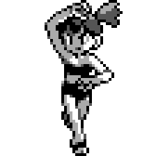
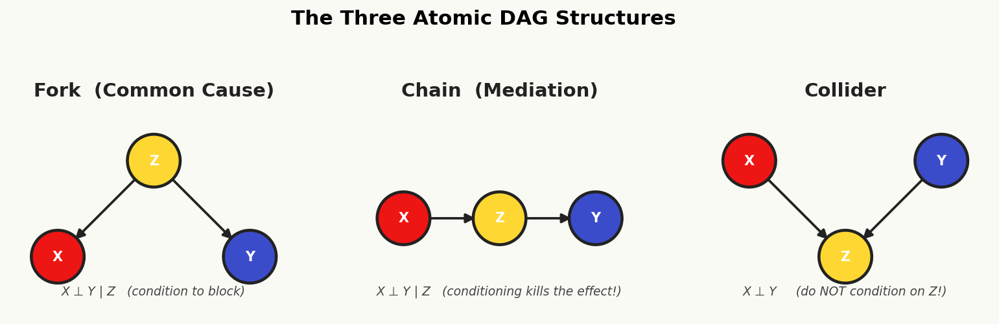
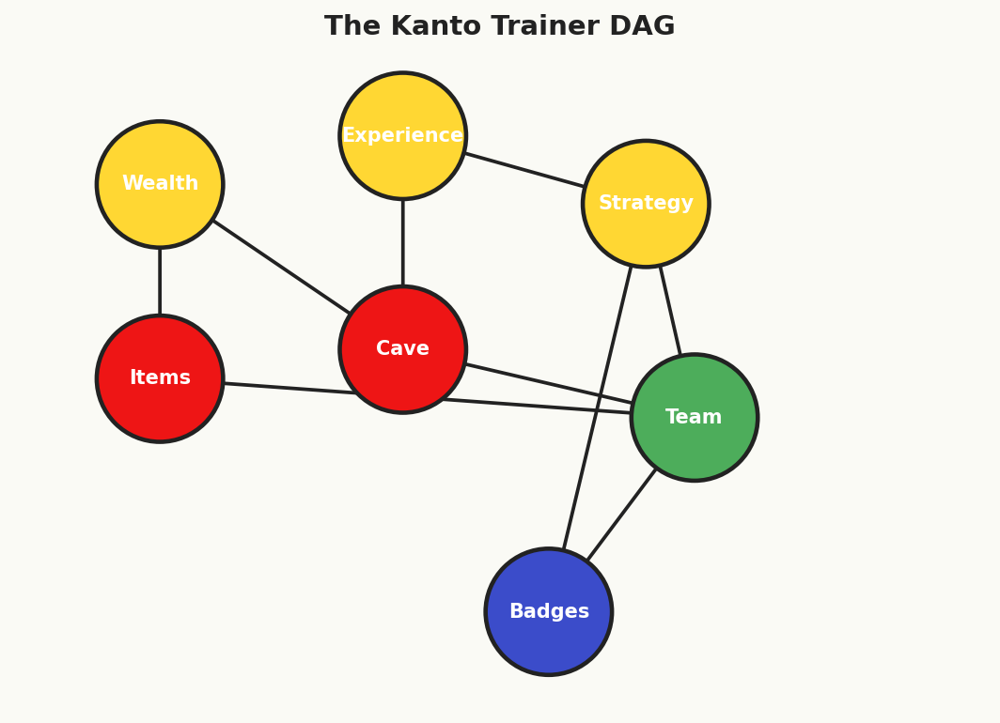

# Chapter 3: Cerulean City — Observational Studies & Graphical Models

<!-- FIG-CH03-MISTY -->
<figure style="margin:1.5em auto; max-width:160px; text-align:center;">

<figcaption style="font-size:0.85em;">Misty, Cerulean Gym Leader</figcaption>
</figure>


> *"Water is patient. It doesn't force its way through rock — it finds the path that already exists."*
> — Misty, Cerulean City Gym Leader

You step into Cerulean City with a fresh Boulder Badge pinned to your trainer card and the confidence of someone who has run a proper randomized experiment. In Pewter City, you learned that randomization is the gold standard — it balances confounders, observed and unobserved, and lets you estimate causal effects with clean authority. But as you walk past the bike shop and toward the city's famous gym, a question begins to nag at you: what happens when you *can't* randomize?

Cerulean City is built around water — the Cerulean Cave to the north, the cape where Bill's lighthouse stands to the east, and the gym where Misty trains her Water-type team at the city's heart. Water, like observational data, flows where it will. You cannot command it into neat experimental channels. You must learn to read its currents.

Misty has a problem. Cerulean Cave, the treacherous cavern north of the city, has long been considered an elite training ground. Trainers who survive its depths seem to emerge stronger — they win more gym badges, perform better in league tournaments, and command higher-level Pokemon. But Misty suspects the relationship isn't so simple. She has years of battle logs from 2,000 trainers who passed through Cerulean City, and she wants to know: **does training in Cerulean Cave actually make trainers better, or do better trainers simply choose to enter the Cave?**

She can't run an experiment — she can't force trainers into the Cave or forbid them from entering. She needs to learn from the data she has. And for that, she needs you to understand observational studies, the biases that haunt them, and the graphical tools that can — sometimes — rescue causal inference from observational chaos.

---

## 3.1 Why Observational Studies Are Necessary

### The Limits of Experimentation

In Chapter 2, we established that randomized controlled trials (RCTs) are the gold standard for causal inference. If you can randomize treatment assignment, you eliminate confounding by design. The Pewter City Protein experiment was clean: trainers were randomly assigned to receive Protein supplements or placebo, and we measured the effect on battle performance. Beautiful.

But the world — even the Pokemon world — is not a laboratory. Three forces conspire to make experimentation impossible in many settings:

**Ethics.** Could we randomly assign trainers to enter Cerulean Cave, knowing that some might lose their Pokemon to the powerful wild encounters inside? Could we randomly withhold medical treatment from injured Pokemon to measure its effect? The Kanto Pokemon Ethics Board would never approve such studies. In the human world, we cannot randomly assign people to smoke, to experience poverty, or to receive inferior education. Many of the most important causal questions involve treatments that would be unethical to assign.

**Cost and feasibility.** Running an RCT requires resources — you need to recruit participants, implement randomization, maintain compliance, and follow up over time. Misty would need to intercept trainers arriving in Cerulean City, randomly assign half to train in the Cave (and somehow enforce this), and then track their subsequent journey across Kanto. The logistical cost would be enormous. Many policy-relevant questions involve treatments that operate at scale (city-level policies, national regulations) where randomization is simply infeasible.

**Timeliness.** Misty has data *now*. She has five years of battle logs sitting in the Cerulean Gym's Pokedex database. An RCT would take another year to design, implement, and analyze. By then, the League season will be over. In many real-world settings, decisions must be made with the data available, not the data we wish we had.

### Misty's Dataset

Misty's observational dataset, `kanto_trainers.csv`, contains records on $n = 2{,}000$ trainers who passed through Cerulean City over the past five years. For each trainer $i$, she observes:

| Variable | Description | Type |
|----------|-------------|------|
| `trainer_id` | Unique identifier | ID |
| `cave_training` $(D_i)$ | Whether trainer trained in Cerulean Cave | Binary (0/1) |
| `badges_earned` $(Y_i)$ | Total gym badges earned in Kanto | Count (0-8) |
| `experience_level` | Pre-existing trainer experience (years) | Continuous |
| `starter_type` | Starter Pokemon type (Fire/Water/Grass) | Categorical |
| `wealth` | Trainer's family wealth (Pokedollars) | Continuous |
| `strategy_score` | Measured battle strategy proficiency | Continuous |
| `natural_talent` | Unobserved innate ability | *Unobserved* |

A naive comparison of means yields:

$$\bar{Y}_{\text{cave}} - \bar{Y}_{\text{no cave}} = 5.8 - 3.2 = 2.6 \text{ badges}$$

Trainers who entered the Cave earned, on average, 2.6 more badges than those who did not. Should Misty conclude that Cave training causes a 2.6-badge improvement?

Of course not. You already sense the problem. Trainers who *chose* to enter Cerulean Cave are not a random sample — they tend to be more experienced, wealthier (they can afford supplies for the dangerous cave), and more naturally talented. The comparison is contaminated by **confounding**.

### The Promise and Peril of Observational Data

Observational data is abundant and cheap. Every gym in Kanto logs battle outcomes. The Pokemon League maintains records on every registered trainer. Nurse Joy's healing stations track Pokemon injuries across the region. This data exists whether or not anyone designs a study.

The promise: if we can properly account for confounding, observational data can answer causal questions that experiments never could. The peril: if we fail to account for confounding, observational studies will mislead us — and they will mislead us with the false confidence of large sample sizes.

The tools we develop in this chapter — directed acyclic graphs, d-separation, the backdoor criterion, and the do-calculus — are the trainer's guide to navigating observational data. They tell us *when* we can extract causal answers from observational data, *what* we need to condition on, and *when* the data simply cannot answer our question no matter how cleverly we analyze it.

Let us begin with the central threat: confounding.

---

## 3.2 Confounding (Formal Treatment)

### The Intuition

You're standing outside the Cerulean Gym when Blue strolls up, his Pidgeot preening on his shoulder. "Cave training is the best thing I ever did," he declares. "I trained in Cerulean Cave for two weeks, and look — seven badges already."

You ask: "But Blue, you've been training Pokemon since you were five years old. Your grandfather is Professor Oak. You had a head start on every trainer in Kanto. How do you know it was the Cave and not your experience?"

Blue waves his hand dismissively. "Details."

Blue's mistake is the most fundamental error in causal reasoning: **confounding**. A confounder is a variable that influences both the treatment and the outcome, creating a spurious association that masquerades as a causal effect.

### Formal Definition

> **Definition 3.1 (Confounder — Informal).** A variable $Z$ is a confounder of the relationship between treatment $D$ and outcome $Y$ if $Z$ is a common cause of both $D$ and $Y$. That is, $Z$ causally affects $D$ and $Z$ causally affects $Y$, creating a non-causal path $D \leftarrow Z \rightarrow Y$.

We will refine this definition using DAGs in Section 3.5. For now, the intuition suffices: a confounder is a "back door" through which association flows between $D$ and $Y$ without any causal mechanism from $D$ to $Y$.

In Misty's data, **trainer experience** is a confounder. More experienced trainers are more likely to enter the Cave (they're better prepared for its dangers), and more experienced trainers earn more badges (regardless of whether they enter the Cave). The causal structure is:

$$\text{Experience} \rightarrow \text{Cave Training}$$
$$\text{Experience} \rightarrow \text{Badges Earned}$$

This creates a spurious association between Cave Training and Badges Earned that has nothing to do with the Cave itself.

### The Confounding Bias Formula

Let us formalize the bias. Consider the linear model:

$$Y_i = \alpha + \tau D_i + \gamma Z_i + \varepsilon_i \tag{3.1}$$

where $Y_i$ is badges earned, $D_i$ is cave training (binary), $Z_i$ is experience level, $\tau$ is the true causal effect of cave training, $\gamma$ is the effect of experience on badges, and $\varepsilon_i$ is an error term uncorrelated with $D_i$ and $Z_i$.

If we run the "short regression" that omits $Z_i$:

$$Y_i = \tilde{\alpha} + \tilde{\tau} D_i + \tilde{\varepsilon}_i \tag{3.2}$$

then the OLS estimator $\hat{\tilde{\tau}}$ converges not to $\tau$ but to:

$$\text{plim} \; \hat{\tilde{\tau}} = \tau + \gamma \cdot \delta \tag{3.3}$$

where $\delta$ is the coefficient from regressing the omitted variable $Z_i$ on the treatment $D_i$:

$$Z_i = a + \delta D_i + u_i \tag{3.4}$$

> **Definition 3.2 (Omitted Variable Bias).** When a relevant variable $Z$ is omitted from a regression of $Y$ on $D$, the bias in the estimated treatment effect is:
>
> $$\text{OVB} = \gamma \cdot \delta$$
>
> where $\gamma = \frac{\partial Y}{\partial Z}$ is the effect of the omitted variable on the outcome, and $\delta = \frac{\text{Cov}(D, Z)}{\text{Var}(D)}$ is the relationship between the omitted variable and the treatment.

### Signed OVB: Direction of Bias Analysis

The beauty of the OVB formula is that even when we cannot measure the exact bias, we can often determine its **direction**. This is called a *signed OVB analysis*.

The bias $\gamma \cdot \delta$ is:
- **Positive** (upward bias) if $\gamma$ and $\delta$ have the same sign
- **Negative** (downward bias) if $\gamma$ and $\delta$ have opposite signs

| | $\delta > 0$ (omitted var positively related to treatment) | $\delta < 0$ (omitted var negatively related to treatment) |
|---|---|---|
| $\gamma > 0$ (omitted var increases outcome) | **Bias > 0** (overestimate) | **Bias < 0** (underestimate) |
| $\gamma < 0$ (omitted var decreases outcome) | **Bias < 0** (underestimate) | **Bias > 0** (overestimate) |

### Worked Example: Blue's Mistake

Let us put numbers to Blue's error. Suppose the true data generating process is:

$$\text{Badges}_i = 1.0 + 0.8 \cdot \text{CaveTraining}_i + 0.5 \cdot \text{Experience}_i + \varepsilon_i$$

So the true causal effect of cave training is $\tau = 0.8$ badges. Now suppose that experience is positively correlated with cave training: among trainers in Misty's data, those who enter the Cave have, on average, 3.6 more years of experience ($\delta = 3.6$). The OVB is:

$$\text{OVB} = \gamma \cdot \delta = 0.5 \times 3.6 = 1.8$$

The naive estimate would be approximately $\hat{\tilde{\tau}} \approx 0.8 + 1.8 = 2.6$ badges — exactly what Misty's raw comparison found. The true effect is 0.8 badges; the rest is confounding bias.

> **Blue's Mistake 3.1.** Blue trained in Cerulean Cave AND has extensive experience. He attributes all 2.6 extra badges to the Cave, but 1.8 of those badges would have been earned anyway due to his experience advantage. His causal estimate is inflated by $\frac{2.6 - 0.8}{0.8} = 225\%$. Never let your rival do causal inference without controlling for confounders.

### Multiple Confounders

In practice, confounding rarely comes from a single variable. In Misty's data, **wealth** also confounds the Cave-Badges relationship: wealthier trainers can afford better supplies for the Cave *and* better Pokeballs throughout their journey. **Natural talent** is an unobserved confounder: more talented trainers select into Cave training and earn more badges. The total bias is the sum of individual OVBs across all omitted confounders:

$$\text{Total Bias} = \sum_{j} \gamma_j \cdot \delta_j$$

This is why observational studies are so treacherous. Even if you control for experience, the bias from wealth and natural talent remains. And natural talent, being unobserved, cannot be controlled for directly. We will need more sophisticated tools — and that is where DAGs enter the story.

---

## 3.3 Selection Bias, Survivorship Bias, and Berkson's Paradox

Confounding is not the only threat to observational studies. A family of related biases arises from **how the sample is selected** rather than from omitted variables. Misty pours you a glass of water in the gym's back office and opens a second set of concerns.

### Selection Bias

> **Definition 3.3 (Selection Bias).** Selection bias occurs when the sample analyzed is not representative of the population of interest, and the selection mechanism is related to both the treatment and the outcome.

Consider Misty's dataset. It contains trainers who *reached* Cerulean City — the third city on the Kanto journey. But not every trainer who left Pallet Town made it this far. Some were defeated on Route 1. Others gave up in Viridian Forest. Still others lost to Brock in Pewter City and went home.

The trainers who reached Cerulean City are **survivors**. They are, on average, stronger, more determined, and more talented than the full population of trainers who started their journey. If the factors that helped trainers survive to reach Cerulean (e.g., talent, determination) are also correlated with both Cave training and badge outcomes, then analyzing only the Cerulean sample introduces bias.

Formally, let $S_i = 1$ indicate that trainer $i$ is in our sample (reached Cerulean City). If $S$ is caused by both $D$ (or causes of $D$) and $Y$ (or causes of $Y$), then conditioning on $S = 1$ — which we do implicitly by only analyzing trainers in the sample — distorts the relationship between $D$ and $Y$.

### Survivorship Bias

Survivorship bias is a specific form of selection bias that is particularly insidious because the missing data is invisible.

> **Definition 3.4 (Survivorship Bias).** Survivorship bias occurs when we analyze only the units that "survived" some process, ignoring those that dropped out, and the reasons for dropping out are related to the treatment and outcome.

**Example: The Protein That "Failed."** Recall from Chapter 2 that Pewter City ran an RCT on Protein supplements. Suppose that among trainers who received Protein, some experienced adverse effects — their Pokemon became over-aggressive and uncontrollable in battle — and those trainers quit their journey before reaching Cerulean City. If Misty later analyzes the "effect of Protein use" in her Cerulean sample, she would only see the trainers for whom Protein worked well (the survivors). The harmful effects are invisible because those trainers are gone.

The data would show: "Among trainers in Cerulean City who used Protein, average badges = 5.1. Among those who didn't, average badges = 4.3." This overstates the true effect because the failures have been pruned from the sample.

To make this concrete with numbers:

| Group | Started journey | Reached Cerulean | Avg. badges (survivors) | Avg. badges (all) |
|-------|----------------|-----------------|------------------------|-------------------|
| Protein users | 500 | 400 (80%) | 5.1 | 4.2 |
| Non-users | 500 | 450 (90%) | 4.3 | 4.0 |

The survivor-only comparison suggests a 0.8-badge Protein advantage. The full-population comparison shows only a 0.2-badge advantage. The Protein actually caused 100 trainers to drop out, but we never see them in the Cerulean data.

### Berkson's Paradox (Collider Bias)

The most counterintuitive member of the selection bias family is **Berkson's paradox**, also called **collider bias**. It can create associations — even negative associations — between variables that are completely independent in the population.

> **Definition 3.5 (Berkson's Paradox).** Berkson's paradox occurs when we condition on a variable that is caused by two (or more) independent variables, inducing a spurious association between those causes.

**The Elite Four Example.** Consider two traits among Kanto trainers: **natural talent** (innate battling ability) and **training intensity** (hours spent practicing). In the general population, these two traits are independent — talented trainers don't train any more or less than untalented ones.

Now consider the sample of **Elite Four challengers** — the handful of trainers strong enough to challenge Kanto's final gauntlet. To reach the Elite Four, a trainer needs to be *either* very talented, *or* very dedicated to training, *or* (ideally) both. Being an Elite Four challenger ($S = 1$) is *caused by* both talent and training:

$$\text{Talent} \rightarrow \text{Elite Four Challenger} \leftarrow \text{Training Intensity}$$

If we analyze data *only among Elite Four challengers* (conditioning on $S = 1$), we find a **negative correlation** between talent and training. Why? Because among this elite group, if a trainer is not very talented, they *must* have trained extremely hard to get there — and vice versa. Conditioning on the collider "Elite Four Challenger" opens a path between talent and training that doesn't exist in the population.

**Worked Example with Numbers:**

| | Low talent | High talent | Total |
|---|---|---|---|
| Low training | 2/200 reach E4 (1%) | 30/200 reach E4 (15%) | 32/400 |
| High training | 25/200 reach E4 (12.5%) | 45/200 reach E4 (22.5%) | 70/400 |
| Total | 27/400 | 75/400 | 102/800 |

In the full population of 800 trainers, talent and training are independent (each is 50/50 regardless of the other). But among the 102 Elite Four challengers:

| | Low talent | High talent |
|---|---|---|
| Low training | 2 (2.0%) | 30 (29.4%) |
| High training | 25 (24.5%) | 45 (44.1%) |

Among challengers with low talent, $\frac{25}{27} = 92.6\%$ had high training. Among challengers with high talent, $\frac{45}{75} = 60.0\%$ had high training. Within the conditioned sample, talent and training are **negatively associated** — a complete artifact of selection.

> **Professor Oak Explains 3.1.** "Selection bias, survivorship bias, and Berkson's paradox are all manifestations of the same underlying problem: conditioning on a variable that is a *consequence* of the variables you're studying. In DAG terminology (which we'll formalize shortly), they all involve conditioning on a **collider** or a **descendant of a collider**. The visual language of DAGs will make these biases much easier to diagnose."

---

## 3.4 Simpson's Paradox

You're reviewing Misty's data in the gym office when you notice something strange. The overall data clearly shows that Cave training is associated with more badges. But when you break the data down by starter Pokemon type, the relationship *reverses* within every group.

### The Paradox

> **Definition 3.6 (Simpson's Paradox).** Simpson's paradox occurs when a trend or association that appears in several subgroups of data reverses or disappears when the groups are combined.

This is not merely a statistical curiosity — it strikes at the heart of causal reasoning. The question "which comparison is correct?" cannot be answered by the data alone. It requires understanding the **causal structure**.

### Worked Example: Cave Training by Starter Type

Misty's data on the relationship between Cave training and badges, broken down by starter type:

**Fire-type starters (Charmander line):**

| | Trained in Cave | Did not train | Difference |
|---|---|---|---|
| Number of trainers | 400 | 100 | |
| Avg. badges earned | 4.5 | 5.0 | **-0.5** |

**Water-type starters (Squirtle line):**

| | Trained in Cave | Did not train | Difference |
|---|---|---|---|
| Number of trainers | 200 | 400 | |
| Avg. badges earned | 3.5 | 4.0 | **-0.5** |

**Grass-type starters (Bulbasaur line):**

| | Trained in Cave | Did not train | Difference |
|---|---|---|---|
| Number of trainers | 200 | 700 | |
| Avg. badges earned | 5.5 | 6.0 | **-0.5** |

Within every starter type group, Cave training is associated with **0.5 fewer badges**. Now let us aggregate:

**Overall (all starters combined):**

| | Trained in Cave | Did not train | Difference |
|---|---|---|---|
| Number of trainers | 800 | 1,200 | |
| Avg. badges earned | 4.35 | 4.83 | ... |

Wait — let us compute the overall averages properly.

For Cave trainers:
$$\bar{Y}_{\text{cave}} = \frac{400(4.5) + 200(3.5) + 200(5.5)}{800} = \frac{1800 + 700 + 1100}{800} = \frac{3600}{800} = 4.50$$

For non-Cave trainers:
$$\bar{Y}_{\text{no cave}} = \frac{100(5.0) + 400(4.0) + 700(6.0)}{1200} = \frac{500 + 1600 + 4200}{1200} = \frac{6300}{1200} = 5.25$$

So the overall difference is $4.50 - 5.25 = -0.75$ ... that still shows Cave training as *harmful*. Let us adjust the example to produce the actual paradox. Consider revised numbers where starter type affects both Cave selection *and* baseline badge performance differently:

**Revised Example — Simpson's Paradox in Full:**

**Fire-type starters:**

| | Trained in Cave | Did not train | Difference |
|---|---|---|---|
| Number of trainers | 400 | 50 | |
| Avg. badges earned | 6.0 | 6.5 | **-0.5** |

**Water-type starters:**

| | Trained in Cave | Did not train | Difference |
|---|---|---|---|
| Number of trainers | 100 | 350 | |
| Avg. badges earned | 3.0 | 3.5 | **-0.5** |

**Grass-type starters:**

| | Trained in Cave | Did not train | Difference |
|---|---|---|---|
| Number of trainers | 300 | 800 | |
| Avg. badges earned | 4.0 | 4.5 | **-0.5** |

Within each group, Cave training is associated with **0.5 fewer badges**.

Now, the overall averages:

For Cave trainers:
$$\bar{Y}_{\text{cave}} = \frac{400(6.0) + 100(3.0) + 300(4.0)}{800} = \frac{2400 + 300 + 1200}{800} = \frac{3900}{800} = 4.875$$

For non-Cave trainers:
$$\bar{Y}_{\text{no cave}} = \frac{50(6.5) + 350(3.5) + 800(4.5)}{1200} = \frac{325 + 1225 + 3600}{1200} = \frac{5150}{1200} = 4.292$$

**Overall difference: $4.875 - 4.292 = +0.583$.**

The paradox is now manifest:

| Comparison | Cave Effect |
|---|---|
| Fire starters only | **-0.5** badges |
| Water starters only | **-0.5** badges |
| Grass starters only | **-0.5** badges |
| **Overall (aggregated)** | **+0.583** badges |

Cave training appears *harmful* within every subgroup but *helpful* overall.

### How Is This Possible?

The key is the **unequal distribution of starter types across treatment groups**. Fire-type trainers (who tend to earn more badges overall, perhaps because Charmander evolves into the powerful Charizard) are massively overrepresented among Cave trainers ($400/800 = 50\%$) compared to non-Cave trainers ($50/1200 = 4.2\%$). The aggregated comparison conflates the Cave effect with the starter-type effect.

The mechanism: Fire-type starters tend to belong to more aggressive, risk-taking trainers who both (a) enter the Cave at higher rates and (b) earn more badges due to their starter's strength. The starter type is a confounder.

### Resolution: Which Comparison Is Causal?

Simpson's paradox cannot be resolved by statistical reasoning alone. The question "should we aggregate or stratify?" is a **causal** question, and the answer depends on the DAG.

**If starter type is a confounder** (common cause of Cave training and badges):

$$\text{Starter Type} \rightarrow \text{Cave Training}$$
$$\text{Starter Type} \rightarrow \text{Badges}$$

Then we should **condition on** starter type. The within-group estimates ($-0.5$ badges) are closer to the causal effect. The aggregated estimate is confounded.

**If starter type is a mediator** (Cave training affects badges *through* changing which Pokemon a trainer uses):

$$\text{Cave Training} \rightarrow \text{Starter Type Used in Battle} \rightarrow \text{Badges}$$

Then we should **not condition** on starter type, because that would block part of the causal effect. The aggregated estimate would be preferred.

> **Professor Oak Explains 3.2.** "Simpson's paradox teaches us that data alone cannot tell us what to condition on. Two analysts looking at the same dataset, with different beliefs about the causal structure, will reach different — and potentially opposite — conclusions. This is why we need DAGs: they make our causal assumptions explicit so we can determine the correct analysis. The numbers don't speak for themselves."

---

## 3.5 Directed Acyclic Graphs (DAGs)

> **Notation at a Glance: Reading DAGs and OVB Formulas**
>
> From this section on, the chapter mixes graph-theory vocabulary with regression notation. Keep this sheet nearby.
>
> | Symbol | Plain-English reading |
> |:---|:---|
> | $\mathcal{G} = (V, E)$ | A DAG. $V$ = nodes (variables), $E$ = arrows (direct causal links). |
> | $V_i \to V_j$ | "$V_i$ directly causes $V_j$" — moving $V_i$ changes $V_j$ holding everything else fixed. |
> | $\text{pa}(V_j)$ | The **parents** of $V_j$: every variable with an arrow *into* $V_j$. |
> | descendant / ancestor | "Downstream" / "upstream" of a node via directed arrows. |
> | $U$ (dashed) | An *unobserved* variable — we know it exists but can't measure it. |
> | $D$ | Treatment (e.g., cave training, 0/1). |
> | $Y$ | Outcome (e.g., badges). |
> | $Z, X$ | Covariates — things we measured that might confound or mediate. |
> | $\tau$ | The *true* causal effect of $D$ on $Y$. |
> | $\hat{\tau}$ | Our data-derived estimate of $\tau$. |
> | $\gamma$ | The effect of the omitted variable $Z$ on $Y$ (the "outcome side" of OVB). |
> | $\delta$ | The relationship between the omitted variable $Z$ and the treatment $D$ (the "treatment side" of OVB). |
> | $\gamma \cdot \delta$ | Omitted Variable Bias: the product of the two "legs" of the confounding path. Positive = overestimate, negative = underestimate. |
> | $A \perp\!\!\!\perp B \mid C$ | "$A$ is independent of $B$ once we know $C$" — d-separation's plain-English goal. |
> | backdoor path | A path from $D$ to $Y$ that starts with an arrow *into* $D$ — i.e., a confounding route. |
> | backdoor criterion | "Block every backdoor path without conditioning on a descendant of $D$." |
>
> When a definition feels abstract, trace it on Bill's wall diagram with your finger until the symbols become arrows in your head.

You leave the Cerulean Gym and walk east along Route 25 toward the Sea Cottage, where Bill — Kanto's most eccentric Pokemon researcher — lives and works. You need his help. Misty's data problems (confounding, selection bias, Simpson's paradox) all hinge on understanding the **causal structure** underlying the data. Bill, you've heard, has spent years mapping exactly that.

When Bill opens his door (he's accidentally merged himself with a Clefairy again, but you help him fix that first), he leads you to his study. One entire wall is covered with a massive diagram: variables connected by arrows, a web of causal relationships spanning everything from trainer wealth to Pokemon happiness to battle outcomes. "Beautiful, isn't it?" Bill says, adjusting his glasses. "This is a Directed Acyclic Graph. A DAG. It's the most important tool in causal inference."

### Formal Definition

> **Definition 3.7 (Directed Acyclic Graph).** A Directed Acyclic Graph (DAG) $\mathcal{G} = (V, E)$ consists of:
> - A set of **vertices** (nodes) $V = \{V_1, V_2, \ldots, V_p\}$ representing random variables
> - A set of **directed edges** (arrows) $E \subseteq V \times V$, where $(V_i, V_j) \in E$ is drawn as $V_i \rightarrow V_j$
> - The **acyclicity constraint**: there is no sequence of directed edges that starts and ends at the same node. That is, there exists no path $V_i \rightarrow \cdots \rightarrow V_i$.

### Terminology

Bill points to different parts of his wall diagram as he explains the vocabulary:

- **Parent:** If $V_i \rightarrow V_j$, then $V_i$ is a **parent** of $V_j$. We write $\text{pa}(V_j)$ for the set of all parents of $V_j$.
- **Child:** If $V_i \rightarrow V_j$, then $V_j$ is a **child** of $V_i$.
- **Ancestor:** $V_i$ is an **ancestor** of $V_j$ if there exists a directed path $V_i \rightarrow \cdots \rightarrow V_j$.
- **Descendant:** $V_j$ is a **descendant** of $V_i$ if $V_i$ is an ancestor of $V_j$.
- **Path:** Any sequence of edges connecting two nodes, regardless of direction. A path from $A$ to $B$ might follow arrows forward or backward.
- **Directed path:** A path that follows all arrows in their forward direction.

### How to Read a DAG

Each arrow $V_i \rightarrow V_j$ represents a **direct causal effect** of $V_i$ on $V_j$ — a mechanism by which changing $V_i$ (while holding all other parents of $V_j$ fixed) would change the distribution of $V_j$. Crucially:

1. **The absence of an arrow is a stronger claim than its presence.** If there is no arrow from $A$ to $B$, the DAG asserts that $A$ has no direct causal effect on $B$ (given the other variables in the graph). Every missing arrow is a falsifiable assumption.

2. **DAGs encode qualitative, not quantitative, assumptions.** A DAG says "Wealth affects Starter Type" but does not specify how much or in what functional form.

3. **DAGs are non-parametric.** They do not assume linearity, normality, or any particular distribution. The causal relationships can be arbitrarily complex functions.

### Building the Kanto Trainer DAG

Bill walks you through constructing a DAG for Misty's problem, one variable at a time.

**Step 1: Treatment and outcome.**

$$\text{Cave Training} \quad \longrightarrow \quad \text{Badges Earned}$$

This is the causal question: does Cave Training directly affect Badges Earned?

**Step 2: Add the observed confounder.**

$$\text{Experience} \rightarrow \text{Cave Training} \rightarrow \text{Badges Earned}$$
$$\text{Experience} \rightarrow \text{Badges Earned}$$

Experience causes trainers to enter the Cave (more experience $\Rightarrow$ more confident about surviving) and directly causes more badges (experience helps in all gym battles). This creates a "fork" structure at Experience.

**Step 3: Add wealth.**

$$\text{Wealth} \rightarrow \text{Cave Training}$$
$$\text{Wealth} \rightarrow \text{Starter Type}$$
$$\text{Starter Type} \rightarrow \text{Badges Earned}$$

Wealthier trainers can afford supplies for the Cave and can also afford to buy better items throughout their journey. Wealth also affects Starter Type (wealthier families in Kanto have connections that influence which starter Professor Oak offers — or so the rumor goes). Starter Type, in turn, affects Badges through type advantages.

**Step 4: Add the mediator.**

$$\text{Cave Training} \rightarrow \text{Strategy Score} \rightarrow \text{Badges Earned}$$

Cave training improves badges *through* improving battle strategy. Strategy Score is a **mediator** — it lies on the causal path from treatment to outcome.

**Step 5: Add the unobserved confounder.**

$$\text{Natural Talent} \rightarrow \text{Cave Training}$$
$$\text{Natural Talent} \rightarrow \text{Badges Earned}$$

Natural talent is unobserved but affects both the treatment and the outcome. We typically draw unobserved variables in a dashed circle or mark them with a $U$.

**The Full Kanto Trainer DAG:**

```
                    Wealth
                   /      \
                  v        v
  Natural      Cave    Starter
  Talent  --> Training   Type
    \         / |  \       |
     \       /  |   v      v
      \     /   |  Strategy  |
       v   v    |  Score --->|
       Badges Earned <-------+
```

In arrow notation, the complete edge set is:

- $\text{Wealth} \rightarrow \text{Cave Training}$
- $\text{Wealth} \rightarrow \text{Starter Type}$
- $\text{Natural Talent} \rightarrow \text{Cave Training}$
- $\text{Natural Talent} \rightarrow \text{Badges Earned}$
- $\text{Experience} \rightarrow \text{Cave Training}$
- $\text{Experience} \rightarrow \text{Badges Earned}$
- $\text{Cave Training} \rightarrow \text{Badges Earned}$
- $\text{Cave Training} \rightarrow \text{Strategy Score}$
- $\text{Strategy Score} \rightarrow \text{Badges Earned}$
- $\text{Starter Type} \rightarrow \text{Badges Earned}$

### Why "Acyclic"?

"No cycles," Bill emphasizes, tapping the wall. "If $A$ causes $B$ and $B$ causes $C$, then $C$ cannot cause $A$ — at least not in the same time period. Causation flows forward in time."

This is the **acyclicity** constraint. In the Pokemon world: training in the Cave might improve your strategy, and better strategy might help you earn badges, but earning badges does not retroactively cause you to have trained in the Cave. There is no time travel in Kanto (Celebi notwithstanding, and Celebi is a Johto Pokemon).

Formally, acyclicity means there is a **topological ordering** of the nodes — an ordering $V_1, V_2, \ldots, V_p$ such that if $V_i \rightarrow V_j$ then $i < j$. This ordering corresponds to causal (and often temporal) priority.

> **Professor Oak Explains 3.3.** "A DAG is a map of your assumptions about how the world works. It is not derived from data — it is drawn from domain knowledge, theory, and careful reasoning. Two researchers studying the same problem might draw different DAGs, reflecting different beliefs about the causal structure. The DAG then tells you what statistical analysis is appropriate *given those assumptions*. If the DAG is wrong, the analysis may be wrong too. The DAG makes your assumptions transparent and debatable — which is far better than leaving them hidden inside a regression specification."

---

## 3.6 Chains, Forks, and Colliders

<!-- FIG-CH03-THREE -->
<figure>

<figcaption>The three atomic DAG structures: fork, chain, and collider.</figcaption>
</figure>


Bill settles into a chair and pulls out three small diagrams — the three fundamental building blocks of all DAGs. "Every DAG, no matter how complex, is made up of just three types of path structures," he says. "Master these three, and you can read any DAG."

### The Three Elemental Structures

Every path between two nodes $X$ and $Y$ in a DAG passes through intermediate nodes. At each intermediate node, the path has one of three shapes:

1. **Fork** (common cause): $X \leftarrow Z \rightarrow Y$
2. **Chain** (mediation): $X \rightarrow Z \rightarrow Y$
3. **Collider**: $X \rightarrow Z \leftarrow Y$

The behavior of information flow through these structures — and how **conditioning** on the middle node $Z$ changes that flow — is the foundation of everything that follows.

---

### 3.6.1 The Fork (Common Cause)

**Structure:** $X \leftarrow Z \rightarrow Y$

The variable $Z$ is a common cause of both $X$ and $Y$. This is the structure that generates **confounding**.

**Pokemon Example:** 

$$\text{Cave Training} \leftarrow \text{Experience} \rightarrow \text{Badges}$$

Experience causes trainers to enter the Cave *and* causes them to earn more badges. Even if Cave Training has zero causal effect on Badges, the fork through Experience creates a statistical association between them.

**Association flows through a fork.** Because $Z$ causes both $X$ and $Y$, knowing $X$ gives information about $Z$ (since $Z$ caused $X$), which in turn gives information about $Y$. The two variables are **marginally associated**: $X \not\!\perp\!\!\!\perp Y$.

**Conditioning on $Z$ blocks the fork.** If we condition on (control for) the common cause $Z$, the path is blocked. Once we know $Z$, learning $X$ gives no additional information about $Y$ through this path.

$$X \perp\!\!\!\perp Y \mid Z \quad \text{(if this fork is the only path between } X \text{ and } Y\text{)}$$

**Worked Calculation.** Suppose:
- $Z \sim \text{Bernoulli}(0.5)$ — half of trainers are experienced
- $P(X=1 \mid Z=1) = 0.8$, $P(X=1 \mid Z=0) = 0.2$ — experienced trainers usually enter Cave
- $P(Y=1 \mid Z=1) = 0.9$, $P(Y=1 \mid Z=0) = 0.3$ — experienced trainers usually earn many badges

The marginal association:
$$P(Y=1 \mid X=1) = \frac{P(X=1, Y=1)}{P(X=1)}$$

Computing the joint:
$$P(X=1, Y=1) = P(X=1, Y=1 \mid Z=1)P(Z=1) + P(X=1, Y=1 \mid Z=0)P(Z=0)$$
$$= (0.8)(0.9)(0.5) + (0.2)(0.3)(0.5) = 0.36 + 0.03 = 0.39$$

And $P(X=1) = 0.8(0.5) + 0.2(0.5) = 0.5$, so:
$$P(Y=1 \mid X=1) = \frac{0.39}{0.50} = 0.78$$

But $P(Y=1) = 0.9(0.5) + 0.3(0.5) = 0.60$.

So $P(Y=1 \mid X=1) = 0.78 \neq 0.60 = P(Y=1)$: $X$ and $Y$ are associated. But conditional on $Z$:

$$P(Y=1 \mid X=1, Z=1) = P(Y=1 \mid Z=1) = 0.9$$
$$P(Y=1 \mid X=0, Z=1) = P(Y=1 \mid Z=1) = 0.9$$

Conditional on $Z$, $X$ and $Y$ are **independent**. The fork is blocked.

---

### 3.6.2 The Chain (Mediation)

**Structure:** $X \rightarrow Z \rightarrow Y$

The variable $Z$ is a **mediator** — it lies on the causal path from $X$ to $Y$. The effect of $X$ on $Y$ operates *through* $Z$.

**Pokemon Example:**

$$\text{Cave Training} \rightarrow \text{Strategy Score} \rightarrow \text{Badges}$$

Cave training improves a trainer's battle strategy, and better strategy leads to more badges. Strategy is the *mechanism* through which the Cave has its effect.

**Association flows through a chain.** Because $X$ causes $Z$ and $Z$ causes $Y$, there is a causal (and statistical) association between $X$ and $Y$: $X \not\!\perp\!\!\!\perp Y$.

**Conditioning on $Z$ blocks the chain — and this is dangerous!** If we condition on the mediator $Z$, we block the causal path from $X$ to $Y$. This means that controlling for Strategy Score when estimating the effect of Cave Training on Badges would **remove** (part of) the very causal effect we are trying to measure.

$$X \perp\!\!\!\perp Y \mid Z \quad \text{(if this chain is the only path between } X \text{ and } Y\text{)}$$

> **Blue's Mistake 3.2.** Imagine Blue runs a regression: $\text{Badges} = \beta_0 + \beta_1 \cdot \text{CaveTraining} + \beta_2 \cdot \text{StrategyScore} + \varepsilon$. He finds that $\hat{\beta}_1$ is small and not statistically significant, and concludes that the Cave doesn't help. But he has committed the **bad control** error: by controlling for Strategy Score, he has blocked the very mechanism through which Cave training works. The Cave *does* help — it helps *by improving strategy*. Controlling for the mediator hides the effect. Never control for a variable on the causal path between treatment and outcome unless you specifically want to decompose the effect into direct and indirect components (see Chapter 8 on mediation analysis).

**Worked Calculation.** Suppose:
- $P(Z=1 \mid X=1) = 0.7$, $P(Z=1 \mid X=0) = 0.2$ — Cave training usually improves strategy
- $P(Y=1 \mid Z=1) = 0.8$, $P(Y=1 \mid Z=0) = 0.3$ — good strategy usually yields badges

Then:
$$P(Y=1 \mid X=1) = P(Y=1 \mid Z=1)P(Z=1 \mid X=1) + P(Y=1 \mid Z=0)P(Z=0 \mid X=1)$$
$$= (0.8)(0.7) + (0.3)(0.3) = 0.56 + 0.09 = 0.65$$

$$P(Y=1 \mid X=0) = (0.8)(0.2) + (0.3)(0.8) = 0.16 + 0.24 = 0.40$$

So $P(Y=1 \mid X=1) - P(Y=1 \mid X=0) = 0.65 - 0.40 = 0.25$ — a substantial association. But conditional on $Z=1$:

$$P(Y=1 \mid X=1, Z=1) = P(Y=1 \mid Z=1) = 0.8$$
$$P(Y=1 \mid X=0, Z=1) = P(Y=1 \mid Z=1) = 0.8$$

Conditional on the mediator, the association vanishes. The chain is blocked.

---

### 3.6.3 The Collider

**Structure:** $X \rightarrow Z \leftarrow Y$

The variable $Z$ is a **collider** — it is caused by both $X$ and $Y$. The two arrows "collide" at $Z$.

**Pokemon Example:**

$$\text{Natural Talent} \rightarrow \text{Elite Four Challenger} \leftarrow \text{Training Intensity}$$

Both talent and training contribute to a trainer reaching the Elite Four. The "Elite Four Challenger" node is where the two arrows meet.

**A collider BLOCKS the path by default.** This is the critical difference from forks and chains. Even though both $X$ and $Y$ cause $Z$, there is no association between $X$ and $Y$ through this path when $Z$ is not conditioned on:

$$X \perp\!\!\!\perp Y \quad \text{(through this path, unconditionally)}$$

The intuition: knowing that someone is naturally talented tells you nothing about how hard they train (and vice versa) — the two traits are independent. The fact that they both contribute to Elite Four status doesn't create an association between them in the general population.

**Conditioning on $Z$ OPENS the path — collider bias!** If we condition on $Z$ (e.g., by restricting our analysis to Elite Four challengers only), we **induce** an association between $X$ and $Y$:

$$X \not\!\perp\!\!\!\perp Y \mid Z$$

The intuition: among Elite Four challengers, if you learn that a trainer has low natural talent, you can infer that they must have trained very hard (otherwise, how did they get there?). Conditioning on the collider creates a "explaining away" effect — the two causes become negatively associated within levels of their common effect.

**Conditioning on a descendant of $Z$ also opens the path.** If $Z \rightarrow W$ (i.e., $W$ is a descendant of the collider), then conditioning on $W$ partially opens the collider path as well. For example, if "Elite Four Challenger" causes "Media Coverage" ($Z \rightarrow W$), conditioning on "Media Coverage" partially opens the Talent $\rightarrow$ Challenger $\leftarrow$ Training path.

**Worked Calculation.** Suppose $X$ (talent) and $Y$ (training) are independent, each Bernoulli(0.5), and:

$$P(Z=1 \mid X, Y) = \begin{cases} 0.05 & \text{if } X=0, Y=0 \\ 0.40 & \text{if } X=1, Y=0 \\ 0.40 & \text{if } X=0, Y=1 \\ 0.90 & \text{if } X=1, Y=1 \end{cases}$$

Marginally, $X \perp\!\!\!\perp Y$ by construction. Now condition on $Z=1$:

$$P(X=1 \mid Z=1, Y=0) = \frac{P(Z=1 \mid X=1, Y=0)P(X=1)}{P(Z=1 \mid Y=0)} = \frac{(0.40)(0.5)}{(0.05)(0.5) + (0.40)(0.5)} = \frac{0.20}{0.225} = 0.889$$

$$P(X=1 \mid Z=1, Y=1) = \frac{(0.90)(0.5)}{(0.40)(0.5) + (0.90)(0.5)} = \frac{0.45}{0.65} = 0.692$$

Among Elite Four challengers ($Z=1$): when training is low ($Y=0$), the probability of high talent is 88.9%. When training is high ($Y=1$), the probability of high talent drops to 69.2%. Talent and training are **negatively associated** — purely as an artifact of conditioning on their common effect.

### The Critical Insight

The behavior of the three structures is summarized in this table:

| Structure | Name | Unconditionally | Conditioned on $Z$ |
|-----------|------|----------------|-------------------|
| $X \leftarrow Z \rightarrow Y$ | Fork | **Open** (association flows) | **Blocked** |
| $X \rightarrow Z \rightarrow Y$ | Chain | **Open** (association flows) | **Blocked** |
| $X \rightarrow Z \leftarrow Y$ | Collider | **Blocked** (no association) | **Open** (association flows!) |

The fork and chain behave identically: open by default, closed when conditioned. The collider is the opposite: closed by default, opened when conditioned.

This asymmetry is the engine of d-separation. Conditioning can **close** paths (good, when removing confounding) or **open** paths (bad, when introducing collider bias). The DAG tells you which will happen.

---

## 3.7 d-Separation and the Backdoor Criterion

<!-- FIG-CH03-DAG -->
<figure>

<figcaption>The Kanto Trainer DAG (latent vs observed nodes).</figcaption>
</figure>


Armed with the three building blocks, Bill leads you to the most powerful tool in the graphical causal inference toolkit: **d-separation**. "This," Bill says, "is the algorithm that tells you whether your statistical analysis will give you a causal answer — or garbage."

### d-Separation: The Formal Algorithm

> **Definition 3.8 (Blocked Path).** A path between nodes $X$ and $Y$ in a DAG $\mathcal{G}$ is **blocked** by a set of nodes $\mathbf{Z}$ if and only if the path contains at least one of the following:
> 1. A **chain** $\cdots \rightarrow Z_j \rightarrow \cdots$ or a **fork** $\cdots \leftarrow Z_j \rightarrow \cdots$ where $Z_j \in \mathbf{Z}$ (a non-collider that is conditioned on), OR
> 2. A **collider** $\cdots \rightarrow Z_j \leftarrow \cdots$ where $Z_j \notin \mathbf{Z}$ and no descendant of $Z_j$ is in $\mathbf{Z}$ (a collider that is not conditioned on, nor are any of its descendants).
>
> A path that is not blocked is **open** (or **active**).

> **Definition 3.9 (d-Separation).** Two nodes $X$ and $Y$ are **d-separated** by a set $\mathbf{Z}$ in a DAG $\mathcal{G}$, written $X \perp_{\mathcal{G}} Y \mid \mathbf{Z}$, if and only if **every path** between $X$ and $Y$ is blocked by $\mathbf{Z}$.
>
> If $X$ and $Y$ are not d-separated by $\mathbf{Z}$, they are **d-connected**.

The **Causal Markov Condition** links the graphical criterion to probability: if the DAG is correct, then d-separation implies conditional independence. That is, $X \perp_{\mathcal{G}} Y \mid \mathbf{Z}$ implies $X \perp\!\!\!\perp Y \mid \mathbf{Z}$ in the joint distribution.

### The d-Separation Algorithm (Step by Step)

To determine whether $X \perp_{\mathcal{G}} Y \mid \mathbf{Z}$:

1. **List all paths** between $X$ and $Y$ (regardless of arrow directions).
2. For each path, examine **every intermediate node** $Z_j$:
   - If $Z_j$ is a **non-collider** on this path (fork or chain) AND $Z_j \in \mathbf{Z}$: this node **blocks** the path.
   - If $Z_j$ is a **collider** on this path AND $Z_j \notin \mathbf{Z}$ (and no descendant of $Z_j$ is in $\mathbf{Z}$): this node **blocks** the path.
3. A path is **blocked** if at least one node along it blocks the path.
4. $X$ and $Y$ are d-separated by $\mathbf{Z}$ if and only if **every** path between them is blocked.

### Worked Example: Paths from Cave Training to Badges

Using the Kanto Trainer DAG from Section 3.5, let us identify all paths from $D$ = Cave Training to $Y$ = Badges Earned.

**Path 1 (Causal, direct):** $D \rightarrow Y$
- No intermediate nodes. This path is always open (unless we condition on $D$ or $Y$ themselves, which we never do).

**Path 2 (Causal, through mediator):** $D \rightarrow \text{Strategy} \rightarrow Y$
- Strategy is a non-collider (chain). Open unless we condition on Strategy.

**Path 3 (Backdoor, through Experience):** $D \leftarrow \text{Experience} \rightarrow Y$
- Experience is a non-collider (fork). Open unless we condition on Experience.

**Path 4 (Backdoor, through Natural Talent):** $D \leftarrow \text{Natural Talent} \rightarrow Y$
- Natural Talent is a non-collider (fork). Open unless we condition on Natural Talent.

**Path 5 (Backdoor, through Wealth and Starter Type):** $D \leftarrow \text{Wealth} \rightarrow \text{Starter Type} \rightarrow Y$
- Wealth is a non-collider (fork on the path from $D$ to $Y$). Open unless we condition on Wealth (or Starter Type, which would block the chain portion).

Paths 3, 4, and 5 are **backdoor paths** — they are non-causal paths that flow through common causes of $D$ and $Y$. These are the paths that generate confounding bias.

### The Backdoor Criterion

> **Definition 3.10 (Backdoor Criterion; Pearl, 1993).** A set of variables $\mathbf{Z}$ satisfies the **backdoor criterion** relative to an ordered pair of variables $(D, Y)$ in a DAG $\mathcal{G}$ if:
> 1. No node in $\mathbf{Z}$ is a **descendant** of $D$, and
> 2. $\mathbf{Z}$ **blocks every path** between $D$ and $Y$ that contains an arrow *into* $D$ (i.e., every backdoor path).

If $\mathbf{Z}$ satisfies the backdoor criterion, then the causal effect of $D$ on $Y$ is **identifiable** by adjustment:

> **Theorem 3.1 (Backdoor Adjustment Formula).** If $\mathbf{Z}$ satisfies the backdoor criterion relative to $(D, Y)$, then the causal effect of $D$ on $Y$ is given by:
>
> $$P(Y = y \mid do(D = d)) = \sum_{\mathbf{z}} P(Y = y \mid D = d, \mathbf{Z} = \mathbf{z}) \, P(\mathbf{Z} = \mathbf{z}) \tag{3.5}$$
>
> For continuous variables and the average treatment effect:
>
> $$\text{ATE} = E[Y \mid do(D=1)] - E[Y \mid do(D=0)] = \sum_{\mathbf{z}} \left[ E[Y \mid D=1, \mathbf{Z}=\mathbf{z}] - E[Y \mid D=0, \mathbf{Z}=\mathbf{z}] \right] P(\mathbf{Z}=\mathbf{z}) \tag{3.6}$$

The adjustment formula is the mathematical bridge between observational data and causal effects. It says: compute the treatment effect *within each stratum* of $\mathbf{Z}$, then take a weighted average over the distribution of $\mathbf{Z}$ in the population. This is exactly the stratified analysis we discussed in Section 3.4 — but now we know *when* it yields a causal estimate and *which* variables to stratify on.

### Applying the Backdoor Criterion: Finding Valid Adjustment Sets

Returning to the Kanto Trainer DAG, we need a set $\mathbf{Z}$ that:
1. Contains no descendants of Cave Training (so Strategy Score is excluded)
2. Blocks all three backdoor paths

**Backdoor paths to block:**
- Path 3: $D \leftarrow \text{Experience} \rightarrow Y$ — blocked by conditioning on Experience
- Path 4: $D \leftarrow \text{Natural Talent} \rightarrow Y$ — blocked by conditioning on Natural Talent (but it's *unobserved*!)
- Path 5: $D \leftarrow \text{Wealth} \rightarrow \text{Starter Type} \rightarrow Y$ — blocked by conditioning on Wealth OR Starter Type

**Valid Adjustment Set 1:** $\mathbf{Z}_1 = \{\text{Experience, Natural Talent, Wealth}\}$

This blocks all three backdoor paths. But Natural Talent is unobserved, so this set is not **feasible**.

**Valid Adjustment Set 2:** $\mathbf{Z}_2 = \{\text{Experience, Natural Talent, Starter Type}\}$

Also valid (Starter Type blocks Path 5 just as well as Wealth does). But still requires unobserved Natural Talent.

The problem is clear: **no valid adjustment set exists using only observed variables**, because Natural Talent is an unobserved confounder on Path 4 and there is no other way to block that path by conditioning on observed variables.

This is a profound result. The DAG doesn't just tell us *what* to condition on — it also tells us when **no conditioning strategy can recover the causal effect**. For Misty's problem, as drawn, the backdoor criterion cannot be satisfied with observed data alone.

> **Professor Oak Explains 3.4.** "This is the sobering power of graphical causal inference. The DAG makes explicit what we can and cannot identify. Many researchers proceed with regression adjustment, hoping they've 'controlled for enough.' The DAG forces you to ask: is there an unobserved confounder that no amount of regression can fix? If the answer is yes, you need a different strategy — instrumental variables (Chapter 6), difference-in-differences (Chapter 7), or the frontdoor criterion (Section 3.8)."

### Multiple Valid Adjustment Sets

When unobserved confounders are not present, there may be **multiple** valid adjustment sets. Consider a simplified DAG where Natural Talent is removed:

$$\text{Experience} \rightarrow D \rightarrow Y$$
$$\text{Experience} \rightarrow Y$$
$$\text{Wealth} \rightarrow D$$
$$\text{Wealth} \rightarrow \text{Starter Type} \rightarrow Y$$

The backdoor paths are:
- $D \leftarrow \text{Experience} \rightarrow Y$
- $D \leftarrow \text{Wealth} \rightarrow \text{Starter Type} \rightarrow Y$

Valid adjustment sets include:
- $\{\text{Experience, Wealth}\}$
- $\{\text{Experience, Starter Type}\}$
- $\{\text{Experience, Wealth, Starter Type}\}$ (valid but redundant)

All three satisfy the backdoor criterion. They will all yield consistent estimates of the causal effect (in large samples), though they may differ in efficiency. In practice, researchers often prefer the smallest sufficient set (to avoid unnecessary variance) or the set with the most precisely measured variables.

Note: $\{\text{Wealth}\}$ alone is **not** valid because it does not block Path 3 (through Experience). And $\{\text{Experience}\}$ alone is **not** valid because it does not block Path 5 (through Wealth/Starter Type).

---

## 3.8 The Frontdoor Criterion

Bill pauses at a section of his wall diagram and points to an unusual configuration. "Sometimes," he says, "the backdoor is locked. No valid adjustment set exists because of an unobserved confounder. But occasionally — just occasionally — you can go through the *front door* instead."

### When the Backdoor Fails

Recall from Section 3.7 that Natural Talent ($U$) is an unobserved confounder of Cave Training and Badges Earned. The backdoor path $D \leftarrow U \rightarrow Y$ cannot be blocked by conditioning on observed variables. Does this mean all hope is lost?

Not necessarily. Consider the subgraph:

$$U \rightarrow D \rightarrow M \rightarrow Y \leftarrow U$$

where $D$ = Cave Training, $M$ = Strategy Score, $Y$ = Badges Earned, and $U$ = Natural Talent. Notice that:

1. $D \rightarrow M \rightarrow Y$ is the only directed path from $D$ to $Y$ (through the mediator $M$).
2. There are no unobserved confounders of $D$ and $M$ (Natural Talent does not directly affect Strategy Score — the Cave equally improves strategy for all talent levels).
3. $D$ blocks the backdoor path from $M$ to $Y$: the path $M \leftarrow D \leftarrow U \rightarrow Y$ is blocked by conditioning on $D$.

This is the setup for the **frontdoor criterion**.

### Formal Statement

> **Definition 3.11 (Frontdoor Criterion; Pearl, 1995).** A set of variables $\mathbf{M}$ satisfies the **frontdoor criterion** relative to $(D, Y)$ in a DAG $\mathcal{G}$ if:
> 1. $D$ **intercepts** all directed paths from $D$ to $Y$ — that is, every directed path from $D$ to $Y$ goes through $\mathbf{M}$.
> 2. There is **no unblocked backdoor path** from $D$ to $\mathbf{M}$ — all backdoor paths from $D$ to $M$ are blocked (possibly by the empty set).
> 3. All **backdoor paths from $\mathbf{M}$ to $Y$** are blocked by $D$.

> **Theorem 3.2 (Frontdoor Adjustment Formula).** If $\mathbf{M}$ satisfies the frontdoor criterion relative to $(D, Y)$, then:
>
> $$P(Y = y \mid do(D = d)) = \sum_{m} P(M = m \mid D = d) \sum_{d'} P(Y = y \mid D = d', M = m) \, P(D = d') \tag{3.7}$$

### The Logic of the Frontdoor

The frontdoor formula works in two steps:

**Step 1: Identify the effect of $D$ on $M$.** Since there are no unobserved confounders of $D$ and $M$ (condition 2), we can estimate $P(M \mid do(D = d)) = P(M \mid D = d)$ directly from observational data.

**Step 2: Identify the effect of $M$ on $Y$.** There *are* confounders of $M$ and $Y$ (Natural Talent confounds through $U \rightarrow Y$ and $U \rightarrow D \rightarrow M$). But by conditioning on $D$, we block this backdoor path (condition 3). So $P(Y \mid do(M = m)) = \sum_{d'} P(Y \mid D = d', M = m) P(D = d')$.

**Combining:** The total effect of $D$ on $Y$ is the composition of these two identified effects.

### Pokemon Example

In Misty's data, suppose:
- $D$ = Cave Training (binary)
- $M$ = Strategy Score (binary: high/low for simplicity)
- $Y$ = Badges $\geq 6$ (binary)
- $U$ = Natural Talent (unobserved)

Observed data:

| | $P(M = \text{high} \mid D)$ |
|---|---|
| $D = 1$ (Cave) | 0.75 |
| $D = 0$ (No Cave) | 0.30 |

| | $P(Y = 1 \mid D, M)$ |
|---|---|
| $D = 1, M = \text{high}$ | 0.80 |
| $D = 1, M = \text{low}$ | 0.50 |
| $D = 0, M = \text{high}$ | 0.70 |
| $D = 0, M = \text{low}$ | 0.30 |

And $P(D = 1) = 0.40$, $P(D = 0) = 0.60$.

**Applying the frontdoor formula for $do(D = 1)$:**

$$P(Y=1 \mid do(D=1)) = \sum_{m} P(M=m \mid D=1) \sum_{d'} P(Y=1 \mid D=d', M=m) P(D=d')$$

For $M = \text{high}$:
$$P(M=\text{high} \mid D=1) = 0.75$$
$$\sum_{d'} P(Y=1 \mid D=d', M=\text{high}) P(D=d') = (0.80)(0.40) + (0.70)(0.60) = 0.32 + 0.42 = 0.74$$

For $M = \text{low}$:
$$P(M=\text{low} \mid D=1) = 0.25$$
$$\sum_{d'} P(Y=1 \mid D=d', M=\text{low}) P(D=d') = (0.50)(0.40) + (0.30)(0.60) = 0.20 + 0.18 = 0.38$$

$$P(Y=1 \mid do(D=1)) = (0.75)(0.74) + (0.25)(0.38) = 0.555 + 0.095 = 0.650$$

**For $do(D = 0)$:**

For $M = \text{high}$: $P(M=\text{high} \mid D=0) = 0.30$, same $0.74$ from above.

For $M = \text{low}$: $P(M=\text{low} \mid D=0) = 0.70$, same $0.38$ from above.

$$P(Y=1 \mid do(D=0)) = (0.30)(0.74) + (0.70)(0.38) = 0.222 + 0.266 = 0.488$$

**Causal effect:**
$$P(Y=1 \mid do(D=1)) - P(Y=1 \mid do(D=0)) = 0.650 - 0.488 = 0.162$$

Cave training increases the probability of earning 6+ badges by 16.2 percentage points — identified *despite* the unobserved confounder Natural Talent.

### When Is the Frontdoor Useful?

The frontdoor criterion is conceptually important but **rare in practice**. It requires:
- A complete mediator $M$ that captures *all* causal paths from $D$ to $Y$
- No direct unobserved confounders of $D$ and $M$
- The ability to observe $M$

These conditions are stringent. But when they hold, the frontdoor criterion is a remarkable result: it extracts causal information from observational data even in the presence of unmeasured confounding of the primary relationship.

> **Professor Oak Explains 3.5.** "The frontdoor criterion illustrates a deep principle: identifiability depends not just on what you observe, but on the *structure* of the problem. Two problems with identical observed variables and identical unobserved confounders may differ in identifiability if their causal structures differ. This is why drawing the DAG first — before touching the data — is so important."

---

## 3.9 do-Calculus, Structural Causal Models, and the do-Operator

*This section introduces more advanced material (Tier 3/4). Readers focused on applied methods may wish to absorb the key ideas and return for the formal details later.*

Bill turns to the most abstract part of his wall: a set of mathematical equations, each corresponding to a node in his DAG. "The DAG is the picture," he says. "But behind the picture, there is a complete mathematical model — a **Structural Causal Model**. And from that model, Judea Pearl derived three rules that can, in principle, answer *any* identifiable causal question from observational data."

### Structural Causal Models

> **Definition 3.12 (Structural Causal Model; Pearl, 2000).** A Structural Causal Model (SCM) is a triple $\mathcal{M} = \langle \mathbf{U}, \mathbf{V}, \mathbf{F} \rangle$ where:
> - $\mathbf{U}$ is a set of **exogenous** (background) variables, determined by factors outside the model
> - $\mathbf{V} = \{V_1, \ldots, V_p\}$ is a set of **endogenous** variables, determined by variables in the model
> - $\mathbf{F} = \{f_1, \ldots, f_p\}$ is a set of **structural equations** (also called **mechanisms**), one for each endogenous variable:
>
> $$V_i = f_i(\text{pa}(V_i), U_i) \tag{3.8}$$
>
> where $\text{pa}(V_i)$ denotes the parents of $V_i$ in the associated DAG, and $U_i \subseteq \mathbf{U}$ are the exogenous variables affecting $V_i$.

**Example: The Kanto Trainer SCM.**

$$\text{Experience} = f_1(U_1)$$
$$\text{Wealth} = f_2(U_2)$$
$$\text{Natural Talent} = f_3(U_3)$$
$$\text{Cave Training} = f_4(\text{Experience, Wealth, Natural Talent}, U_4)$$
$$\text{Starter Type} = f_5(\text{Wealth}, U_5)$$
$$\text{Strategy Score} = f_6(\text{Cave Training}, U_6)$$
$$\text{Badges} = f_7(\text{Cave Training, Experience, Natural Talent, Strategy Score, Starter Type}, U_7)$$

Each equation describes a *mechanism* — a stable process by which a variable is determined by its parents and exogenous noise. The functions $f_i$ can be arbitrary (nonlinear, non-additive, threshold effects, etc.).

### The do-Operator

The most profound concept in Pearl's framework is the distinction between **observing** and **intervening**.

> **Definition 3.13 (The do-Operator).** The expression $P(Y \mid do(X = x))$ denotes the probability distribution of $Y$ after an **intervention** that sets $X$ to the value $x$, regardless of $X$'s natural causes. This is also called the **interventional distribution** and is distinct from the **observational conditional** $P(Y \mid X = x)$.

The do-operator corresponds to a physical intervention: we reach into the system and force $X = x$, overriding whatever process normally determines $X$. In the SCM, this means we **replace** the structural equation for $X$:

**Before intervention (observational):**
$$X = f_X(\text{pa}(X), U_X)$$

**After intervention $do(X = x)$:**
$$X = x \quad \text{(the original equation is deleted)}$$

All other structural equations remain unchanged. This is called **graph surgery** or the **truncated factorization**.

### Graph Surgery and the Truncated Factorization

The observational joint distribution factorizes according to the DAG:

$$P(V_1, \ldots, V_p) = \prod_{i=1}^{p} P(V_i \mid \text{pa}(V_i)) \tag{3.9}$$

After the intervention $do(X = x)$, we remove the factor $P(X \mid \text{pa}(X))$ (because $X$ is no longer determined by its parents) and fix $X = x$:

$$P(V_1, \ldots, V_p \mid do(X = x)) = \begin{cases} \displaystyle\prod_{i: V_i \neq X} P(V_i \mid \text{pa}(V_i)) & \text{evaluated at } X = x \\ 0 & \text{if any } V_i = X \neq x \end{cases} \tag{3.10}$$

This is the **truncated factorization**. It formalizes the idea that intervening on $X$ removes the arrows *into* $X$ in the DAG (graph surgery) while leaving all other mechanisms intact.

**Graphical representation:** In the mutilated graph $\mathcal{G}_{\overline{X}}$ (the original graph with all arrows into $X$ removed), the interventional distribution $P(Y \mid do(X = x))$ equals the observational distribution of $Y$ given $X = x$:

$$P(Y \mid do(X = x)) = P_{\mathcal{G}_{\overline{X}}}(Y \mid X = x) \tag{3.11}$$

### The Three Rules of do-Calculus

Pearl (1995) proved that the following three rules, combined with standard probability axioms, are **complete** for identifying causal effects — any causal effect that can be identified from observational data can be derived using these rules.

Let $\mathcal{G}$ be a DAG, and let $X, Y, Z, W$ be disjoint sets of variables. Define:
- $\mathcal{G}_{\overline{X}}$: the graph with all arrows **into** $X$ deleted
- $\mathcal{G}_{\underline{X}}$: the graph with all arrows **out of** $X$ deleted
- $\mathcal{G}_{\overline{X}\underline{Z}}$: the graph with arrows into $X$ and out of $Z$ deleted

> **Theorem 3.3 (The Three Rules of do-Calculus; Pearl, 1995).** For any interventional distribution compatible with a DAG $\mathcal{G}$:
>
> **Rule 1 (Insertion/deletion of observations):**
> $$P(Y \mid do(X), Z, W) = P(Y \mid do(X), W) \quad \text{if } (Y \perp_{\mathcal{G}_{\overline{X}}} Z \mid X, W) \tag{3.12}$$
>
> **Rule 2 (Action/observation exchange):**
> $$P(Y \mid do(X), do(Z), W) = P(Y \mid do(X), Z, W) \quad \text{if } (Y \perp_{\mathcal{G}_{\overline{X}\underline{Z}}} Z \mid X, W) \tag{3.13}$$
>
> **Rule 3 (Insertion/deletion of actions):**
> $$P(Y \mid do(X), do(Z), W) = P(Y \mid do(X), W) \quad \text{if } (Y \perp_{\mathcal{G}_{\overline{X}\overline{Z(S)}}} Z \mid X, W) \tag{3.14}$$
>
> where $Z(S)$ is the set of $Z$-nodes that are not ancestors of any $W$-node in $\mathcal{G}_{\overline{X}}$.

### Interpreting the Rules

**Rule 1** says: you can add or remove an observation $Z$ from the conditioning set if $Z$ is d-separated from $Y$ in the manipulated graph. This is analogous to the standard rule of conditional independence, but in the graph where $X$ has been intervened on.

**Rule 2** says: you can replace an intervention $do(Z)$ with an observation $Z$ (or vice versa) if $Y$ is d-separated from $Z$ in the graph where arrows into $X$ and out of $Z$ are deleted. This is the rule that converts interventional quantities into observational ones — the key to identification.

**Rule 3** says: you can remove an intervention $do(Z)$ entirely if, in the appropriately modified graph, $Y$ is d-separated from $Z$.

### Completeness

> **Theorem 3.4 (Completeness of do-Calculus; Huang & Valtorta, 2006; Shpitser & Pearl, 2006).** The three rules of do-calculus, together with standard probability axioms, are **complete** for identifying causal effects. That is: if a causal effect $P(Y \mid do(X))$ can be expressed as a function of observational distributions, then it can be derived by a finite sequence of applications of Rules 1-3.

This is a landmark result. It means that:
1. The do-calculus provides a **complete algorithmic procedure** for causal identification.
2. If the do-calculus cannot identify an effect, then the effect is **genuinely non-identifiable** from the given DAG and observational data — no clever statistical trick can recover it.
3. The DAG encodes **all** the information needed to determine what can and cannot be learned from observational data.

### Why This Matters

The practical implication is both empowering and humbling:

**Empowering:** Given a correct DAG, we have a systematic, mechanical procedure for determining whether a causal question is answerable from observational data, and if so, what formula to use. The backdoor formula (Equation 3.5) and the frontdoor formula (Equation 3.7) are both special cases derivable from the do-calculus.

**Humbling:** When the do-calculus says "non-identifiable," there is no escape. No amount of data, no sophisticated machine learning algorithm, no clever regression specification can identify the effect. The only options are: (a) collect additional data (new variables that change the DAG), (b) make additional assumptions (parametric restrictions), or (c) use a different identification strategy (IV, DiD, RDD — the subjects of future chapters).

> **Blue's Mistake 3.3.** Blue, having learned about regression in school, runs a kitchen-sink regression with every variable he can find and declares the causal effect identified. But regression is just a tool for implementing the adjustment formula — it doesn't justify *which* variables to adjust for. Without a DAG, Blue has no way to know whether his variables satisfy the backdoor criterion, whether he's controlling for a mediator (biasing his estimate), or whether he's conditioning on a collider (introducing new bias). "I controlled for everything" is not a causal argument. A DAG is.

---

## Chapter Summary

<!-- FIG-CH03-BADGE -->
<figure style="text-align:center; margin:1.5em auto;">

<figcaption><strong>Cascade Badge earned!</strong></figcaption>
</figure>


You leave Bill's cottage as the sun sets over the Cape, the orange light glinting off the water. You came to Cerulean City with a naive comparison of means. You leave with a toolkit for reading the causal structure of the world.

**Key concepts from this chapter:**

1. **Observational studies** are necessary when experiments are unethical, infeasible, or impractical. They are abundant but vulnerable to bias.

2. **Confounding** occurs when a common cause of treatment and outcome creates a spurious association. The Omitted Variable Bias formula $\text{OVB} = \gamma \cdot \delta$ quantifies the bias from omitting a confounder, and signed OVB analysis determines its direction.

3. **Selection bias, survivorship bias, and Berkson's paradox** arise from conditioning on variables caused by treatment or outcome. They can create, remove, or reverse associations.

4. **Simpson's paradox** demonstrates that aggregate and subgroup associations can point in opposite directions. The resolution requires causal reasoning, not statistical reasoning.

5. **Directed Acyclic Graphs (DAGs)** are the formal language for encoding causal assumptions. Each node is a variable; each arrow represents a direct causal effect; the absence of an arrow is a testable assumption.

6. **Three elemental structures** determine information flow: forks (common causes, creating confounding), chains (mediators, transmitting causal effects), and colliders (common effects, blocking association by default but opening it when conditioned on).

7. **d-Separation** is the algorithmic criterion for reading conditional independence from a DAG. It determines which associations are causal and which are spurious.

8. **The Backdoor Criterion** identifies valid adjustment sets for estimating causal effects. The **Adjustment Formula** converts observational conditionals into interventional quantities.

9. **The Frontdoor Criterion** enables causal identification through a complete mediator, even in the presence of unobserved confounders.

10. **Structural Causal Models** and the **do-calculus** provide the complete mathematical foundation for causal inference from observational data. The three rules of do-calculus are provably complete: they can derive any identifiable causal effect.

---

## Professor Oak's Review Questions

> Test your understanding of this chapter's core concepts.

1. **Confounding.** Explain, in your own words, why a naive comparison of outcomes between trainers who entered Cerulean Cave and those who did not is likely biased. Identify at least two confounders and sign the direction of bias for each.

2. **Selection bias vs. confounding.** What is the difference between confounding bias and selection bias? Give an example of each using the Cerulean City setting. Can the same variable produce both types of bias in different analyses?

3. **Simpson's paradox.** Construct your own numerical example (different from the one in Section 3.4) where an association reverses upon stratification. Explain why the reversal occurs and which comparison is causal under your assumed DAG.

4. **The three structures.** For each of the following, state whether conditioning on $Z$ opens or closes the path, and whether this is desirable or harmful for estimating the effect of $X$ on $Y$:
   - (a) $X \leftarrow Z \rightarrow Y$
   - (b) $X \rightarrow Z \rightarrow Y$
   - (c) $X \rightarrow Z \leftarrow Y$

5. **d-Separation.** In the Kanto Trainer DAG (Section 3.5), determine whether Cave Training and Starter Type are d-separated conditional on: (a) the empty set, (b) $\{$Wealth$\}$, (c) $\{$Wealth, Experience$\}$. Show your work by listing all paths and checking each.

6. **Backdoor criterion.** Consider the simplified DAG (without Natural Talent) in Section 3.7. List all minimal sufficient adjustment sets. For each, verify that it satisfies both conditions of the backdoor criterion.

---

## Trainer Challenge Exercises

> These exercises require deeper analysis and creative application of the chapter's tools.

**Exercise 3.1: Draw the DAG.**
Misty tells you that in addition to the variables in the Kanto Trainer DAG, she has data on `pokemon_center_visits` (how often a trainer visits a Pokemon Center) and `team_size` (number of Pokemon in the trainer's party). She believes:
- Experience affects team size (experienced trainers catch more Pokemon)
- Team size affects badges earned (more Pokemon = more strategic options)
- Cave training affects Pokemon Center visits (the Cave is dangerous)
- Pokemon Center visits affect badges earned (healed Pokemon perform better)
- Wealth affects Pokemon Center visits (healing items reduce the need for Centers)

Draw the extended DAG incorporating these new variables. Identify all paths from Cave Training to Badges Earned. Which are causal? Which are backdoor paths? Find a valid adjustment set using only observed variables (assume Natural Talent is still unobserved).

**Exercise 3.2: Collider detection.**
A sports journalist in Saffron City reports: "Among Pokemon League champions, there is a strong negative correlation between natural talent and training hours. This proves that talented trainers are lazy!" Explain, using the concept of collider bias, why this conclusion is flawed. Draw the relevant DAG and show how conditioning on "champion" induces the spurious correlation.

**Exercise 3.3: Frontdoor in practice.**
Suppose a researcher wants to estimate the causal effect of a new Pokemon training app ($D$) on tournament wins ($Y$). The app works entirely by improving trainers' knowledge of type matchups ($M$). There is an unobserved confounder: trainers who download the app tend to be more motivated ($U$), and motivation independently affects tournament wins. Draw the DAG, verify the frontdoor criterion, and write out the frontdoor adjustment formula for this specific problem.

**Exercise 3.4: do-Calculus application.**
Consider the DAG: $Z \rightarrow X \rightarrow Y$, $Z \rightarrow Y$, $U \rightarrow X$, $U \rightarrow Y$ where $U$ is unobserved. Show that the backdoor criterion fails (no valid adjustment set exists using observed variables). Then use Rule 2 of the do-calculus to show that $P(Y \mid do(X = x))$ is nonetheless identifiable by adjusting for $Z$. (Hint: consider the graph $\mathcal{G}_{\underline{X}}$ and check d-separation.)

---

## Further Reading

- **Pearl, J. (2009).** *Causality: Models, Reasoning, and Inference* (2nd ed.). Cambridge University Press. — The definitive treatment of DAGs, do-calculus, and structural causal models. Essential for anyone serious about graphical causal inference.

- **Pearl, J., Glymour, M., & Jewell, N. P. (2016).** *Causal Inference in Statistics: A Primer.* Wiley. — An accessible introduction to Pearl's framework, with worked examples and exercises. Excellent companion to this chapter.

- **Hernan, M. A., & Robins, J. M. (2020).** *Causal Inference: What If.* Chapman & Hall/CRC. — A masterful treatment of causal inference from an epidemiological perspective, covering DAGs, confounding, selection bias, and identification strategies. Freely available online.

- **Spirtes, P., Glymour, C., & Scheines, R. (2000).** *Causation, Prediction, and Search* (2nd ed.). MIT Press. — The foundational text on causal discovery — learning DAGs from data. Introduces the PC algorithm and the faithfulness condition.

- **Greenland, S., Pearl, J., & Robins, J. M. (1999).** Causal diagrams for epidemiologic research. *Epidemiology*, 10(1), 37-48. — The landmark paper that introduced DAGs to epidemiology. Clear, practical, and still highly relevant.

---

## Skills to Practice in the Notebook

The `notebooks/ch03_cerulean_city.ipynb` notebook turns DAGs from wall art into running code. Before you claim the Cascade Badge, you should be able to do the following fluently:

1. **Build a DAG in code.** Using `networkx` (or the provided `kanto_dag` helper), represent a DAG as nodes + directed edges. Add, remove, and query parents/children/ancestors/descendants programmatically. If you can't construct a DAG in five lines, go back to Section 3.5.

2. **Simulate data from a known DAG.** Write a function that takes a DAG specification (with linear coefficients) and returns a dataframe of $n$ observations consistent with it. This is how you will stress-test every estimator in the rest of the book — you *must* be able to generate data where the truth is known.

3. **Demonstrate OVB numerically.** Simulate data from the Kanto Trainer DAG. Fit the "short" regression (Badges ~ CaveTraining) and the "long" regression (Badges ~ CaveTraining + Experience). Show that the short regression's coefficient equals $\tau + \gamma\cdot\delta$, matching the OVB formula.

4. **Reproduce Simpson's paradox.** Generate (or use the provided) cave-training dataset where the overall effect flips sign when you split by starter type. Compute the aggregated and stratum-specific means and explain which comparison is causal.

5. **Verify d-separation on small DAGs.** For a fork, chain, and collider, compute sample correlations in a simulated dataset and verify that conditioning on the middle node (1) removes the association for forks and chains and (2) *creates* association for colliders. This is the "collider bias experiment" — everyone should see it with their own eyes once.

6. **Apply the backdoor criterion.** Given a DAG, enumerate all paths from $D$ to $Y$, classify each as causal or backdoor, and find a minimal adjustment set that blocks every backdoor path without conditioning on a descendant of $D$. Use `dagitty` (via `pydagitty`) or the provided utility to cross-check your answer.

7. **Complete the Trainer Challenge Exercises.** The notebook's challenges walk you through: (a) identifying confounders vs. mediators vs. colliders in a mystery DAG, (b) computing adjustment sets for multiple candidate estimands, and (c) demonstrating Berkson's paradox in simulation.

---

## Check Your Understanding

Before boarding the S.S. Anne, run this gauntlet. Every concept here will be assumed when Chapter 4 builds matching estimators.

**Questions you should be able to answer out loud, without notes:**

- What is a DAG? What do the arrows mean, and what does a *missing* arrow assert?
- Define confounder, mediator, and collider in terms of arrows. Why is conditioning on a confounder *required* but conditioning on a mediator *forbidden*?
- State the OVB formula $\text{Bias} = \gamma \cdot \delta$ and explain what each factor represents in words.
- What is a backdoor path? Give a plain-English explanation of *why* backdoor paths create spurious associations.
- State the backdoor criterion. Why is the "no descendants of $D$" clause in there?
- Describe the three elemental structures (fork, chain, collider). For each, say whether conditioning on the middle node opens or closes the path.
- Explain Simpson's paradox in terms of a DAG. Which comparison (aggregated or stratified) is the causal one, and *why*?
- Explain Berkson's paradox using a selection-into-sample DAG. What node is the collider, and what spurious correlation does it create?
- State d-separation informally. When does d-separation imply conditional independence in the data?
- Why is a *missing* arrow a stronger assumption than a present arrow?
- What is the frontdoor criterion, and when would you use it instead of the backdoor criterion?

**Tasks you should be able to perform in code:**

- Represent a DAG, query its parents/children/ancestors/descendants, and list all paths between two nodes.
- Simulate data from a user-specified DAG with linear structural equations.
- Fit short and long regressions on simulated data and verify that their difference matches $\gamma \cdot \delta$ to within Monte Carlo noise.
- Reproduce Simpson's paradox — both the aggregated and the stratified comparisons — and explain which is causal given the DAG.
- Check a proposed adjustment set against the backdoor criterion programmatically (by enumerating paths).
- Run the collider-bias experiment: generate two independent variables, create a third as their sum (the collider), subset on the collider, and observe the induced (spurious) correlation.

If you can do every one of these, the Cascade Badge is yours.

---

> *The S.S. Anne awaits in Vermilion Harbor. Among 400 passengers, you'll search for your causal "twin" — a trainer just like you who made a different choice. In Chapter 4, we learn **matching and propensity scores**: how to construct counterfactuals from observational data by finding your closest match in the data. Pack your bags — the ship departs at dawn.*
