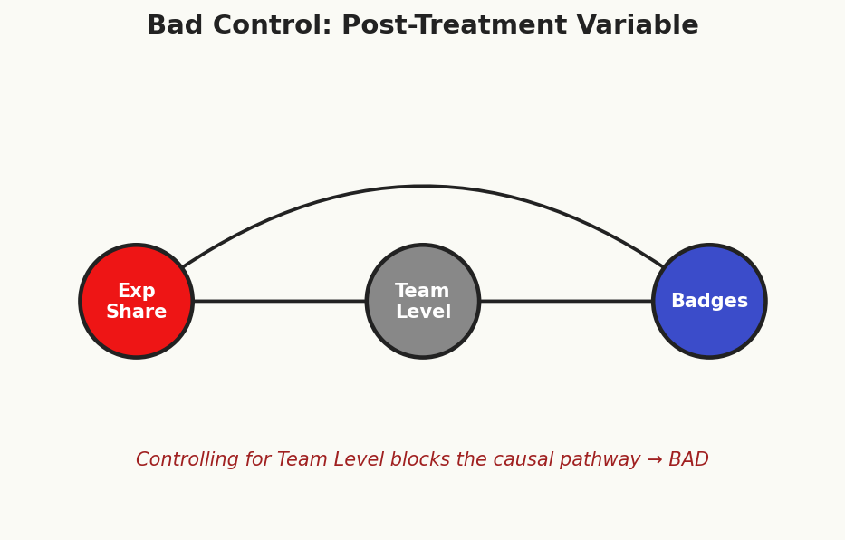

# Chapter 5: Celadon City — Regression, Weighting, & Doubly Robust Methods

<!-- FIG-CH05-ERIKA -->
<figure style="float:right; margin:0 0 12px 16px; max-width:140px;">

<figcaption style="font-size:0.85em; text-align:center;">Erika, Celadon Gym Leader</figcaption>
</figure>


> *"Celadon City — the city of rainbow dreams."*

Celadon City is the commercial heart of Kanto. The Department Store towers above the skyline, its six floors stocked with everything a trainer could desire: TMs for new battle moves, stat-boosting vitamins like Calcium and Iron, evolution stones, and the coveted Rare Candy. Trainers flock here from across the region, wallets open, convinced that spending more on premium items will transform them into Pokemon League champions.

But does spending at the Celadon Department Store actually *cause* better battle outcomes? Or do wealthier trainers — who can afford to spend lavishly — also happen to train harder, travel to more routes, and accumulate more experience? If so, naive comparisons between big spenders and frugal trainers will confuse the effect of spending with the effect of wealth and dedication.

This is the problem of confounding, and in this chapter, we develop the three most important tools in the applied researcher's arsenal for addressing it: **regression adjustment**, **inverse probability weighting**, and **doubly robust estimation**. Along the way, we will navigate two dangerous pitfalls — omitted variable bias and post-treatment bias — that can silently undermine even well-intentioned analyses.

And then there is the Game Corner. Behind the cheerful facade of slot machines and prize exchanges, Team Rocket runs an elaborate scheme: subsidized items funneled to trainers they want to recruit. These subsidies are not handed out at random. Team Rocket targets trainers with specific characteristics — making the "treated" group deeply unrepresentative of the broader trainer population. This is precisely the setting where inverse probability weighting earns its keep.

Gym Leader Erika, the serene master of Grass-type Pokemon, will not be swayed by hand-waving or casual correlations. She demands rigorous statistical proof — a proper identification strategy — before she will acknowledge any causal claim. Earn her respect, and you earn the Rainbow Badge.

---

## 5.1 Regression for Causal Inference

### 5.1.1 OLS: Not Just for Prediction

In Chapter 3, we introduced DAGs and the backdoor criterion as tools for reasoning about which variables to condition on. In Chapter 4, we used matching and propensity scores to create comparable treatment and control groups. Now we turn to the workhorse of empirical social science: **ordinary least squares (OLS) regression**.

Most students first encounter OLS in a statistics or econometrics course focused on *prediction* — finding the linear function that best fits the data. But regression can also serve as a tool for *causal inference*, provided we are willing to make specific assumptions about the data-generating process. The key distinction is this: in predictive modeling, we care about $\hat{Y}$; in causal inference, we care about $\hat{\tau}$, the coefficient on the treatment variable.

Consider our Celadon City question. We observe $n$ trainers, each with:

- $Y_i$: battle outcome (e.g., gym badges earned, tournament wins)
- $D_i$: a binary indicator for whether the trainer spent heavily at the Department Store ($D_i = 1$) or not ($D_i = 0$)
- $X_i$: a vector of pre-treatment covariates (wealth, prior experience, number of routes traveled, starter Pokemon type, etc.)

We write the **causal regression model**:

$$Y_i = \alpha + \tau D_i + X_i'\beta + \epsilon_i$$

where $\tau$ is the parameter we hope captures the causal effect of Department Store spending on battle outcomes. But when does the OLS estimator $\hat{\tau}_{OLS}$ actually recover a causal effect?

### 5.1.2 The Conditional Mean Independence Assumption

The answer hinges on a critical assumption. Recall from Chapter 1 that each trainer has two potential outcomes: $Y_i(1)$ (outcome if they spend heavily) and $Y_i(0)$ (outcome if they do not). The average treatment effect is $\tau_{ATE} = E[Y(1) - Y(0)]$.

> **Definition 5.1 (Conditional Mean Independence).** Treatment $D$ satisfies conditional mean independence given covariates $X$ if:
>
> $$E[Y(0) \mid X, D] = E[Y(0) \mid X]$$
>
> and
>
> $$E[Y(1) \mid X, D] = E[Y(1) \mid X]$$
>
> That is, once we condition on $X$, knowing a trainer's treatment status provides no additional information about their potential outcomes.

This is a weaker requirement than the full conditional independence assumption $\{Y(0), Y(1)\} \perp\!\!\!\perp D \mid X$ that we used in Chapter 4. We only need *mean* independence, not independence of the entire distribution. In DAG language, conditional mean independence holds when $X$ blocks all backdoor paths between $D$ and $Y$ — at least with respect to the conditional expectation function.

### 5.1.3 When Does OLS Estimate the ATE?

Under conditional mean independence, OLS recovers the ATE under additional conditions:

1. **Linearity of the conditional expectation.** The true conditional expectation $E[Y(0) \mid X]$ is linear in $X$: that is, $E[Y(0) \mid X] = \alpha + X'\beta$. This is a functional form restriction.

2. **Constant (homogeneous) treatment effects.** The causal effect $\tau_i = Y_i(1) - Y_i(0) = \tau$ is the same for all trainers $i$. Under heterogeneous effects, OLS recovers a variance-weighted average of conditional treatment effects, which generally differs from the ATE.

3. **Correct specification.** The control variables $X$ must include all confounders — variables that jointly affect $D$ and $Y$. Omitting a confounder leads to omitted variable bias (Section 5.2), while including post-treatment variables leads to bad control bias (Section 5.3).

> **Professor Oak Explains: The Regression Anatomy**
>
> "Think of regression as doing two things simultaneously, young trainer. First, it uses the covariates $X$ to predict treatment $D$ and outcome $Y$. Then it correlates the *residuals* — the parts of $D$ and $Y$ that $X$ cannot explain. This is exactly the Frisch-Waugh-Lovell (FWL) theorem, and it gives you powerful intuition for what regression actually does."

### 5.1.4 The Frisch-Waugh-Lovell Theorem

The FWL theorem provides the deepest intuition for how regression achieves causal adjustment. It states that the coefficient $\hat{\tau}$ from the full regression $Y_i = \alpha + \tau D_i + X_i'\beta + \epsilon_i$ is numerically identical to the coefficient from a bivariate regression of residualized $Y$ on residualized $D$:

> **Theorem 5.1 (Frisch-Waugh-Lovell).** Let $\tilde{D}_i$ be the residual from regressing $D_i$ on $X_i$, and let $\tilde{Y}_i$ be the residual from regressing $Y_i$ on $X_i$. Then:
>
> $$\hat{\tau}_{OLS} = \frac{\sum_i \tilde{D}_i \tilde{Y}_i}{\sum_i \tilde{D}_i^2}$$
>
> This is the slope from the simple regression $\tilde{Y}_i = \tau \tilde{D}_i + u_i$.

The intuition is "partialling out." Step 1: Regress $D$ on $X$ and save the residuals $\tilde{D}$. These residuals represent the variation in treatment status that is *not* predicted by the covariates — the "as-good-as-random" part of treatment, if our model is correct. Step 2: Regress $Y$ on $X$ and save the residuals $\tilde{Y}$. Step 3: Regress $\tilde{Y}$ on $\tilde{D}$. This final regression uses only the variation in treatment that cannot be explained by confounders to estimate the effect on the part of the outcome that is similarly unexplained.

In our Celadon City context, FWL tells us: first strip out the predictable relationship between trainer wealth/experience and Department Store spending. Then strip out the predictable relationship between wealth/experience and battle outcomes. Finally, ask: among trainers with similar wealth and experience, does the *residual* variation in spending predict *residual* variation in outcomes?

### 5.1.5 Saturated Models and Nonparametric Regression

An important special case arises when we fully saturate the model with interactions. If $X$ is discrete — say, a set of binary indicators for wealth level (low, medium, high) and experience tier (novice, intermediate, expert) — then a fully saturated regression includes a dummy for every cell in the cross-tabulation plus interactions with treatment. In this case, the regression coefficient is a weighted average of within-cell treatment-control differences, and the linearity assumption is automatically satisfied.

Formally, with $K$ discrete cells, the saturated model is:

$$Y_i = \sum_{k=1}^{K} \alpha_k \cdot \mathbf{1}(X_i \in \text{cell } k) + \sum_{k=1}^{K} \tau_k \cdot D_i \cdot \mathbf{1}(X_i \in \text{cell } k) + \epsilon_i$$

The OLS estimate of $\tau_k$ equals the difference in sample means between treated and control units within cell $k$. The overall $\hat{\tau}$ is a *precision-weighted* average of these cell-specific effects — cells with more observations and less variance receive more weight. Note carefully: this is not the same as the ATE, which would weight by cell *population shares*. This distinction matters when treatment effects are heterogeneous and the distribution of covariates differs between treatment and control groups.

### 5.1.6 Regression as Matching

Regression and matching are closely related. Both condition on covariates $X$ to compare like with like. But they differ in how they weight observations:

| Feature | Matching | Regression |
|---------|----------|------------|
| **Functional form** | Nonparametric | Assumes linearity (unless saturated) |
| **Weighting** | Equal weight to each matched pair/stratum | Precision-weighted (more weight to higher-variance cells) |
| **Extrapolation** | Refuses to compare if no match exists | Extrapolates linearly into regions with no data |
| **Curse of dimensionality** | Severe with many covariates | Handles high-dimensional $X$ via parametric structure |

Regression's willingness to extrapolate is both its greatest strength and its greatest vulnerability. When treatment and control groups have good overlap (common support), regression and matching tend to agree. When overlap is poor, regression cheerfully extrapolates — a property we should regard with suspicion.

### 5.1.7 Worked Example: Badges on Department Store Spending

Suppose we observe the following data for six Celadon City trainers:

| Trainer | Badges ($Y$) | Dept Store ($D$) | Wealth ($W$) | Experience ($E$) |
|---------|:---:|:---:|:---:|:---:|
| Ash     | 5   | 0   | 2   | 3   |
| Misty   | 7   | 1   | 4   | 5   |
| Brock   | 6   | 1   | 3   | 4   |
| Gary    | 8   | 1   | 5   | 6   |
| Jessie  | 3   | 0   | 1   | 2   |
| James   | 4   | 0   | 2   | 1   |

**Naive comparison** (ignoring confounders):

$$\bar{Y}_{D=1} - \bar{Y}_{D=0} = \frac{7+6+8}{3} - \frac{5+3+4}{3} = 7.0 - 4.0 = 3.0$$

This suggests spending at the Department Store increases badges by 3. But treated trainers are wealthier and more experienced.

**Short regression** (no controls): $Y_i = \alpha + \tau D_i + \epsilon_i$ yields $\hat{\tau}_{short} = 3.0$ — identical to the naive comparison.

**Long regression** (with controls): $Y_i = \alpha + \tau D_i + \beta_1 W_i + \beta_2 E_i + \epsilon_i$. Running this regression (which we encourage the reader to verify in the companion notebook), we obtain approximately:

$$\hat{\tau}_{long} \approx 0.8$$

The coefficient drops from 3.0 to 0.8 once we control for wealth and experience. Most of the naive "effect" was driven by confounding: wealthier, more experienced trainers both spend more and earn more badges. The residual effect of 0.8 — if our model is correctly specified — represents the causal contribution of Department Store spending, holding wealth and experience fixed.

> **Key Insight.** The dramatic decline from $\hat{\tau}_{short} = 3.0$ to $\hat{\tau}_{long} = 0.8$ is driven by omitted variable bias in the short regression. We formalize this in Section 5.2.

---

## 5.2 Omitted Variable Bias

### 5.2.1 The OVB Formula

Omitted variable bias (OVB) is the single most important concept in applied causal inference with observational data. It formalizes what happens when a relevant confounder is left out of a regression.

Consider two regressions:

- **Short regression**: $Y_i = \alpha_s + \tau_s D_i + \epsilon_i^s$
- **Long regression**: $Y_i = \alpha_\ell + \tau_\ell D_i + \gamma W_i + \epsilon_i^\ell$

where $W$ is the omitted variable (e.g., wealth). The OVB formula relates the two coefficients:

> **Theorem 5.2 (Omitted Variable Bias Formula).**
>
> $$\hat{\tau}_{short} = \hat{\tau}_{long} + \hat{\delta} \cdot \hat{\gamma}$$
>
> where:
> - $\hat{\delta}$ is the coefficient from regressing $W$ on $D$: the relationship between the omitted variable and treatment
> - $\hat{\gamma}$ is the coefficient on $W$ in the long regression: the relationship between the omitted variable and the outcome, controlling for treatment
>
> Equivalently, the **bias** is:
>
> $$\text{OVB} = \hat{\tau}_{short} - \hat{\tau}_{long} = \hat{\delta} \cdot \hat{\gamma}$$

The formula decomposes the bias into two intuitive pieces. The omitted variable biases the treatment effect estimate only if it is correlated with *both* the treatment ($\hat{\delta} \neq 0$) and the outcome ($\hat{\gamma} \neq 0$). If the omitted variable is unrelated to treatment or unrelated to the outcome, there is no bias.

### 5.2.2 Signing the Bias

Even when we cannot estimate the bias precisely (because we do not observe $W$), we can often *sign* it using substantive reasoning. This is one of the most valuable skills in applied work.

| $\hat{\delta}$ (Omitted var ~ Treatment) | $\hat{\gamma}$ (Omitted var ~ Outcome) | Bias Direction |
|:---:|:---:|:---:|
| $+$ | $+$ | **Positive** (upward) |
| $+$ | $-$ | **Negative** (downward) |
| $-$ | $+$ | **Negative** (downward) |
| $-$ | $-$ | **Positive** (upward) |

In our Department Store example:

- **Omitted variable**: trainer "grit" (unobserved dedication and work ethic)
- **$\hat{\delta}$ (grit ~ spending)**: Grittier trainers probably spend more at the Department Store because they invest in every possible advantage. So $\hat{\delta} > 0$.
- **$\hat{\gamma}$ (grit ~ badges)**: Grittier trainers earn more badges because they train harder, regardless of spending. So $\hat{\gamma} > 0$.
- **Bias direction**: $\hat{\delta} \cdot \hat{\gamma} > 0$. The bias is **positive**: omitting grit makes the Department Store spending effect appear *larger* than it truly is.

This matches our worked example: $\hat{\tau}_{short} = 3.0$ overstated the controlled estimate of $\hat{\tau}_{long} = 0.8$.

### 5.2.3 Worked Example: Computing OVB

Returning to our six-trainer dataset, let us verify the OVB formula for the case where wealth is omitted.

**Short regression**: $Y_i = \alpha_s + \tau_s D_i + \epsilon_i^s$, yielding $\hat{\tau}_{short} = 3.0$.

**Long regression**: $Y_i = \alpha_\ell + \tau_\ell D_i + \gamma W_i + \epsilon_i^\ell$. Suppose this yields $\hat{\tau}_{long} = 1.2$ and $\hat{\gamma} = 0.9$.

**Auxiliary regression**: $W_i = a + \delta D_i + u_i$. The mean wealth among treated trainers is $(4+3+5)/3 = 4.0$; among control trainers, $(2+1+2)/3 = 1.67$. So $\hat{\delta} = 4.0 - 1.67 = 2.33$.

**Verification**:

$$\hat{\tau}_{short} = \hat{\tau}_{long} + \hat{\delta} \cdot \hat{\gamma}$$
$$3.0 \approx 1.2 + 2.33 \times 0.9$$
$$3.0 \approx 1.2 + 2.1 = 3.3$$

The approximation is not exact here because we are using a simplified example with few observations and have omitted the second covariate (experience), but the direction and magnitude of the bias are clear. The OVB of approximately $+2.1$ accounts for the bulk of the difference between the naive and controlled estimates.

### 5.2.4 Oster (2019): Coefficient Stability and Bounding the Bias

A critical question in any observational study is: *Could unobserved confounders explain away the entire estimated effect?* Emily Oster (2019) formalized a method for assessing this, building on the ideas of Altonji, Elder, and Taber (2005).

The key insight is to examine how the treatment coefficient *changes* when we add observed controls, and then extrapolate to ask how much it would change if we could also add unobserved controls.

> **Definition 5.2 (Oster's $\delta$).** Define the proportional selection parameter:
>
> $$\delta = \frac{\hat{\tau}_{long} \cdot (\tilde{R}^2_{max} - \tilde{R}^2_{long})}{\hat{\tau}_{long} - \hat{\tau}_{short}} \cdot \frac{\tilde{R}^2_{long} - \tilde{R}^2_{short}}{\tilde{R}^2_{max} - \tilde{R}^2_{long}}$$
>
> More precisely, the bias-adjusted estimate sets the treatment effect to zero and solves for the $\delta$ that rationalizes $\hat{\tau} = 0$. A common formulation is:
>
> $$\delta = \frac{(\hat{\tau}_{long})(\tilde{R}^2_{max} - \tilde{R}^2_{long})}{(\tilde{R}^2_{long} - \tilde{R}^2_{short})(\hat{\tau}_{short} - \hat{\tau}_{long})}$$
>
> When $\delta > 1$, unobservables would need to be *more* important than observables to fully explain away the effect. When $\delta < 1$, even moderate unobserved confounding could eliminate the estimated effect.

The mechanics are:

1. Run the **short regression** (no controls). Record $\hat{\tau}_{short}$ and $R^2_{short}$.
2. Run the **long regression** (with all observable controls). Record $\hat{\tau}_{long}$ and $R^2_{long}$.
3. Choose $R^2_{max}$, the hypothetical $R^2$ if we could observe *everything*. A common choice is $R^2_{max} = \min(1, 1.3 \times R^2_{long})$.
4. Compute $\delta$. If $\delta \gg 1$, the result is robust to selection on unobservables.

In our Department Store example, suppose $R^2_{short} = 0.40$ and $R^2_{long} = 0.82$, with $R^2_{max} = 1.0$. Then:

$$\delta = \frac{0.8 \times (1.0 - 0.82)}{(0.82 - 0.40) \times (3.0 - 0.8)} = \frac{0.8 \times 0.18}{0.42 \times 2.2} = \frac{0.144}{0.924} \approx 0.156$$

Since $\delta \approx 0.156 < 1$, this tells us that even unobservables that are only 15.6% as important as our observed controls (wealth and experience) could explain away the remaining effect. This is concerning — the estimated effect of Department Store spending is fragile. Erika would raise an eyebrow.

> **Professor Oak Explains: Interpreting Oster's $\delta$**
>
> "Think of $\delta$ as a stress test, young trainer. If $\delta = 3$, then unobservables would need to be *three times* as important as your observed controls to eliminate the effect. That is reassuring. If $\delta = 0.5$, even modest unobserved confounding could do the job. When you publish your research, always report $\delta$ alongside your main estimates. Referees — and Gym Leaders — will respect the honesty."

---

## 5.3 Bad Controls and Post-Treatment Bias

<!-- FIG-CH05-BAD -->
<figure>

<figcaption>Controlling for a post-treatment variable blocks the causal pathway.</figcaption>
</figure>


### 5.3.1 The Most Common Mistake

If omitted variable bias is the *most important* concept in applied causal inference, **bad control bias** (also called **post-treatment bias** or **overcontrol bias**) is the *most common mistake*. It arises when researchers include variables in their regressions that are affected by the treatment — descendants of $D$ on the DAG — in an effort to "control for everything."

The logic seems reasonable: "I want to isolate the effect of $D$ on $Y$, so I should control for as many variables as possible." This is the **kitchen sink** approach, and it is wrong.

> **Definition 5.3 (Bad Control).** A variable is a *bad control* if it is a descendant of the treatment variable $D$ on the causal DAG. Conditioning on a bad control opens spurious paths, introduces collider bias, or blocks causal pathways — any of which distorts the estimated treatment effect.

### 5.3.2 The Exp Share Example

Consider the effect of the Exp Share item on gym badges earned. The Exp Share distributes experience points to all Pokemon in a trainer's party, not just the one that battles. We want to estimate:

$$\text{Treatment } (D): \text{Exp Share usage} \longrightarrow \text{Outcome } (Y): \text{Gym badges earned}$$

A natural confounder is the trainer's *initial experience* — how many battles they had fought before obtaining the Exp Share. We should control for this. But a tempting (and dangerous) "control" is the trainer's **average team level** ($L$) at the time badges are measured.

The DAG looks like this:

```
    Initial Experience
       /          \
      v            v
  Exp Share (D) --> Avg Team Level (L) --> Badges (Y)
      \                                    ^
       \----------------------------------/
```

Average team level $L$ is a **descendant** of treatment $D$: using the Exp Share causes team levels to rise. Controlling for $L$ blocks part of the causal pathway from $D$ to $Y$ and absorbs the very effect we are trying to measure. The regression coefficient on $D$, after controlling for $L$, captures only the *direct* effect of Exp Share on badges that does *not* operate through team level — which may be nearly zero, even if the total causal effect is large.

Formally, the total effect is:

$$\tau_{total} = \tau_{direct} + \tau_{indirect}$$

where $\tau_{indirect}$ flows through $L$. Controlling for $L$ eliminates $\tau_{indirect}$, leaving only $\tau_{direct}$. If the Exp Share helps you earn badges *precisely because* it raises your team level, then $\tau_{direct} \approx 0$ and you would erroneously conclude the Exp Share has no effect.

### 5.3.3 Collider Bias from Bad Controls

The situation can be even worse than merely blocking causal channels. When a post-treatment variable is a *collider* — a variable caused by both the treatment and the outcome (or by the treatment and an unobserved confounder of the outcome) — conditioning on it opens a spurious path and can introduce bias where none existed.

Consider this DAG:

```
     D ---------> Y
      \          ^
       v        /
        M <----U
```

Here $M$ is affected by both $D$ and an unobserved variable $U$ that also affects $Y$. Controlling for $M$ opens the path $D \to M \leftarrow U \to Y$, creating a spurious association between $D$ and $Y$ through $U$.

### 5.3.4 M-Bias (Butterfly Bias)

A subtler case is M-bias, named for the shape of its DAG:

```
    U1        U2
   /  \      /  \
  v    v    v    v
  D    M    Y
       ^
       |
```

More precisely:

```
  U1 --> D
  U1 --> M
  U2 --> M
  U2 --> Y
```

Here $M$ is a collider on the path $D \leftarrow U_1 \to M \leftarrow U_2 \to Y$. Without conditioning on $M$, this path is blocked (because $M$ is a collider). But conditioning on $M$ *opens* it, creating a spurious association between $D$ and $Y$ even though there was no confounding to begin with.

M-bias is controversial because it requires a very specific (and arguably uncommon) causal structure. But it illustrates a crucial principle: **adding controls is not always innocent**.

### 5.3.5 DAG-Based Variable Selection

The correct approach to variable selection for causal inference is to use the **backdoor criterion** from Chapter 3:

> **Rule 5.1 (Variable Selection for Regression).** Include a variable in your regression if and only if:
>
> 1. It is needed to **block a backdoor path** between $D$ and $Y$, AND
> 2. It is **not a descendant** of the treatment $D$.
>
> If both conditions are met, the variable is a "good control." If condition 2 is violated, the variable is a "bad control" regardless of whether it satisfies condition 1.

In practice, this means:

- **Good controls**: pre-treatment covariates that are causes (or proxies for causes) of both $D$ and $Y$. Examples: trainer's initial wealth, starter Pokemon type, hometown.
- **Bad controls**: post-treatment variables that are consequences of $D$. Examples: average team level after using Exp Share, number of TMs purchased after deciding to invest in the Department Store, Pokemon friendship level after treatment.
- **Neutral variables**: pre-treatment variables that predict $Y$ but not $D$ (or vice versa). Including these does not bias $\hat{\tau}$ but may improve precision (if they predict $Y$) or waste degrees of freedom (if they predict neither).

> **Blue's Mistake: The Kitchen Sink Regression**
>
> Blue, the player's rival, runs the following regression to estimate the effect of Exp Share on badges:
>
> $$\text{Badges}_i = \alpha + \tau \cdot \text{ExpShare}_i + \beta_1 \cdot \text{TeamLevel}_i + \beta_2 \cdot \text{MovesLearned}_i + \beta_3 \cdot \text{ItemsUsed}_i + \epsilon_i$$
>
> He proudly reports: "See? The Exp Share coefficient is basically zero. Exp Shares don't help at all!"
>
> But $\text{TeamLevel}$, $\text{MovesLearned}$, and $\text{ItemsUsed}$ are all *consequences* of using the Exp Share. By controlling for the mechanisms through which the treatment operates, Blue has surgically removed the very effect he was trying to measure.
>
> When confronted, Blue says: "But I controlled for *everything!*" This is exactly the problem. In causal inference, controlling for everything is not a virtue — it is a recipe for bias. The kitchen sink approach — throwing every available variable into the regression — is one of the most common errors in applied research.
>
> **The lesson**: More controls are not always better. Let the DAG guide your choices.

### 5.3.6 A Decision Framework

When you encounter a candidate control variable $Z$, ask these questions in order:

1. **Is $Z$ affected by the treatment $D$?** If yes, it is a bad control. Do not include it.
2. **Is $Z$ a confounder (causes both $D$ and $Y$)?** If yes, it is a good control. Include it.
3. **Is $Z$ an instrumental variable (causes $D$ but not $Y$ directly)?** Including it does not bias $\hat{\tau}$ but may reduce precision in finite samples.
4. **Is $Z$ a pure predictor of $Y$ (affects $Y$ but not $D$)?** Including it reduces residual variance and improves precision without affecting consistency.

When in doubt, draw the DAG first and apply the backdoor criterion.

---

## 5.4 Inverse Probability Weighting (IPW)

### 5.4.1 The Game Corner Problem

Behind the neon lights of Celadon's Game Corner, Team Rocket runs a clandestine operation. Among their schemes: subsidizing premium battle items (Rare Candies, PP Ups, stat vitamins) for trainers they hope to recruit. But Team Rocket does not hand out subsidies randomly. They target trainers who are *already strong* — those with more badges, higher-level Pokemon, and demonstrated battle prowess. After all, Team Rocket wants useful recruits, not novices.

This creates a selection problem. If we compare trainers who received subsidized items (treated) to those who did not (control), the treated group is systematically different: stronger, more experienced, and more battle-hardened. The "treatment" group is **unrepresentative** of the broader population. A naive comparison would confuse the effect of the items with the pre-existing superiority of the trainers who received them.

Regression adjustment, as in Section 5.1, is one solution. But regression relies on correctly specifying the functional form of $E[Y \mid X, D]$. **Inverse probability weighting (IPW)** offers an alternative that models the *treatment assignment mechanism* rather than the outcome. It works by reweighting observations to create a **pseudo-population** in which treatment assignment is independent of covariates.

### 5.4.2 The Propensity Score, Revisited

In Chapter 4, we defined the propensity score:

$$e(X_i) = P(D_i = 1 \mid X_i)$$

the probability that trainer $i$ receives treatment, given their observed characteristics. For the Game Corner scheme, $e(X_i)$ represents Team Rocket's "targeting function" — how likely they are to subsidize a trainer with covariates $X_i$.

Under the assumptions of **unconfoundedness** ($\{Y(0), Y(1)\} \perp\!\!\!\perp D \mid X$) and **overlap** ($0 < e(X) < 1$ for all $X$), the propensity score is sufficient for identifying causal effects (Rosenbaum and Rubin, 1983).

### 5.4.3 The Horvitz-Thompson Estimator

The foundational IPW estimator is the **Horvitz-Thompson (HT) estimator**, originally developed for survey sampling (Horvitz and Thompson, 1952):

> **Definition 5.4 (Horvitz-Thompson Estimator).** The IPW estimator of the ATE is:
>
> $$\hat{\tau}_{HT} = \frac{1}{n}\sum_{i=1}^{n} \frac{D_i Y_i}{e(X_i)} - \frac{1}{n}\sum_{i=1}^{n} \frac{(1 - D_i) Y_i}{1 - e(X_i)}$$

The logic is beautifully intuitive. Consider a treated trainer with propensity score $e(X_i) = 0.8$. This trainer had an 80% probability of being treated, meaning they are "overrepresented" among the treated: for every trainer like them who was treated, about 0.25 trainers like them were not. To make the treated group representative of the full population, we downweight this trainer by $1/e(X_i) = 1/0.8 = 1.25$.

Conversely, a treated trainer with $e(X_i) = 0.2$ is "underrepresented" — they had only a 20% chance of treatment but happened to be treated anyway. We upweight them by $1/0.2 = 5$ to compensate.

For the control group, the same logic applies with $1 - e(X_i)$: a control trainer with $e(X_i) = 0.8$ had only a 20% chance of being a control unit, so they are underrepresented in the control group and receive weight $1/(1-0.8) = 5$.

> **Professor Oak Explains: The Pseudo-Population**
>
> "Here is the key insight, trainer. In the observed data, treated and control groups look different because treatment was not assigned randomly. IPW creates a *pseudo-population* — a weighted version of the data — where treatment is independent of covariates. In this pseudo-population, it is *as if* treatment were randomly assigned. Each trainer is weighted by the inverse of their probability of receiving the treatment they actually received. The resulting weighted sample represents the population we *would* have observed under random assignment."

Formally, the weight for unit $i$ is:

$$w_i = \frac{D_i}{e(X_i)} + \frac{1 - D_i}{1 - e(X_i)}$$

Under correct specification of the propensity score, these weights satisfy $E[w_i \mid X_i] = 1$ for all $X_i$, and the weighted distribution of $X$ is balanced between treated and control groups.

### 5.4.4 The Hajek (Normalized) Estimator

In practice, the Horvitz-Thompson estimator can be unstable because the weights $1/e(X_i)$ and $1/(1 - e(X_i))$ do not necessarily sum to $n/2$ in finite samples. The **Hajek estimator** normalizes the weights:

> **Definition 5.5 (Hajek Estimator).** The normalized IPW estimator is:
>
> $$\hat{\tau}_{H} = \frac{\sum_{i=1}^{n} \frac{D_i Y_i}{e(X_i)}}{\sum_{i=1}^{n} \frac{D_i}{e(X_i)}} - \frac{\sum_{i=1}^{n} \frac{(1 - D_i) Y_i}{1 - e(X_i)}}{\sum_{i=1}^{n} \frac{(1 - D_i)}{1 - e(X_i)}}$$

The Hajek estimator is preferred in practice for several reasons:

1. **Lower variance.** The normalization stabilizes the estimator, especially when the propensity score is estimated (as it always is in practice).
2. **Robustness to weight scaling.** Even if the propensity score model is slightly misspecified such that the weights do not sum to the correct totals, the Hajek estimator self-corrects through normalization.
3. **Interpretation.** Each term is a weighted average of outcomes — a quantity that is inherently easier to interpret and more stable than a weighted sum divided by $n$.

The cost of normalization is a small bias: the Hajek estimator is not exactly unbiased in finite samples, unlike the HT estimator. But this bias vanishes as $n \to \infty$, and the variance reduction typically dominates.

### 5.4.5 The Extreme Weight Problem

IPW has an Achilles' heel: **extreme weights**. When $e(X_i) \approx 0$ or $e(X_i) \approx 1$, the weights $1/e(X_i)$ or $1/(1-e(X_i))$ explode. A single trainer with $e(X_i) = 0.01$ receives a weight of 100, effectively determining the entire estimate.

This is not merely a theoretical concern. In the Game Corner setting, suppose Team Rocket never subsidizes very weak trainers — those with zero badges and level-5 Pokemon. If such a trainer somehow *does* receive a subsidy (perhaps by accident), their propensity score is near zero, and their IPW weight is enormous. The entire ATE estimate hinges on this one unusual case.

Extreme weights cause:

- **High variance.** The variance of the IPW estimator is dominated by units with large weights.
- **Sensitivity to outliers.** A single misclassified or unusual observation can swing the estimate dramatically.
- **Instability.** Small changes in the propensity score model (e.g., adding a covariate) can drastically change which units receive extreme weights.

### 5.4.6 Weight Trimming and Truncation

Several strategies address the extreme weight problem:

**Trimming.** Discard observations with propensity scores outside $[\alpha, 1-\alpha]$ for some threshold $\alpha$ (e.g., $\alpha = 0.05$ or $\alpha = 0.10$). This changes the estimand from the ATE to the ATE within the trimmed population — trainers for whom both treatment and control are plausible.

**Truncation (Winsorization).** Cap the weights at some maximum value $c$:

$$w_i^{trunc} = \min\left(w_i, c\right)$$

This introduces bias (we are no longer perfectly reweighting) but reduces variance. The bias-variance tradeoff depends on $c$.

**Stabilized weights.** Replace $1/e(X_i)$ with $P(D=1)/e(X_i)$, which brings the average weight closer to 1 and reduces variability:

$$w_i^{stab} = \frac{D_i \cdot P(D=1)}{e(X_i)} + \frac{(1 - D_i) \cdot P(D=0)}{1 - e(X_i)}$$

**Overlap weights.** Weight each unit by $e(X_i)(1 - e(X_i))$ times the IPW weight, which effectively gives the most weight to units in the region of best overlap. This targets the **ATO** (average treatment effect on the overlap population) rather than the ATE.

### 5.4.7 Worked Example: The Game Corner Subsidies

Suppose we observe eight trainers in Celadon City. Team Rocket subsidized items for four of them ($D=1$), while the other four purchased items at full price ($D=0$):

| Trainer | Badges ($Y$) | Subsidized ($D$) | Badges Pre ($X_1$) | Level ($X_2$) | $\hat{e}(X)$ |
|---------|:---:|:---:|:---:|:---:|:---:|
| A | 7 | 1 | 4 | 35 | 0.85 |
| B | 5 | 1 | 2 | 20 | 0.30 |
| C | 8 | 1 | 5 | 40 | 0.90 |
| D | 6 | 1 | 3 | 30 | 0.60 |
| E | 3 | 0 | 1 | 15 | 0.15 |
| F | 5 | 0 | 3 | 25 | 0.55 |
| G | 4 | 0 | 2 | 18 | 0.25 |
| H | 6 | 0 | 4 | 32 | 0.80 |

The propensity scores $\hat{e}(X)$ were estimated from a logistic regression of $D$ on $X_1$ and $X_2$. Notice that trainers A and C have high propensity scores (Team Rocket clearly targeted them), while trainer E has a very low score (an unlikely target).

**Naive comparison:**

$$\bar{Y}_{D=1} - \bar{Y}_{D=0} = \frac{7+5+8+6}{4} - \frac{3+5+4+6}{4} = 6.50 - 4.50 = 2.00$$

**Horvitz-Thompson estimator:**

$$\hat{\tau}_{HT} = \frac{1}{8}\left[\frac{7}{0.85} + \frac{5}{0.30} + \frac{8}{0.90} + \frac{6}{0.60}\right] - \frac{1}{8}\left[\frac{3}{0.15} + \frac{5}{0.45} + \frac{4}{0.75} + \frac{6}{0.20}\right]$$

Note: $(1-e)$ for trainers E, F, G, H are $0.85, 0.45, 0.75, 0.20$ respectively.

Computing each term:

Treated sum: $8.24 + 16.67 + 8.89 + 10.00 = 43.80$

Control sum: $20.00 + 11.11 + 5.33 + 30.00 = 66.44$

$$\hat{\tau}_{HT} = \frac{43.80}{8} - \frac{66.44}{8} = 5.475 - 8.306 = -2.83$$

The HT estimate is $-2.83$ — a large *negative* effect, strikingly different from the naive $+2.00$! After reweighting to account for Team Rocket's targeting, the subsidized items appear to *hurt* outcomes, or at least not help. But notice the instability: trainer E (with $e(X)=0.15$, weight $= 1/0.85 \approx 1.18$ as control) and trainer H (with $e(X) = 0.80$, weight $= 1/0.20 = 5$ as control) are dominating the control sum. Trainer H, a strong trainer who happened to *not* receive a subsidy despite being a prime target, receives enormous weight.

**Hajek estimator:**

$$\hat{\tau}_{H} = \frac{8.24 + 16.67 + 8.89 + 10.00}{1/0.85 + 1/0.30 + 1/0.90 + 1/0.60} - \frac{20.00 + 11.11 + 5.33 + 30.00}{1/0.85 + 1/0.45 + 1/0.75 + 1/0.20}$$

Treated weights sum: $1.18 + 3.33 + 1.11 + 1.67 = 7.29$

Control weights sum: $1.18 + 2.22 + 1.33 + 5.00 = 9.73$

$$\hat{\tau}_{H} = \frac{43.80}{7.29} - \frac{66.44}{9.73} = 6.01 - 6.83 = -0.82$$

The Hajek estimate of $-0.82$ is much more moderate. The normalization tempers the influence of extreme weights, yielding a more stable (though still negative) estimate. This is why the Hajek estimator is the standard choice in practice.

> **Key Insight.** The naive comparison suggested a $+2.0$ advantage for subsidized trainers. After IPW adjustment, the effect is negative or near zero. The apparent benefit was entirely driven by selection: Team Rocket gave items to trainers who would have performed well *regardless*. Once we reweight to account for this targeting, the items themselves provide little or no benefit — and may even distract trainers from effective training.

---

## 5.5 Augmented IPW / Doubly Robust Estimation

### 5.5.1 The Best of Both Worlds

We now have two approaches to estimating causal effects from observational data:

1. **Outcome modeling (regression)**: Model $E[Y \mid X, D]$, then compare predicted outcomes under treatment and control. This requires correct specification of the outcome model.

2. **Treatment modeling (IPW)**: Model $P(D = 1 \mid X)$, then reweight observations to create balance. This requires correct specification of the propensity score model.

Each approach is consistent (converges to the truth as $n \to \infty$) if its respective model is correctly specified. But in practice, we can never be certain that either model is correct. What if we could combine both approaches and obtain a estimator that is consistent if *either* model is correct?

This is exactly what the **augmented inverse probability weighting (AIPW)** estimator — also called the **doubly robust (DR)** estimator — achieves.

### 5.5.2 The AIPW Estimator

> **Definition 5.6 (Augmented Inverse Probability Weighting).** Let $\hat{e}(X_i)$ be an estimate of the propensity score, and let $\hat{\mu}_d(X_i) = \hat{E}[Y \mid X = X_i, D = d]$ for $d \in \{0, 1\}$ be estimates of the conditional mean outcomes. The AIPW estimator of the ATE is:
>
> $$\hat{\tau}_{DR} = \frac{1}{n}\sum_{i=1}^{n}\left[\hat{\mu}_1(X_i) - \hat{\mu}_0(X_i) + \frac{D_i(Y_i - \hat{\mu}_1(X_i))}{\hat{e}(X_i)} - \frac{(1-D_i)(Y_i - \hat{\mu}_0(X_i))}{1 - \hat{e}(X_i)}\right]$$

This formula can be decomposed into three intuitive pieces:

**Piece 1: The outcome model prediction.** $\hat{\mu}_1(X_i) - \hat{\mu}_0(X_i)$ is the predicted treatment effect based on the outcome model alone. If the outcome model is correct, this by itself estimates the ATE.

**Piece 2: The bias correction for treated units.** $\frac{D_i(Y_i - \hat{\mu}_1(X_i))}{\hat{e}(X_i)}$ corrects the outcome model's predictions using the actual outcomes of treated units, weighted by the inverse propensity score. If $\hat{\mu}_1$ is correct, the residual $Y_i - \hat{\mu}_1(X_i)$ has mean zero and this term vanishes in expectation. If $\hat{\mu}_1$ is wrong, the IPW weights ensure the correction is properly calibrated.

**Piece 3: The bias correction for control units.** $\frac{(1-D_i)(Y_i - \hat{\mu}_0(X_i))}{1 - \hat{e}(X_i)}$ plays the same corrective role for the control group.

An equivalent and sometimes more transparent formulation writes the estimator as two separate potential outcome means:

$$\hat{\mu}^{DR}_1 = \frac{1}{n}\sum_{i=1}^{n}\left[\frac{D_i Y_i}{\hat{e}(X_i)} - \frac{D_i - \hat{e}(X_i)}{\hat{e}(X_i)}\hat{\mu}_1(X_i)\right]$$

$$\hat{\mu}^{DR}_0 = \frac{1}{n}\sum_{i=1}^{n}\left[\frac{(1-D_i) Y_i}{1-\hat{e}(X_i)} + \frac{D_i - \hat{e}(X_i)}{1-\hat{e}(X_i)}\hat{\mu}_0(X_i)\right]$$

$$\hat{\tau}_{DR} = \hat{\mu}^{DR}_1 - \hat{\mu}^{DR}_0$$

### 5.5.3 The Double Robustness Property

The defining property of the AIPW estimator is its **double robustness**:

> **Theorem 5.3 (Double Robustness).** The AIPW estimator $\hat{\tau}_{DR}$ is consistent for the ATE if *either*:
>
> (a) the propensity score model $\hat{e}(X)$ is correctly specified, OR
>
> (b) the outcome model $\hat{\mu}_d(X)$ is correctly specified for both $d = 0$ and $d = 1$,
>
> but not necessarily both.

**Proof sketch.** We show that the bias of the AIPW estimator is proportional to the *product* of the errors in both models, so if either error is zero, the bias vanishes.

Consider the estimand for $E[Y(1)]$. Define the error in the propensity score as $\Delta_e(X) = \hat{e}(X) - e(X)$ and the error in the outcome model as $\Delta_\mu(X) = \hat{\mu}_1(X) - \mu_1(X)$, where $e(X)$ and $\mu_1(X)$ are the true values.

The bias of the AIPW estimator for $E[Y(1)]$ can be shown to be:

$$\text{Bias} = E\left[\frac{\Delta_e(X) \cdot \Delta_\mu(X)}{\hat{e}(X)}\right]$$

This is a product of two error terms. If $\Delta_e(X) = 0$ for all $X$ (propensity score is correct), the bias is zero regardless of $\Delta_\mu$. If $\Delta_\mu(X) = 0$ for all $X$ (outcome model is correct), the bias is zero regardless of $\Delta_e$. Only when *both* models are misspecified is the bias nonzero — and even then, it is a second-order term (the product of two errors), which tends to be small.

**Case (a): Correct propensity score, wrong outcome model.** Set $\hat{e}(X) = e(X)$. The AIPW estimator reduces to a standard IPW estimator plus a mean-zero correction term:

$$\hat{\mu}^{DR}_1 = \frac{1}{n}\sum_i \frac{D_i Y_i}{e(X_i)} - \frac{1}{n}\sum_i \frac{D_i - e(X_i)}{e(X_i)}\hat{\mu}_1(X_i)$$

The second term has expectation zero because $E[D_i - e(X_i) \mid X_i] = 0$. So the estimator is consistent by the consistency of the IPW estimator.

**Case (b): Correct outcome model, wrong propensity score.** Set $\hat{\mu}_1(X) = \mu_1(X)$. Then:

$$\hat{\mu}^{DR}_1 = \frac{1}{n}\sum_i \mu_1(X_i) + \frac{1}{n}\sum_i \frac{D_i(Y_i - \mu_1(X_i))}{\hat{e}(X_i)}$$

The first term converges to $E[\mu_1(X)] = E[Y(1)]$ by the law of large numbers. The second term has expectation zero because $E[Y_i - \mu_1(X_i) \mid X_i, D_i = 1] = 0$ when the outcome model is correct. Even though $\hat{e}(X_i)$ may be wrong, it is multiplied by a term with conditional mean zero, so the product has unconditional mean zero. $\square$

> **Professor Oak Explains: Why "Doubly Robust" Matters**
>
> "In observational studies, you can never be certain that your statistical models are correctly specified. Are the true relationships linear? Did you include the right covariates? Is your propensity score logistic model capturing the true treatment assignment mechanism? These are difficult questions.
>
> Doubly robust estimation gives you *two chances* to get it right. If your outcome model captures the true relationship between covariates and outcomes — even if your propensity score model is wrong — the AIPW estimator still converges to the truth. If your propensity score correctly captures treatment assignment — even if your outcome model is misspecified — it still works.
>
> This does not mean you can be careless. If *both* models are wrong, you still get bias. And in finite samples, having one badly wrong model can inflate your variance even if the other is correct. But the double robustness property provides a meaningful safety net that neither regression nor IPW alone can offer."

### 5.5.4 Semiparametric Efficiency

Beyond double robustness, the AIPW estimator has another remarkable property: it achieves the **semiparametric efficiency bound** for the ATE (Hahn, 1998).

> **Theorem 5.4 (Semiparametric Efficiency Bound, Hahn 1998).** Under unconfoundedness and overlap, the efficient influence function for the ATE is:
>
> $$\psi(Y, D, X) = \frac{D(Y - \mu_1(X))}{e(X)} - \frac{(1-D)(Y - \mu_0(X))}{1-e(X)} + \mu_1(X) - \mu_0(X) - \tau$$
>
> and the semiparametric variance bound is:
>
> $$V_{eff} = E\left[\frac{\sigma_1^2(X)}{e(X)} + \frac{\sigma_0^2(X)}{1-e(X)} + (\tau(X) - \tau)^2\right]$$
>
> where $\sigma_d^2(X) = \text{Var}(Y(d) \mid X)$ and $\tau(X) = E[Y(1) - Y(0) \mid X]$.

The AIPW estimator, when both models are correctly specified, achieves this bound. No other regular estimator can have lower asymptotic variance. This makes AIPW not just robust but also *efficient* — the gold standard in modern applied work.

The efficiency bound also reveals an important insight: estimation is hardest (variance is highest) when propensity scores are extreme — when $e(X) \approx 0$ or $e(X) \approx 1$. This connects back to the overlap assumption and the extreme weight problem discussed in Section 5.4.5.

### 5.5.5 Worked Example: Deliberate Misspecification

To demonstrate double robustness in action, we return to a simplified version of the Celadon City data and deliberately misspecify one model at a time.

**Setup.** The true data-generating process is:

$$Y_i = 2 + 1.0 \cdot D_i + 0.5 \cdot X_i + \epsilon_i, \quad \epsilon_i \sim N(0, 1)$$
$$D_i \sim \text{Bernoulli}(\Lambda(−1 + 0.8 \cdot X_i))$$

where $\Lambda(\cdot)$ is the logistic function and $X_i \sim N(3, 1)$. The true ATE is $\tau = 1.0$.

We consider four scenarios with $n = 500$:

**Scenario 1: Both models correctly specified.**

- Outcome model: $\hat{\mu}_d(X) = \hat{\alpha} + d \cdot \hat{\tau} + \hat{\beta} X$ (linear in $X$). Correct.
- Propensity model: $\hat{e}(X) = \Lambda(\hat{\gamma}_0 + \hat{\gamma}_1 X)$ (logistic in $X$). Correct.
- AIPW estimate: $\hat{\tau}_{DR} \approx 1.02$. Close to truth.

**Scenario 2: Wrong propensity score, correct outcome model.**

- Outcome model: Correctly specified as linear in $X$.
- Propensity model: Misspecified — we omit $X$ and fit a constant: $\hat{e} = \bar{D}$ for all units.
- Pure IPW estimate: $\hat{\tau}_{IPW} \approx 1.42$. Biased (propensity model ignores confounding).
- AIPW estimate: $\hat{\tau}_{DR} \approx 1.01$. Still close to truth! The correct outcome model rescues the estimator.

**Scenario 3: Correct propensity score, wrong outcome model.**

- Outcome model: Misspecified — we predict $\hat{\mu}_d(X) = \bar{Y}_d$ (ignoring $X$ entirely, just using group means).
- Propensity model: Correctly specified as logistic in $X$.
- Pure regression estimate: $\hat{\tau}_{reg} \approx 1.38$. Biased (outcome model ignores confounding).
- AIPW estimate: $\hat{\tau}_{DR} \approx 0.98$. Still close to truth! The correct propensity model rescues the estimator.

**Scenario 4: Both models misspecified.**

- Outcome model: $\hat{\mu}_d(X) = \bar{Y}_d$ (ignoring $X$).
- Propensity model: $\hat{e} = \bar{D}$ (ignoring $X$).
- AIPW estimate: $\hat{\tau}_{DR} \approx 1.42$. Biased. With both models wrong, double robustness cannot save us.

| Scenario | Outcome Model | Propensity Model | $\hat{\tau}_{DR}$ | Consistent? |
|:---:|:---:|:---:|:---:|:---:|
| 1 | Correct | Correct | 1.02 | Yes |
| 2 | Correct | Wrong | 1.01 | Yes |
| 3 | Wrong | Correct | 0.98 | Yes |
| 4 | Wrong | Wrong | 1.42 | No |

The pattern is clear: as long as at least one model is correct, the AIPW estimator delivers a consistent estimate. Only when both fail does the estimator break down.

> **Blue's Mistake: Trusting a Single Model**
>
> Blue runs a regression of badges on Department Store spending, controlling for wealth but omitting trainer experience. His regression estimate is biased upward.
>
> "No problem," he says. "I'll just use IPW instead." But he estimates the propensity score using the same incomplete set of covariates — wealth only, no experience.
>
> His IPW estimate is also biased, for the same reason: the model omits a key confounder.
>
> "Fine, I'll use doubly robust estimation," Blue declares. But he uses the *same* misspecified set of covariates for both the outcome model and the propensity model. The AIPW estimator is doubly robust to misspecification of *functional form*, but it cannot overcome missing confounders that are absent from *both* models. Double robustness gives you two chances to get the model *form* right — it does not create information about confounders you never measured.
>
> **The lesson**: Double robustness is not a substitute for careful thinking about which variables to include. It protects against getting the functional form wrong, not against omitting key confounders entirely.

### 5.5.6 Connection to Targeted Maximum Likelihood Estimation (TMLE)

The AIPW estimator is closely related to **Targeted Maximum Likelihood Estimation (TMLE)**, developed by van der Laan and Rubin (2006). TMLE also combines outcome modeling and propensity score weighting but does so through a different algorithmic procedure:

1. Fit an initial outcome model $\hat{\mu}_d(X)$ (potentially using machine learning).
2. Compute a "clever covariate" $H(D, X) = D/\hat{e}(X) - (1-D)/(1-\hat{e}(X))$.
3. Update the initial outcome model by regressing $Y$ on $H(D,X)$ with an offset of $\text{logit}(\hat{\mu}(X))$.
4. Use the updated model to compute predicted potential outcomes and the ATE.

TMLE has the same double robustness property as AIPW and also achieves the semiparametric efficiency bound. Its main advantage is that the "targeting" step ensures the final estimate respects the bounds of the outcome variable (e.g., for binary outcomes, the predicted probabilities remain in $[0,1]$). We will explore TMLE in greater detail in Chapter 8.

### 5.5.7 Practical Recommendations

For applied researchers, we offer the following guidance:

1. **Start with regression** as a baseline. It is simple, well-understood, and often sufficient when the outcome model is approximately linear and treatment effects are roughly homogeneous.

2. **Estimate the propensity score** and check covariate balance in the weighted sample. If balance is poor, reconsider your model or the plausibility of the overlap assumption.

3. **Use AIPW as your primary estimator** for the final analysis. It provides double robustness and semiparametric efficiency.

4. **Report all three estimates** (regression, IPW, AIPW). Agreement across estimators is reassuring. Disagreement is informative — it suggests at least one model is misspecified and prompts further investigation.

5. **Conduct sensitivity analysis** (Oster's $\delta$, E-values) to assess robustness to unobserved confounding.

6. **Examine the propensity score distribution** for extreme values. If many units have $\hat{e}(X) < 0.05$ or $\hat{e}(X) > 0.95$, consider trimming, truncation, or overlap weights.

---

## Chapter Summary

<!-- FIG-CH05-BADGE -->
<figure style="text-align:center; margin:1.5em auto;">

<figcaption><strong>Rainbow Badge earned!</strong></figcaption>
</figure>


In this chapter, we developed three progressively more sophisticated tools for estimating causal effects from observational data:

**Regression (Section 5.1)** is the workhorse of applied social science. Under conditional mean independence, linearity, and homogeneous treatment effects, OLS recovers the ATE. The Frisch-Waugh-Lovell theorem reveals that regression works by "partialling out" the confounders — correlating the residual variation in treatment with the residual variation in outcomes. Regression is powerful but vulnerable to functional form misspecification and the temptation to extrapolate beyond the data.

**Omitted Variable Bias (Section 5.2)** formalizes what happens when a confounder is left out of the regression. The OVB formula $\hat{\tau}_{short} - \hat{\tau}_{long} = \hat{\delta} \cdot \hat{\gamma}$ decomposes the bias into two pieces: how much the omitted variable correlates with treatment and how much it affects the outcome. Oster's (2019) coefficient stability approach extends this logic to ask: how important would unobservables need to be, relative to observables, to explain away the estimated effect?

**Bad Controls (Section 5.3)** — the most common mistake in applied work — arise when researchers control for variables that are affected by treatment. This blocks causal pathways, introduces collider bias, or both. The DAG-based backdoor criterion provides the correct framework for variable selection: control for confounders, never for descendants of treatment.

**Inverse Probability Weighting (Section 5.4)** approaches the problem from the treatment side, modeling $P(D \mid X)$ rather than $E[Y \mid X, D]$. By reweighting observations, IPW creates a pseudo-population in which treatment is independent of covariates. The Hajek (normalized) estimator is preferred in practice for its lower variance and stability, though extreme propensity scores remain a persistent challenge.

**Doubly Robust Estimation (Section 5.5)** combines outcome modeling and propensity weighting. The AIPW estimator is consistent if *either* model is correctly specified — providing two chances to get the analysis right. It also achieves the semiparametric efficiency bound, making it the gold standard for modern applied causal inference.

Erika nods approvingly. You have demonstrated rigor, acknowledged uncertainty, and deployed the most defensible estimators available. The Rainbow Badge is yours.

---

## Professor Oak's Review Questions

1. **Conditional mean independence.** State the conditional mean independence assumption precisely. How does it differ from the full conditional independence assumption used in matching (Chapter 4)? Under what additional conditions does OLS recover the ATE?

2. **FWL intuition.** Explain the Frisch-Waugh-Lovell theorem in your own words. A trainer asks: "Why can't I just compare average outcomes between treated and control, instead of doing this complicated residual-on-residual regression?" How would you respond?

3. **OVB direction.** Suppose we are estimating the effect of Rare Candy usage on battle performance, but we cannot observe a trainer's "natural talent." If more talented trainers are both more likely to use Rare Candies (because they optimize their strategy) and more likely to win battles (because they are talented), what is the sign of the omitted variable bias? Is our estimated effect of Rare Candies too large or too small?

4. **Bad controls.** Consider a researcher who wants to estimate the effect of TM usage on gym battle outcomes and controls for "number of super-effective moves available." Draw the DAG and explain why this is a bad control. What would the bias look like?

5. **IPW mechanics.** A trainer has a propensity score of $\hat{e}(X) = 0.10$ and was treated ($D=1$). What is their IPW weight? Interpret this weight in words. Why might this extreme weight be problematic?

6. **Double robustness.** Explain the double robustness property of the AIPW estimator. A colleague says: "If I use AIPW, I don't need to worry about model specification at all." Is this correct? What are the limitations of double robustness?

---

## Trainer Challenge Exercises

### Exercise 5.1: OVB Calculation

You are estimating the effect of Department Store spending ($D$) on Pokemon League ranking ($Y$). You have two regressions:

- **Short**: $Y_i = 120 - 15 D_i + \epsilon_i$, with $R^2 = 0.08$
- **Long** (adding wealth $W$ and training hours $H$): $Y_i = 95 - 4 D_i + 0.3 W_i - 0.8 H_i + \epsilon_i$, with $R^2 = 0.52$

(a) Compute the total OVB in the short regression.

(b) The auxiliary regression of $W$ on $D$ gives $\hat{\delta}_W = 50$ (big spenders are wealthier), and the auxiliary regression of $H$ on $D$ gives $\hat{\delta}_H = 8$ (big spenders train more hours). Use the OVB formula to decompose the bias into contributions from each omitted variable. Verify that they approximately sum to the total OVB.

(c) Compute Oster's $\delta$ using $R^2_{max} = 1.0$. Would you consider the long-regression estimate of $\hat{\tau} = -4$ to be robust to unobserved confounding?

### Exercise 5.2: Identify Bad Controls from a DAG

Consider the following DAG for the effect of "training with a professional coach" ($D$) on "Elite Four wins" ($Y$):

```
  SES ---------> D ---------> Team Strength ---------> Y
   |                              |                     ^
   |                              v                     |
   +-----------> Battle IQ       Moves Learned -------->+
                    |                                    
                    +----------------------------------->+
```

where SES (socioeconomic status) affects both $D$ and Battle IQ; $D$ affects Team Strength; Team Strength affects both Moves Learned and $Y$; Moves Learned also affects $Y$; and Battle IQ directly affects $Y$.

(a) List all paths from $D$ to $Y$. Which are causal (front-door) paths and which are backdoor paths?

(b) Which variables are "good controls"? Which are "bad controls"? Justify each.

(c) Write the correctly specified regression model. What variables should you include?

(d) Blue controls for SES, Team Strength, Moves Learned, *and* Battle IQ. What goes wrong?

### Exercise 5.3: Compute IPW Estimates

You observe the following data on six trainers:

| Trainer | Win Rate ($Y$) | Treated ($D$) | $\hat{e}(X)$ |
|---------|:---:|:---:|:---:|
| 1 | 0.70 | 1 | 0.80 |
| 2 | 0.45 | 1 | 0.25 |
| 3 | 0.60 | 1 | 0.60 |
| 4 | 0.30 | 0 | 0.70 |
| 5 | 0.50 | 0 | 0.40 |
| 6 | 0.35 | 0 | 0.15 |

(a) Compute the naive difference in means $\bar{Y}_{D=1} - \bar{Y}_{D=0}$.

(b) Compute the Horvitz-Thompson IPW estimate $\hat{\tau}_{HT}$.

(c) Compute the Hajek (normalized) IPW estimate $\hat{\tau}_{H}$.

(d) Trainer 2 has $\hat{e}(X) = 0.25$ and is treated. What is their IPW weight? Now suppose $\hat{e}(X)$ were instead $0.05$. How would this change the weight, and what concern does this raise?

### Exercise 5.4: Compare Regression, IPW, and Doubly Robust

Using the companion notebook (`ch05_celadon_city.ipynb`) and the `kanto_trainers.csv` dataset:

(a) Estimate the effect of Department Store spending on gym badges using OLS regression, controlling for wealth, experience, and starter type. Report $\hat{\tau}_{OLS}$ and its standard error.

(b) Estimate the propensity score using logistic regression with the same covariates. Plot the distribution of propensity scores for treated and control groups. Assess overlap.

(c) Compute the Hajek IPW estimate using the estimated propensity scores. Examine the distribution of weights: are any extreme?

(d) Compute the AIPW estimate. Compare all three estimates ($\hat{\tau}_{OLS}$, $\hat{\tau}_{IPW}$, $\hat{\tau}_{DR}$). Do they agree? If not, what does the disagreement suggest about your models?

(e) Deliberately misspecify the propensity score model (e.g., omit a key covariate) and re-estimate all three. Which estimator is most sensitive to the misspecification? Which is most robust?

---

## Further Reading

- **Angrist, J. D. & Pischke, J.-S.** (2009). *Mostly Harmless Econometrics: An Empiricist's Companion*. Princeton University Press. Chapters 3 (regression) and the discussion of OVB are foundational for the regression-based approach to causal inference.

- **Oster, E.** (2019). "Unobservable Selection and Coefficient Stability: Theory and Evidence." *Journal of Business & Economic Statistics*, 37(2), 187-204. The definitive modern treatment of coefficient stability as a tool for assessing robustness to unobserved confounding.

- **Horvitz, D. G. & Thompson, D. J.** (1952). "A Generalization of Sampling Without Replacement from a Finite Universe." *Journal of the American Statistical Association*, 47(260), 663-685. The original paper introducing inverse probability weighting for survey estimation.

- **Robins, J. M., Rotnitzky, A., & Zhao, L. P.** (1994). "Estimation of Regression Coefficients When Some Regressors Are Not Always Observed." *Journal of the American Statistical Association*, 89(427), 846-866. Introduced the augmented IPW framework and the double robustness concept.

- **Hahn, J.** (1998). "On the Role of the Propensity Score in Efficient Semiparametric Estimation of Average Treatment Effects." *Econometrica*, 66(2), 315-331. Derives the semiparametric efficiency bound for the ATE and shows that knowing the propensity score does not improve efficiency.

- **Lunceford, J. K. & Davidian, M.** (2004). "Stratification and Weighting Via the Propensity Score in Estimation of Causal Treatment Effects: A Comparative Study." *Statistics in Medicine*, 23(19), 2937-2960. An accessible review comparing propensity score methods, including regression, stratification, IPW, and doubly robust estimation.

- **Bang, H. & Robins, J. M.** (2005). "Doubly Robust Estimation in Missing Data and Causal Inference Models." *Biometrics*, 61(4), 962-973. A clear exposition of doubly robust estimators with practical guidance on implementation.

---

## Badge Earned: Rainbow Badge

```
    ╔══════════════════════════════════════════╗
    ║                                          ║
    ║          🌈  RAINBOW BADGE  🌈           ║
    ║                                          ║
    ║   Awarded for mastery of:                ║
    ║   • Regression for causal inference      ║
    ║   • Omitted variable bias                ║
    ║   • Bad controls & post-treatment bias   ║
    ║   • Inverse probability weighting        ║
    ║   • Doubly robust estimation             ║
    ║                                          ║
    ║   "The Pokemon user with the best        ║
    ║    status moves in Celadon City."        ║
    ║                  — Erika                  ║
    ║                                          ║
    ╚══════════════════════════════════════════╝
```

---

## Next Chapter Preview

> *Fuchsia City's Safari Zone operates a lottery to allocate rare Pokemon encounters — and a clever trainer recognizes this as an* **instrumental variable** *that isolates exogenous variation in team composition. Meanwhile, on Cinnabar Island, the Pokemon Lab uses a sharp* **threshold** *in a Pokemon's base stat total to determine evolution eligibility, creating a natural* **regression discontinuity** *design. These two strategies share a profound advantage: they work even when unobserved confounders lurk in the tall grass...*
>
> **Chapter 6: Fuchsia City & Cinnabar Island — Instrumental Variables and Regression Discontinuity**
