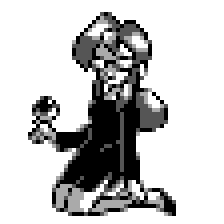
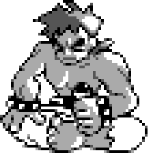
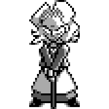
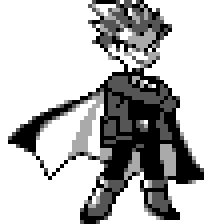
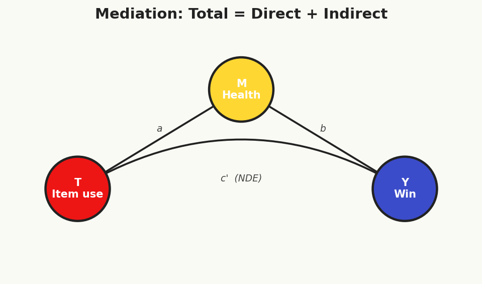
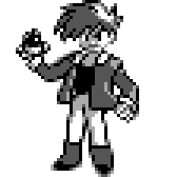

# Chapter 8: Indigo Plateau & Beyond --- Advanced Topics & Frontiers

<!-- FIG-CH08-ELITE4 -->

<figure><figcaption>Lorelei</figcaption></figure>
<figure><figcaption>Bruno</figcaption></figure>
<figure><figcaption>Agatha</figcaption></figure>
<figure><figcaption>Lance</figcaption></figure>

---

*The road from Viridian City narrows into a winding mountain path. Rock walls rise on either side, and the air grows colder with every step. Behind you lies the entire Kanto region --- eight Gym Badges earned, each one representing a different tool in your causal inference arsenal. Potential outcomes. Randomized experiments. DAGs and d-separation. Matching and propensity scores. Regression and doubly robust estimation. Instrumental variables and regression discontinuity. Difference-in-differences and synthetic control.*

*Ahead lies the Indigo Plateau.*

*You push through the gates and step into a vast, echoing hall. A League official checks your Badge case and nods. "Eight badges. You're cleared to challenge the Elite Four." She pauses. "But I should warn you --- each member guards a frontier of causal inference that most trainers never reach. Lorelei will test your understanding of mechanisms. Bruno will ask whether everyone responds the same way. Agatha will haunt you with the specter of unobserved confounding. And Lance... Lance will shatter your most basic assumption about how units interact."*

*She steps aside. "Beyond them waits the Champion. He thinks he knows everything about causation. Prove him wrong."*

*You take a deep breath. You adjust your bag. You walk through the first door.*

---

## 8.1 Mediation Analysis: Lorelei's Ice Chamber

<!-- FIG-CH08-MED -->
<figure>

<figcaption>Mediation: total effect = direct (NDE) + indirect through M (NIE).</figcaption>
</figure>

*The chamber is cold. Ice crystals hang from the ceiling, refracting light into prismatic arcs. Lorelei sits on a throne of frozen stalagmites, a Dewgong resting at her side. She adjusts her glasses and studies you.*

*"Most trainers," she says, "are satisfied knowing* that *a treatment works. I want to know* how. *Through what pathways does a cause produce its effect? Can you freeze out the direct path and isolate the indirect one?"*

*She gestures to the battlefield. "Show me you understand mechanisms."*

### Total, Direct, and Indirect Effects

In Chapters 1 through 7, we focused on estimating the **total effect** of a treatment $D$ on an outcome $Y$. But in many settings, we want to understand the **mechanism** --- the causal pathway through which the effect operates. Mediation analysis decomposes the total effect into a **direct effect** (the pathway from $D$ to $Y$ that does not pass through a specified mediator $M$) and an **indirect effect** (the pathway that operates through $M$).

Consider a concrete example from the Elite Four challenge. Suppose we want to understand whether using healing items ($D$) during Elite Four battles affects the probability of defeating all four members ($Y$). One plausible mechanism is that items maintain Pokemon health ($M$) between battles, which in turn affects the probability of winning later rounds. The question is: does item use affect outcomes *only* through health maintenance, or does it also have a direct effect --- perhaps through strategic confidence or reduced anxiety?

The causal graph is:

$$D \longrightarrow M \longrightarrow Y$$
$$D \longrightarrow Y$$

The total effect decomposes as:

$$\text{Total Effect} = \text{Direct Effect} + \text{Indirect Effect}$$

### The Baron-Kenny Approach and Its Limitations

The classic approach to mediation, introduced by Baron and Kenny (1986), proceeds in three regressions:

1. Regress $Y$ on $D$: $Y = \alpha_1 + c \cdot D + \epsilon_1$
2. Regress $M$ on $D$: $M = \alpha_2 + a \cdot D + \epsilon_2$
3. Regress $Y$ on $D$ and $M$: $Y = \alpha_3 + c' \cdot D + b \cdot M + \epsilon_3$

The indirect effect is estimated as $\hat{a} \times \hat{b}$ (or equivalently, $\hat{c} - \hat{c}'$), and the direct effect is $\hat{c}'$. This approach is intuitive and remains widely used, but it suffers from serious limitations:

- It assumes **linear models** and **no interaction** between $D$ and $M$.
- It conflates causal mediation with statistical mediation; $c - c'$ need not equal the causal indirect effect when models are nonlinear.
- It provides no formal framework for identifying assumptions.
- It does not define what the "direct" and "indirect" effects *mean* in terms of potential outcomes.

> **Blue's Mistake: The Baron-Kenny Trap**
>
> Blue runs the three regressions and announces: "The indirect effect through Pokemon health is $0.15$, and the direct effect is $0.08$. Therefore 65% of the total effect operates through the health mechanism." But Blue's mediator --- average team HP entering each battle --- is also affected by the *opponent's* strategy, which independently affects $Y$. There is a confounder of the $M \to Y$ relationship that Blue has not accounted for. In the presence of such confounders, the Baron-Kenny decomposition does not recover causal mediation effects. Blue needs the formal potential outcomes framework for mediation.

### Causal Mediation: Natural Direct and Indirect Effects

The modern framework for causal mediation defines effects using **nested counterfactuals** (Robins & Greenland, 1992; Pearl, 2001; Imai, Keele & Tingley, 2010). Let $M(d)$ denote the potential value of the mediator when treatment is set to $d$, and let $Y(d, m)$ denote the potential outcome when treatment is $d$ and the mediator is set to $m$.

The **Natural Direct Effect (NDE)** is:

$$\text{NDE} = E[Y(1, M(0)) - Y(0, M(0))]$$

This is the effect of changing treatment from 0 to 1 while holding the mediator at the value it *would naturally take* under control. It captures the portion of the treatment effect that does not operate through $M$.

The **Natural Indirect Effect (NIE)** is:

$$\text{NIE} = E[Y(1, M(1)) - Y(1, M(0))]$$

This is the effect of changing the mediator from its natural value under control to its natural value under treatment, while holding treatment fixed at 1. It captures the portion of the effect that operates through the change in $M$ induced by treatment.

The total effect decomposes exactly:

$$\text{TE} = \text{NDE} + \text{NIE}$$

since $E[Y(1, M(1)) - Y(0, M(0))] = E[Y(1, M(0)) - Y(0, M(0))] + E[Y(1, M(1)) - Y(1, M(0))]$.

> **Professor Oak Explains: Nested Counterfactuals**
>
> The expression $Y(1, M(0))$ is a *nested* counterfactual: it asks what the outcome would be if treatment were set to 1 but the mediator took the value it would have taken under treatment 0. This quantity is fundamentally unobservable --- even in a randomized experiment, we cannot simultaneously set $D = 1$ and force $M$ to behave as if $D = 0$. Identification therefore requires strong assumptions beyond what randomization alone provides.

### Sequential Ignorability

Imai, Keele, and Tingley (2010) showed that identification of NDE and NIE requires **sequential ignorability**:

1. **Treatment ignorability**: $\{Y(d', m), M(d)\} \perp\!\!\!\perp D \mid X$ for all $d, d', m$.
2. **Mediator ignorability**: $Y(d', m) \perp\!\!\!\perp M \mid D = d, X$ for all $d, d', m$.

The first assumption is satisfied by randomization of treatment (or conditional on covariates $X$). The second is far more demanding: conditional on treatment and covariates, the mediator must be as-if randomly assigned. This rules out unobserved confounders of the $M \to Y$ relationship --- a strong requirement, since the mediator is typically *not* randomly assigned.

Under sequential ignorability with a linear model, the mediation effects reduce to the familiar product-of-coefficients $a \times b$. But the framework extends naturally to nonlinear and nonparametric settings.

### Nonparametric and Sensitivity Approaches

When linearity fails (e.g., binary outcomes, count data), the product-of-coefficients method is inconsistent. Imai et al. (2010) propose a general nonparametric identification strategy and provide the `mediation` R package for estimation.

Because the sequential ignorability assumption for the mediator is untestable, **sensitivity analysis for mediation** is critical. The key question is: how large would an unobserved confounder of $M \to Y$ need to be to explain away the estimated indirect effect? Imai et al. (2010) propose a sensitivity parameter $\rho$ --- the correlation between the error terms in the mediator and outcome equations --- and show how the estimated indirect effect varies as $\rho$ departs from zero.

### Pokemon Application

In the Elite Four data, we observe:

- $D$: whether trainer used healing items (Full Restores, Max Potions) between battles
- $M$: average team HP percentage entering each subsequent battle
- $Y$: whether trainer defeated all four Elite Four members
- $X$: trainer level, number of badges, team composition

Estimating the mediation model, we find that roughly 60% of the total effect of item use operates through the health maintenance pathway (NIE), while 40% operates through other channels (NDE) --- perhaps strategic confidence or the ability to use offensive items instead of healing during battle. The sensitivity analysis reveals that a confounder with $\rho > 0.3$ would be sufficient to nullify the indirect effect, suggesting the mediation finding is moderately robust but not ironclad.

*Lorelei's Dewgong falls. She nods approvingly. "You understand that knowing a treatment works is not enough. Understanding* how *it works --- and being honest about the assumptions required to decompose effects --- is the mark of a serious researcher."*

*She steps aside. The door to the next chamber opens.*

---

## 8.2 Sensitivity Analysis: Agatha's Ghost Chamber

*The room is dark. Purple mist coils along the floor. Somewhere in the shadows, something cackles. Then Agatha materializes from the fog, leaning on her cane, a Gengar grinning at her shoulder.*

*"Every study you have ever read," she whispers, "rests on the assumption that you have measured everything that matters. But what about the things you* cannot *see? The ghosts in your model? The unobserved confounders that lurk behind every observational estimate?"*

*Her Gengar's eyes glow red. "Can your estimates survive my ghosts?"*

### The Ghost of Unobserved Confounding

Throughout this book, we have relied on assumptions like conditional ignorability (selection on observables), the exclusion restriction (IV), and the parallel trends assumption (DiD). Each of these assumptions is, at its core, a claim about what we *do not need to worry about* --- that there are no unobserved confounders, no direct effects of instruments, no differential trends. But these assumptions are untestable. Sensitivity analysis asks: **how robust are our conclusions to violations of these assumptions?**

Rather than treating identification assumptions as binary (satisfied or not), sensitivity analysis parameterizes the degree of violation and examines how the estimated effect changes. If the estimate survives large violations, we gain confidence; if it collapses under small perturbations, we should be cautious.

### Rosenbaum Bounds

Rosenbaum (2002) developed a sensitivity analysis framework for matched observational studies. The key parameter is $\Gamma$ (capital gamma), which measures how much an unobserved confounder could alter the odds of treatment assignment.

In a randomized experiment, two matched units with identical observed covariates have the same probability of treatment. An unobserved confounder could distort this. Rosenbaum's framework asks: if two matched units could differ in treatment odds by a factor of at most $\Gamma$, would our conclusion still hold?

Formally, for matched pair $(i, j)$ with identical observed covariates:

$$\frac{1}{\Gamma} \leq \frac{P(D_i = 1 \mid X_i) / P(D_i = 0 \mid X_i)}{P(D_j = 1 \mid X_j) / P(D_j = 0 \mid X_j)} \leq \Gamma$$

When $\Gamma = 1$, there is no hidden bias (equivalent to a randomized experiment). As $\Gamma$ increases, we allow more hidden bias. For each value of $\Gamma$, we compute the worst-case $p$-value. The **sensitivity value** is the smallest $\Gamma$ at which the result becomes statistically insignificant.

> **Professor Oak Explains: Interpreting $\Gamma$**
>
> A sensitivity value of $\Gamma = 2$ means that an unobserved confounder would need to double the odds of treatment for one unit relative to its match in order to explain away the observed effect. Whether $\Gamma = 2$ is "large" depends on context --- in a well-designed study with rich covariates, a confounder doubling the odds of treatment (beyond what observed variables already explain) may be implausible. In a study with sparse controls, $\Gamma = 2$ may be easy to imagine.

### The E-value

VanderWeele and Ding (2017) introduced the **E-value** as a model-free measure of the minimum strength of association that an unobserved confounder would need to have with both the treatment and the outcome to fully explain away an observed effect.

For an observed risk ratio $\text{RR}$, the E-value is:

$$E\text{-value} = \text{RR} + \sqrt{\text{RR} \times (\text{RR} - 1)}$$

The E-value has an elegant interpretation: it is the minimum value of the risk ratio that an unmeasured confounder would need to have with *both* the treatment and the outcome (conditional on measured covariates) to reduce the observed association to the null.

For example, if we observe $\text{RR} = 2.5$ for the effect of Exp. Share on defeating the Elite Four, the E-value is:

$$E\text{-value} = 2.5 + \sqrt{2.5 \times 1.5} = 2.5 + \sqrt{3.75} \approx 2.5 + 1.94 = 4.44$$

This means an unobserved confounder would need to have a risk ratio of at least 4.44 with both Exp. Share use and Elite Four victory to explain away the observed $\text{RR} = 2.5$. That is a very strong confounder. For reference, the E-value can also be computed for the lower bound of the confidence interval, providing a more conservative assessment.

### Oster Bounds (Coefficient Stability)

Oster (2019) developed a sensitivity analysis based on **coefficient stability** --- how much the treatment effect estimate changes as additional controls are added. The intuition is simple: if adding observed controls barely moves the coefficient, then unobserved confounders (which are presumably "similar" to observed ones) would also barely move it.

The key parameter is $\delta$, which represents the ratio of selection on unobservables to selection on observables. Oster's approach assumes a maximum $R^2$ for the hypothetical regression that includes all confounders (observed and unobserved), denoted $R^2_{\text{max}}$, and computes the bias-adjusted treatment effect as a function of $\delta$ and $R^2_{\text{max}}$.

The identified set is constructed by varying $\delta$. If $\delta = 1$ means unobservables are as important as observables, and the bias-adjusted effect remains meaningfully different from zero at $\delta = 1$ (with $R^2_{\text{max}} = 1.3 \times \tilde{R}^2$, where $\tilde{R}^2$ is the $R^2$ from the controlled regression), the result is considered robust.

### Manski Partial Identification Bounds

Manski (1990, 2003) took a fundamentally different approach: rather than asking "how large must the bias be to explain the result," he asked "what can we learn with minimal assumptions?" His **worst-case bounds** place no restrictions on the relationship between treatment and potential outcomes among the untreated (or vice versa).

For a binary treatment $D$ and bounded outcome $Y \in [y_{\min}, y_{\max}]$:

$$E[Y(1)|D=1] P(D=1) + y_{\min} P(D=0) \leq E[Y(1)] \leq E[Y(1)|D=1] P(D=1) + y_{\max} P(D=0)$$

$$E[Y(0)|D=0] P(D=0) + y_{\min} P(D=1) \leq E[Y(0)] \leq E[Y(0)|D=0] P(D=0) + y_{\max} P(D=1)$$

These bounds are wide --- often too wide to be informative --- but they are **assumption-free** (given random sampling). They represent the price of honesty.

### Lee Bounds for Sample Selection

Lee (2009) developed bounds for settings with **sample selection** or attrition --- where the outcome is only observed for a subset of the population, and the selection is potentially affected by treatment. For example, if item use affects whether trainers make it to the later Elite Four battles (where we measure performance), then naive estimation suffers from selection bias.

Lee bounds assume only **monotonicity of selection**: treatment can only move selection in one direction (e.g., item use can only increase the probability of reaching later battles, never decrease it). Under this assumption, bounds on the treatment effect are obtained by trimming the "excess" observations in the group with higher selection rates.

### Worked Example

Suppose we estimate that Exp. Share increases the probability of defeating the Elite Four by a factor of $\text{RR} = 1.8$ (a propensity-score-matched study from Chapter 4 data). We compute:

**E-value:**
$$E = 1.8 + \sqrt{1.8 \times 0.8} = 1.8 + \sqrt{1.44} = 1.8 + 1.2 = 3.0$$

An unobserved confounder would need $\text{RR} \geq 3.0$ with both treatment and outcome to explain away the result.

**Rosenbaum bounds:** In our matched sample, the result remains significant at $\alpha = 0.05$ up to $\Gamma = 1.6$. At $\Gamma = 1.7$, the worst-case $p$-value crosses $0.05$. This means a moderate unobserved confounder (increasing treatment odds by 70%) could potentially explain the finding.

**Oster bounds:** The coefficient on Exp. Share moves from $0.42$ (no controls) to $0.35$ (full controls), while $R^2$ increases from $0.05$ to $0.22$. At $\delta = 1$ and $R^2_{\max} = 0.29$, the bias-adjusted estimate is $0.30$, still meaningfully different from zero.

Taken together, these analyses suggest the Exp. Share effect is moderately robust but not impervious to confounding --- a common and honest conclusion.

*Agatha's Gengar fades into the shadows. The old woman studies you. "You didn't flinch when I showed you the ghosts. Good. A researcher who pretends there are no unobserved confounders is more dangerous than one who knows they exist."*

*She taps her cane on the floor. The mist parts, revealing the third door.*

---

## 8.3 Heterogeneous Treatment Effects: Bruno's Fighting Ring

*The chamber shakes. Two Machamp are sparring in the center of a raised platform. Bruno sits cross-legged at the edge, shirtless, his arms folded across his chest. He opens one eye as you enter.*

*"You've spent this entire journey estimating average effects," he says. "But not everyone is average. Different fighters respond differently to the same training. The question is not just* does the treatment work *--- it is* for whom does it work, and how much?"

*He stands. "Show me you can see the differences."*

### Beyond the Average

The Average Treatment Effect is a useful summary, but it masks potentially enormous variation. A drug that helps half the population and harms the other half has an ATE of zero --- the same as a drug that does nothing for anyone. Policy-makers, clinicians, and trainers all want to know: **who benefits, who is harmed, and who is unaffected?**

The **Conditional Average Treatment Effect (CATE)** captures this heterogeneity:

$$\text{CATE}(x) = E[Y(1) - Y(0) \mid X = x]$$

where $X$ is a vector of pre-treatment characteristics. The CATE is the average treatment effect for the subpopulation with characteristics $X = x$. If we could estimate CATE as a function of $x$, we would have a complete picture of treatment effect heterogeneity.

Traditional approaches to heterogeneity involve specifying interaction terms (e.g., $D \times X$) in a regression. But this requires the researcher to pre-specify which variables matter and what functional form the interactions take. With high-dimensional $X$, the number of possible interactions is enormous, and pre-specification becomes guesswork.

### Causal Forests

Wager and Athey (2018) introduced **causal forests**, a machine learning method specifically designed to estimate CATE. The key innovation is adapting random forests --- a powerful nonparametric prediction method --- to the causal inference setting.

**Core idea.** A standard random forest predicts $E[Y \mid X = x]$ by partitioning the covariate space into leaves and averaging outcomes within each leaf. A causal forest instead estimates $E[Y(1) - Y(0) \mid X = x]$ by partitioning the covariate space into regions where treatment effects are most heterogeneous, and estimating the local treatment effect within each leaf.

**Honest estimation.** A critical innovation is **honesty** --- the sample is split so that one subsample determines the tree structure (which covariates to split on and where) and a separate subsample estimates the treatment effects within each leaf. This separation prevents overfitting: the tree structure cannot "peek" at the outcomes used for estimation.

Formally, for a new observation with covariates $x$, the causal forest estimate is:

$$\hat{\tau}(x) = \sum_{i=1}^{n} \alpha_i(x) \cdot Y_i$$

where the weights $\alpha_i(x)$ are determined by how often observation $i$ falls in the same leaf as $x$ across the ensemble of trees. Treated and control observations within each leaf contribute with opposite signs.

**Asymptotic properties.** Under regularity conditions (including honesty and a minimum leaf size that grows with $n$), Wager and Athey (2018) prove that:

$$\frac{\hat{\tau}(x) - \tau(x)}{\hat{\sigma}(x)} \xrightarrow{d} \mathcal{N}(0, 1)$$

This means causal forests produce valid confidence intervals for $\text{CATE}(x)$ --- a remarkable result for a machine learning method. The variance estimate $\hat{\sigma}^2(x)$ is obtained via an infinitesimal jackknife.

### Best Linear Projection (BLP)

Estimating $\hat{\tau}(x)$ for every $x$ is informative but can be hard to summarize. Chernozhukov, Demirer, Duflo, and Fernandez-Val (2020) proposed the **Best Linear Projection (BLP)** as a simple summary of heterogeneity. The BLP regresses the estimated CATE on covariates:

$$\hat{\tau}(X_i) = \beta_0 + \beta_1' X_i + \epsilon_i$$

If $\beta_1 = 0$, there is no detectable heterogeneity that can be explained linearly by $X$. The coefficients $\beta_1$ tell us which covariates are most associated with treatment effect variation.

### Sorted Group Average Treatment Effects (GATES)

The GATES approach (also from Chernozhukov et al., 2020) provides a nonparametric summary. The procedure is:

1. Estimate $\hat{\tau}(x)$ for all observations (e.g., using a causal forest).
2. Sort observations by their predicted CATE.
3. Divide into $K$ groups (e.g., quintiles).
4. Estimate the average treatment effect within each group.

If the predicted CATE is informative, we should see a monotonically increasing pattern across groups: the group predicted to benefit most should show the largest estimated effect.

> **Professor Oak Explains: The CLAN**
>
> The **Classification Analysis (CLAN)** complements GATES by asking: what are the *characteristics* of the most-affected and least-affected groups? After sorting by predicted CATE, we compare covariate means across the top and bottom groups. This reveals *who* benefits most, not just *that* heterogeneity exists. For policy purposes, CLAN is often the most actionable output.

### Policy Learning and Optimal Treatment Rules

Given an estimate of CATE, the natural next question is: **who should receive treatment?** This is the problem of **optimal treatment rules** or **policy learning** (Athey & Wager, 2021; Kitagawa & Tetenov, 2018).

An optimal treatment rule $\pi^*(x)$ assigns treatment to maximize welfare:

$$\pi^* = \arg\max_{\pi} E[Y(\pi(X))]$$

where $\pi(X) \in \{0, 1\}$ is a decision rule mapping covariates to treatment assignment. Under the simplest formulation, the optimal rule is to treat everyone with $\text{CATE}(x) > 0$ and withhold treatment from everyone with $\text{CATE}(x) < 0$.

In practice, constraints matter: budget constraints (treat at most 30% of the population), fairness constraints (the rule should not discriminate on protected characteristics), or simplicity constraints (the rule should be a short decision tree that practitioners can follow).

Athey and Wager (2021) develop a framework for **policy learning from observational data** using doubly robust scores, ensuring that the estimated optimal policy converges to the true optimal policy even when nuisance parameters are estimated with ML.

### Conformal Causal Inference

A recent development is the use of **conformal inference** for individual treatment effects (Lei & Candes, 2021). Traditional CATE estimation provides *average* effects conditional on $X$, but conformal methods can provide valid **prediction intervals** for individual treatment effects --- bounds that contain the true $\tau_i$ with specified probability. This is a promising frontier for individualized treatment decisions.

### Pokemon Application

Which types of trainers benefit most from Exp. Share? Using a causal forest on the Kanto trainer data, we estimate CATE as a function of trainer experience, team diversity (number of unique types), play style (offensive vs. defensive), and starting region.

The GATES analysis reveals striking heterogeneity:

| Quintile | Predicted CATE | Estimated ATE | 95% CI |
|:---|:---:|:---:|:---:|
| Q1 (lowest) | $-0.2$ to $0.3$ | $0.1$ | $[-0.3, 0.5]$ |
| Q2 | $0.3$ to $0.8$ | $0.5$ | $[0.1, 0.9]$ |
| Q3 | $0.8$ to $1.2$ | $1.0$ | $[0.5, 1.5]$ |
| Q4 | $1.2$ to $1.8$ | $1.5$ | $[0.9, 2.1]$ |
| Q5 (highest) | $1.8$ to $3.1$ | $2.7$ | $[1.9, 3.5]$ |

The CLAN analysis reveals that Q5 (highest benefit) consists predominantly of trainers with diverse teams (4+ types), moderate experience, and an offensive play style. The Exp. Share allows their underleveled team members to catch up, dramatically improving coverage across type matchups. Q1 (lowest benefit) consists of trainers who already have a concentrated, high-level team --- the Exp. Share dilutes experience without adding much.

The optimal treatment rule recommends Exp. Share for trainers with team diversity above the median and experience below the 75th percentile. Under this rule, expected badge count increases by 1.8 (vs. 0.9 under treat-all).

*Bruno nods. "Not every fighter needs the same training regimen. The master understands that individual differences are not noise to be averaged away --- they are signal to be understood."*

*He bows and steps aside. The third door creaks open. A chill runs down your spine.*

---

## 8.4 Interference & Spillovers: Lance's Dragon Chamber

*The final Elite Four chamber is vast --- an arena open to the sky, where dark clouds swirl overhead. Lance stands at the far end, his cape billowing, flanked by three Dragonite. As you enter, two of them turn to face you --- and each other.*

*"Your entire journey," Lance says, his voice carrying across the arena, "has relied on a single, foundational assumption: that one trainer's treatment does not affect another trainer's outcome. But dragons do not fight in isolation. My Dragonite share the battlefield. When one uses Earthquake, the other feels it too."*

*His eyes narrow. "What happens when SUTVA fails?"*

### The Stable Unit Treatment Value Assumption --- Revisited

Recall from Chapter 1 the **Stable Unit Treatment Value Assumption (SUTVA)**: each unit's potential outcome depends only on its own treatment assignment, not on the treatment assignments of other units. Formally, $Y_i(d_1, d_2, \ldots, d_n) = Y_i(d_i)$ for all $i$. SUTVA also requires no hidden variations of treatment.

SUTVA is often reasonable --- whether Ash uses Exp. Share should not affect Misty's badge count. But in many settings, it fails spectacularly:

- **Double battles**: using Earthquake damages your partner Pokemon.
- **Vaccination**: my vaccination protects not only me but also those around me (herd immunity).
- **Education interventions**: a trained teacher improves outcomes for students in her class, but also for teachers who collaborate with her.
- **Social programs**: job training for some workers may worsen outcomes for untrained workers competing for the same jobs.

When SUTVA fails, the standard potential outcomes framework breaks down. The potential outcome for unit $i$ depends on the entire treatment vector $\mathbf{d} = (d_1, \ldots, d_n)$, not just $d_i$. With $n$ units and binary treatment, there are $2^n$ possible treatment vectors --- far too many potential outcomes to estimate.

### Estimands Under Interference

To make progress, we need to define new causal estimands. Following Hudgens and Halloran (2008), the key effects under interference are:

**Direct effect**: the effect of changing unit $i$'s treatment, holding neighbors' treatments fixed.

$$\text{DE}(d_{-i}) = E[Y_i(1, d_{-i}) - Y_i(0, d_{-i})]$$

**Indirect (spillover) effect**: the effect of changing neighbors' treatments, holding unit $i$'s treatment fixed.

$$\text{IE}(d_i) = E[Y_i(d_i, \mathbf{1}_{-i}) - Y_i(d_i, \mathbf{0}_{-i})]$$

**Total effect**: the combined effect of changing both own and neighbors' treatments.

$$\text{TE} = E[Y_i(1, \mathbf{1}_{-i}) - Y_i(0, \mathbf{0}_{-i})]$$

**Overall effect**: the average effect of a treatment policy across the population.

### Exposure Mapping

To tame the $2^n$ complexity, we use **exposure mappings** --- functions that summarize the relevant aspects of others' treatments into a low-dimensional statistic. For unit $i$, define the effective exposure as:

$$g_i(\mathbf{d}) = f(d_i, \mathbf{d}_{N(i)})$$

where $N(i)$ is the set of unit $i$'s neighbors and $f$ is a known function. Common choices include:

- **Proportion treated among neighbors**: $g_i = (d_i, \bar{d}_{N(i)})$
- **Any neighbor treated**: $g_i = (d_i, \mathbf{1}[\exists j \in N(i) : d_j = 1])$
- **Number of treated neighbors**: $g_i = (d_i, \sum_{j \in N(i)} d_j)$

Under an exposure mapping assumption, the potential outcomes simplify: $Y_i(\mathbf{d}) = Y_i(g_i(\mathbf{d}))$.

### Partial Interference

A common and useful simplification is **partial interference** (Sobel, 2006): units can be grouped into clusters such that interference occurs *within* clusters but not *across* clusters. In our Pokemon setting, this is natural: interference occurs within a double battle (your two Pokemon affect each other) but not across separate battles.

Under partial interference, the treatment vector that matters for unit $i$ is only $\mathbf{d}_{C(i)}$ --- the treatments of units in $i$'s cluster $C(i)$. If clusters are small, the number of relevant treatment vectors is manageable.

### Two-Stage Randomization

Hudgens and Halloran (2008) proposed **two-stage randomization** as an experimental design for estimating effects under partial interference:

1. **Stage 1**: Randomly assign clusters to different treatment *intensities* (e.g., 30% treated vs. 70% treated).
2. **Stage 2**: Within each cluster, randomly assign individual units to treatment or control at the designated intensity.

This design identifies both direct and spillover effects. The direct effect is estimated by comparing treated and control units *within* the same cluster (same neighbors' treatment environment). The spillover effect is estimated by comparing units with the same individual treatment status *across* clusters with different treatment intensities.

### Network Interference

When interference propagates through a network (social connections, trade relationships, geographic proximity), the structure matters. **Network interference** models specify how effects propagate through edges of a graph.

Key challenges include:

- **Network endogeneity**: network connections may be formed based on the same variables that affect outcomes.
- **Propagation depth**: does interference extend to friends of friends? How far?
- **Strategic interaction**: units may anticipate spillovers and adjust behavior.

Aronow and Samii (2017) develop inverse probability weighted estimators for network experiments that are unbiased under specified exposure mapping assumptions.

### Double Battle Worked Example

Consider double battles in which two allied Pokemon ($A$ and $B$) each independently choose whether to use a multi-target move ($D_A, D_B \in \{0,1\}$). The outcome is total damage dealt by the pair. Multi-target moves hit the opponent but may also damage the ally (interference).

We observe data from 200 double battles with two-stage randomization. In Stage 1, battles are randomly assigned to "low multi-target" (20% probability) or "high multi-target" (80% probability) conditions. In Stage 2, within each battle, each Pokemon independently receives its multi-target assignment.

Results:

| Own Treatment | Partner's Treatment | Mean Total Damage |
|:---:|:---:|:---:|
| 0 | 0 | 145.2 |
| 1 | 0 | 178.6 |
| 0 | 1 | 132.8 |
| 1 | 1 | 161.4 |

**Direct effect** (partner untreated): $178.6 - 145.2 = 33.4$ (using multi-target moves increases own damage).

**Spillover effect** (own treatment = 0): $132.8 - 145.2 = -12.4$ (partner's multi-target move *reduces* your damage --- you take splash damage).

**Total effect**: $161.4 - 145.2 = 16.2$ (smaller than the direct effect because the spillover partially offsets).

This decomposition has clear strategic implications: multi-target moves are individually beneficial but impose negative externalities on partners. A coordinator who accounts for interference would use multi-target moves more selectively than a naive analysis (ignoring spillovers) would suggest.

*Lance recalls his Dragonite. "SUTVA is a convenient fiction. In a world where units interact --- and they always do --- you must account for the connections between them. Ignore interference at your peril."*

*He steps aside, and the final door swings wide. Beyond it, a familiar figure waits, arms crossed, smirking.*

---

## 8.5 Regression Kink Design

*Between the Elite Four and the Champion's chamber, there is a quiet corridor lined with bookshelves. A League librarian intercepts you. "Before you face the Champion, allow me to share a few more tools. You may need them."*

### Identification from Kinks

The Regression Discontinuity Design (Chapter 6) exploits a **jump** in the probability of treatment at a threshold. But what if treatment does not jump --- instead, the *intensity* of treatment changes slope?

A **Regression Kink Design (RKD)** exploits a kink (change in slope) in the relationship between a running variable $R$ and treatment intensity $D$ at a threshold $r_0$ (Card, Lee, Pei & Weber, 2015). Unlike RDD, where treatment is binary and jumps at the threshold, RKD applies when treatment is continuous and its relationship to the running variable has a slope change.

The key identification result is:

$$\tau_{\text{RKD}} = \frac{\lim_{r \downarrow r_0} \frac{dE[Y|R=r]}{dr} - \lim_{r \uparrow r_0} \frac{dE[Y|R=r]}{dr}}{\lim_{r \downarrow r_0} \frac{dE[D|R=r]}{dr} - \lim_{r \uparrow r_0} \frac{dE[D|R=r]}{dr}}$$

This is the ratio of the change in slope of the outcome to the change in slope of the treatment at the kink point.

### Pokemon Application

Consider the Kanto League training program, which provides subsidized training hours to trainers based on their performance score $R$. Below the threshold $r_0 = 50$, trainers receive a flat allocation of 10 hours per week. Above $r_0$, hours increase linearly with the score: $D(r) = 10 + 0.5(r - 50)$ for $r > 50$. There is no jump in training hours at the threshold --- only a change in slope from 0 to 0.5.

To estimate the effect of marginal training hours on battle performance, we estimate the change in slope of outcomes at $r_0$ and divide by the change in slope of treatment (0.5). If the outcome slope changes by 1.2 win-rate percentage points at the kink, the estimated effect of one additional training hour is $1.2 / 0.5 = 2.4$ percentage points.

### Bunching Estimators

A related method is the **bunching estimator** (Saez, 2010; Kleven & Waseem, 2013), which exploits excess mass at kink points in the density of the running variable. If agents optimize against a kinked budget constraint (e.g., a tax schedule), bunching at the kink reveals the behavioral response. While primarily used in public finance, the logic extends to any setting where agents respond to kinks in incentive schedules.

### Validity and Diagnostics

RKD requires smoothness of potential outcomes and the density of $R$ at the kink point --- analogous to RDD validity conditions but applied to derivatives rather than levels. Key diagnostics include testing for a kink in the density of $R$ (there should be none if the running variable is not manipulated) and checking for kinks in predetermined covariates at $r_0$.

---

## 8.6 Bounds and Partial Identification

### What Can We Learn Without Assumptions?

Manski (1990, 2003) posed a profound question: if we are unwilling to make any assumptions about the relationship between treatment assignment and potential outcomes, what can we still learn? The answer is **partial identification** --- we cannot point-identify the treatment effect, but we can bound it.

### Worst-Case Bounds

For a binary treatment $D$ and outcome $Y \in [y_{\min}, y_{\max}]$:

The mean potential outcome under treatment is bounded by:

$$E[Y(1)|D=1] \cdot P(D=1) + y_{\min} \cdot P(D=0) \leq E[Y(1)] \leq E[Y(1)|D=1] \cdot P(D=1) + y_{\max} \cdot P(D=0)$$

The first term, $E[Y(1)|D=1] \cdot P(D=1)$, is identified from data (the observed mean outcome among the treated, weighted by the probability of treatment). The second term replaces the *unidentified* component --- $E[Y(1)|D=0]$, which we cannot observe --- with its worst-case values ($y_{\min}$ and $y_{\max}$).

Similarly for the untreated potential outcome:

$$E[Y(0)|D=0] \cdot P(D=0) + y_{\min} \cdot P(D=1) \leq E[Y(0)] \leq E[Y(0)|D=0] \cdot P(D=0) + y_{\max} \cdot P(D=1)$$

The bounds on the ATE are obtained by subtracting:

$$\text{ATE} \in \left[ E[Y|D=1] P(D=1) + y_{\min} P(D=0) - E[Y|D=0] P(D=0) - y_{\max} P(D=1), \; \text{upper analog} \right]$$

### Monotone Treatment Response

The worst-case bounds are typically very wide. Manski and Pepper (2000) showed that adding the assumption of **monotone treatment response (MTR)** --- $Y_i(1) \geq Y_i(0)$ for all $i$ (treatment cannot hurt) --- can substantially tighten bounds.

Under MTR, $E[Y(1)|D=0] \geq E[Y(0)|D=0]$ (the treated potential outcome for the untreated is at least as large as their observed control outcome). This replaces the $y_{\min}$ lower bound with the observed $E[Y|D=0]$, dramatically narrowing the identified set.

### Lee Bounds for Sample Selection

Lee (2009) addressed the problem of **sample selection**: when the outcome is only observed for a selected subset, and selection is potentially affected by treatment. For example, wages are observed only for employed workers, and a job training program may affect employment.

Lee bounds require only **monotonicity of selection** --- the treatment can only increase (or only decrease) the probability that the outcome is observed. Under this assumption, bounds on the treatment effect are obtained by trimming the group with higher selection rates to equalize selection across treatment and control.

Formally, if treatment increases selection (more treated units have observed outcomes), the trimming proportion is:

$$p_0 = 1 - \frac{P(\text{selected} | D=0)}{P(\text{selected} | D=1)}$$

Trim the top or bottom $p_0$ fraction of the treatment group's outcome distribution to get upper and lower bounds.

### When Bounds Are Useful

Wide bounds may seem uninformative, but they can still rule out interesting hypotheses. If the entire identified set is positive, we can conclude that the treatment effect is beneficial even without point identification. If the bounds for a cheap intervention exclude zero, the policy implication may be clear even though we do not know the exact magnitude.

> **Professor Oak Explains: The Virtue of Honesty**
>
> Partial identification represents a philosophical stance: it is better to report what the data can actually support than to manufacture precision through strong (and potentially false) assumptions. As Manski (2003) wrote: "Better to have wide bounds that are honest than narrow confidence intervals that are based on incredible assumptions." When you report bounds, you are saying: "Given what I know for certain, the answer lies in this range." That is a powerful statement.

---

## 8.7 Causal Discovery

### Can We Learn the DAG from Data?

Throughout this textbook, we have *assumed* the causal graph (DAG) based on domain knowledge and theoretical reasoning. But what if we could **learn** the causal structure directly from data? This is the goal of **causal discovery** (or causal structure learning).

The motivation is clear: in complex systems with many variables, the correct DAG may not be obvious. If observational data contain enough information to infer at least some causal relationships, this could guide both research design and analysis.

### The PC Algorithm

The **PC algorithm** (named after its inventors, Peter Spirtes and Clark Glymour; Spirtes, Glymour & Scheines, 2000) is a constraint-based method that uses conditional independence tests to infer the causal graph.

**Step 1: Start with a complete undirected graph.** Connect every pair of variables with an edge.

**Step 2: Test pairwise independences.** For each pair $(X, Y)$, test whether $X \perp\!\!\!\perp Y$. If independent, remove the edge.

**Step 3: Test conditional independences.** For each remaining edge $(X, Y)$, test whether $X \perp\!\!\!\perp Y \mid Z$ for each possible conditioning set $Z$. If conditionally independent given some $Z$, remove the edge and record $Z$ as the *separating set*.

**Step 4: Orient edges.** Use the separating sets to identify v-structures (colliders). If $X - Z - Y$ with no edge between $X$ and $Y$, and $Z$ is *not* in the separating set of $(X, Y)$, then orient as $X \to Z \leftarrow Y$. Apply additional orientation rules to propagate directions.

### The FCI Algorithm

The PC algorithm assumes **causal sufficiency** --- no unobserved common causes. When latent variables may exist, the **FCI (Fast Causal Inference) algorithm** (Spirtes et al., 2000) extends PC to handle hidden confounders. FCI produces a **Partial Ancestral Graph (PAG)**, which represents an equivalence class of graphs that are compatible with the observed conditional independences and the possible presence of latent variables.

### GES: Score-Based Approach

An alternative to constraint-based methods is the **Greedy Equivalence Search (GES)** (Chickering, 2002). GES optimizes a score (e.g., BIC) over the space of DAG equivalence classes:

1. **Forward phase**: start with an empty graph and greedily add edges that most improve the score.
2. **Backward phase**: greedily remove edges that improve the score.

GES is consistent (recovers the true equivalence class in the large-sample limit) under the faithfulness assumption and is often more statistically powerful than constraint-based methods.

### The Faithfulness Assumption

All causal discovery methods rely on the **faithfulness assumption**: every conditional independence in the data reflects a structural feature of the DAG (specifically, d-separation). Equivalently, there are no "accidental" cancellations of causal paths that produce conditional independences not implied by the graph.

Faithfulness can fail when two causal paths have effects that exactly cancel (e.g., $X \to Y$ with coefficient $+1$ and $X \to M \to Y$ with combined coefficient $-1$, yielding $X \perp\!\!\!\perp Y$ despite two active causal paths). Such cancellations are measure-zero in parameter space but can occur in practice.

### Markov Equivalence Classes

A fundamental limitation of causal discovery from observational data: multiple DAGs can produce the same set of conditional independences. These observationally indistinguishable DAGs form a **Markov equivalence class**.

For example, $X \to Y$ and $X \leftarrow Y$ produce identical observational distributions (both imply $X \not\perp\!\!\!\perp Y$ and nothing else). Without additional assumptions (e.g., temporal ordering, experimental data, functional form restrictions), we cannot distinguish the causal direction.

Markov equivalence classes can be represented compactly as **Completed Partially Directed Acyclic Graphs (CPDAGs)**, where directed edges indicate orientations shared by all members of the class, and undirected edges indicate orientations that vary.

### Pokemon Application

Suppose we observe five trainer statistics: $\text{Hours Trained}$, $\text{Strategy Score}$, $\text{Team Level}$, $\text{Badges}$, and $\text{Confidence}$. We apply the PC algorithm with $\alpha = 0.05$ conditional independence tests.

The algorithm returns the following CPDAG:

- $\text{Hours Trained} \to \text{Team Level}$ (directed: more training raises levels)
- $\text{Hours Trained} - \text{Strategy Score}$ (undirected: cannot determine direction)
- $\text{Strategy Score} \to \text{Badges}$ (directed: part of a v-structure)
- $\text{Team Level} \to \text{Badges}$ (directed: part of a v-structure)
- $\text{Badges} \to \text{Confidence}$ (directed: oriented by propagation rule)

The v-structure $\text{Strategy Score} \to \text{Badges} \leftarrow \text{Team Level}$ is identified because $\text{Strategy Score} \perp\!\!\!\perp \text{Team Level}$ marginally, but $\text{Strategy Score} \not\perp\!\!\!\perp \text{Team Level} \mid \text{Badges}$ --- the hallmark of a collider.

> **Professor Oak Explains: The Limits of Discovery**
>
> Causal discovery is a powerful complement to domain knowledge, but it is not a replacement. The methods tell us which graphs are *consistent* with the data --- they cannot uniquely determine the true graph from observational data alone. Always combine algorithmic output with substantive knowledge. If the algorithm tells you "Hours Trained causes Strategy Score," but you know that strategic trainers also train more, the undirected edge is honest: the data alone cannot resolve this.

---

## 8.8 Causal Inference with Machine Learning

*The corridor opens into a vast library. Shelves stretch to the ceiling, filled with volumes on semiparametric theory, empirical process theory, and high-dimensional statistics. A sign reads: "The Machine Learning Wing."*

### The Promise and the Peril

Machine learning methods --- random forests, neural networks, gradient boosting, LASSO --- are extraordinary at prediction. But naive application of ML to causal inference fails for a subtle reason: **regularization bias**.

When we use LASSO to estimate a treatment effect, the penalty that improves prediction accuracy also shrinks the treatment coefficient toward zero. This bias does not vanish as $n \to \infty$ because the regularization is applied to the parameter of interest. The result is biased estimates with invalid confidence intervals.

The solution is not to abandon ML but to use it *carefully*, in ways that separate the ML estimation of nuisance parameters (confounders, propensity scores) from the estimation of the causal parameter of interest.

### Double/Debiased Machine Learning (DML)

Chernozhukov, Chetverikov, Demirer, Duflo, Hansen, Newey, and Robins (2018) developed **Double/Debiased Machine Learning (DML)**, a general framework for using ML in causal inference while maintaining valid statistical inference.

**The key ideas:**

1. **Neyman orthogonalization.** Construct a **moment condition** for the causal parameter that is **orthogonal** to (insensitive to) small errors in nuisance parameter estimation. This is the "debiasing" step.

2. **Cross-fitting.** Split the sample into $K$ folds. For each fold $k$, estimate nuisance parameters (propensity score, outcome model) on the other $K-1$ folds, then compute the causal estimate on fold $k$. Average across folds. This avoids overfitting bias.

**The partially linear model.** Consider:

$$Y = D\theta_0 + g_0(X) + U, \quad E[U|D,X] = 0$$
$$D = m_0(X) + V, \quad E[V|X] = 0$$

where $\theta_0$ is the causal parameter, $g_0(X)$ is the (potentially complex) confounding function, and $m_0(X)$ is the propensity score. The DML procedure:

1. Estimate $\hat{g}$ and $\hat{m}$ using any ML method (random forest, neural net, etc.) via cross-fitting.
2. Compute residuals: $\tilde{Y}_i = Y_i - \hat{g}(X_i)$ and $\tilde{D}_i = D_i - \hat{m}(X_i)$.
3. Estimate $\theta_0$ by regressing $\tilde{Y}$ on $\tilde{D}$:

$$\hat{\theta}_{\text{DML}} = \left(\frac{1}{n}\sum_i \tilde{D}_i^2\right)^{-1} \frac{1}{n}\sum_i \tilde{D}_i \tilde{Y}_i$$

Under regularity conditions, $\hat{\theta}_{\text{DML}}$ is $\sqrt{n}$-consistent and asymptotically normal, even when $\hat{g}$ and $\hat{m}$ converge at slower-than-$\sqrt{n}$ rates. This is the power of Neyman orthogonality: first-order errors in nuisance estimation do not contaminate the causal estimate.

> **Blue's Mistake: Naive ML**
>
> Blue trains a gradient-boosted model to predict badge count from all available features, including an Exp. Share indicator. He reports the coefficient on Exp. Share as the "causal effect." But the regularization in gradient boosting shrinks all coefficients, including the treatment effect, and the model optimizes for *prediction* accuracy, not *causal* estimation. The coefficient is biased, and the standard error from the boosting model is meaningless for inference. Blue needs DML.

### Targeted Learning (TMLE)

**Targeted Maximum Likelihood Estimation (TMLE)**, developed by van der Laan and Rose (2011), takes a different approach to combining ML with causal inference:

1. **Initial estimate.** Use ML (Super Learner --- an ensemble method) to estimate the outcome model $E[Y | D, X]$.
2. **Clever covariate.** Compute the "clever covariate" $H(D, X) = \frac{D}{\hat{e}(X)} - \frac{1-D}{1-\hat{e}(X)}$, where $\hat{e}(X)$ is the estimated propensity score.
3. **Targeting step.** Fit a logistic regression of $Y$ on $H(D,X)$ with offset $\text{logit}(\hat{Q}(D,X))$, where $\hat{Q}$ is the initial outcome model. This "tilts" the initial estimate to optimize the bias-variance tradeoff for the specific causal parameter.
4. **Substitution estimator.** Compute the ATE by averaging the updated predictions under treatment and control.

TMLE achieves the **semiparametric efficiency bound** --- no regular estimator can have smaller asymptotic variance. It is also **doubly robust**: consistent if either the outcome model or the propensity score model is correctly specified.

### Entropy Balancing and CBPS

Two methods that use optimization to improve covariate balance deserve mention:

**Entropy Balancing** (Hainmueller, 2012) finds weights for the control group that exactly match specified moments (means, variances, skewness) of the treatment group's covariate distribution. Unlike propensity score methods, which achieve balance *approximately* through modeling the treatment assignment, entropy balancing achieves exact balance by construction, subject to the specified moments.

**Covariate Balancing Propensity Score (CBPS)** (Imai & Ratkovic, 2014) estimates the propensity score model by jointly optimizing for correct specification of the treatment model *and* covariate balance. This addresses the disconnect in standard propensity score methods, where the propensity score is estimated to predict treatment (not to balance covariates), and good prediction does not guarantee good balance.

### Automatic Debiased Machine Learning

Chernozhukov, Newey, and Singh (2022) extend DML to a broader class of causal parameters --- not just average treatment effects, but any functional of the data distribution that can be expressed as a linear functional of a conditional expectation. Their **Automatic Debiased Machine Learning (AutoDML)** framework automatically constructs the Riesz representer needed for debiasing, using ML methods to learn the debiasing correction itself. This makes the framework applicable to a wide range of causal estimands (CATE, dose-response curves, policy effects) without requiring the researcher to manually derive the orthogonal moment condition for each new parameter.

---

## 8.9 Transportability & External Validity

*A map on the library wall catches your eye. It shows not just Kanto but the region to the west:* **Johto.** *A label reads: "Just because it works in Kanto doesn't mean it works in Johto."*

### The Problem of External Validity

Suppose we have conducted a rigorous randomized experiment in the Kanto region and estimated that Exp. Share increases badge count by 1.5 badges. A League official in Johto asks: can we apply this finding to Johto trainers?

The answer depends on *why* Johto might differ from Kanto. If the treatment effect is the same in both regions, the estimate transports directly. But Johto has different gyms, different Pokemon distributions, different trainer demographics, and different item availability. The treatment effect could plausibly differ.

This is the problem of **transportability** or **external validity**: when can causal conclusions from one population (the source) be applied to another (the target)?

### Selection Diagrams

Bareinboim and Pearl (2013) formalized transportability using **selection diagrams** --- DAGs augmented with special nodes $S$ (selection variables) that indicate where the source and target populations differ. An $S$-node pointing into a variable indicates that this variable's mechanism differs between populations.

For example, if Kanto and Johto differ in trainer demographics ($X$) but the causal mechanisms $D \to Y$ and $X \to Y$ are the same in both regions, the selection diagram has $S \to X$ but no $S$-nodes on other variables. In this case, the treatment effect is transportable after reweighting for the difference in covariate distributions.

### Formal Transportability Conditions

A causal effect is **directly transportable** if the selection variables do not affect any variable on the causal pathway from treatment to outcome (after conditioning on measured covariates). More generally, Pearl and Bareinboim (2011) provide a complete algorithm for determining whether a causal effect identified in the source can be expressed in terms of quantities estimable in the target.

The key insight: transportability fails when the mechanism by which treatment affects outcome *itself* differs between populations, and we cannot condition on the relevant effect modifiers.

### Reweighting for External Validity

When transportability holds after adjusting for covariate differences, the simplest approach is **reweighting** (Stuart, Cole, Bradshaw & Leaf, 2011; Tipton, 2013):

$$\text{ATE}_{\text{target}} = \sum_x \text{CATE}(x) \cdot P_{\text{target}}(X = x) = E_{\text{source}}\left[\text{CATE}(X) \cdot \frac{P_{\text{target}}(X)}{P_{\text{source}}(X)}\right]$$

In practice, we estimate the density ratio $P_{\text{target}}(X) / P_{\text{source}}(X)$ using logistic regression (predict source vs. target membership) and reweight the source-estimated CATE.

### Site Selection Bias in Multi-Site Experiments

A related problem arises in **multi-site experiments**, where a treatment is evaluated at multiple sites (schools, hospitals, regions) but the sites are not randomly selected. If sites that participate in the study are systematically different from those that do not, the average effect across study sites may not represent the effect in the broader population. Allcott (2015) and Gechter (2024) discuss methods for correcting site selection bias.

### Worked Example: Kanto to Johto

The Kanto Exp. Share experiment estimates $\hat{\tau}_{\text{Kanto}} = 1.5$ badges (ATE). We have covariate data from both regions. Key differences:

| Variable | Kanto Mean | Johto Mean |
|:---|:---:|:---:|
| Trainer experience (years) | 3.2 | 2.1 |
| Team diversity (types) | 3.8 | 4.5 |
| Urban/rural (% urban) | 62% | 41% |

Using the CATE estimates from our causal forest (Section 8.3) and reweighting to the Johto distribution, we obtain:

$$\hat{\tau}_{\text{Johto}} = \sum_{i \in \text{Kanto}} \hat{\tau}(X_i) \cdot \hat{w}_i = 1.9 \text{ badges}$$

The transported effect is *larger* than the Kanto estimate, driven by Johto's higher team diversity (which, as we found in Section 8.3, is associated with larger Exp. Share benefits). This illustrates a key lesson: external validity is not just about whether effects "generalize" but about *how* they change across populations.

> **Professor Oak Explains: The Limits of Transportability**
>
> Transportability requires that we know *what differs* between populations and that these differences are captured in measured covariates. If Johto gyms have fundamentally different battle mechanics that interact with Exp. Share in unmeasured ways, no amount of covariate reweighting will produce the correct transported effect. Transportability is a property of the causal structure, not just the statistical method.

---

## 8.10 Dynamic Treatment Regimes

### Time-Varying Treatments

All methods in Chapters 1--7 consider a single treatment at a single point in time. But many real-world treatments are **dynamic** --- administered sequentially over time, with each treatment decision depending on evolving patient (or trainer) status.

In the Elite Four challenge, a trainer faces four sequential battles: Lorelei, Bruno, Agatha, and Lance. Before each battle, the trainer decides whether to use healing items ($D_t \in \{0,1\}$ for $t = 1, 2, 3, 4$). The outcome $Y$ is whether the trainer defeats all four. Crucially, the **health of the trainer's team** entering battle $t$ ($L_t$) is both:

1. A **confounder** of the $D_t \to Y$ relationship (sicker teams benefit more from items).
2. **Affected by prior treatment** ($D_{t-1} \to L_t$): using items in battle $t-1$ improves health entering battle $t$.

This creates a vicious cycle: $L_t$ is a time-varying confounder affected by prior treatment. Standard regression adjustment for $L_t$ introduces **collider bias** (blocking the $D_{t-1} \to L_t \to Y$ pathway), while failing to adjust for $L_t$ leaves confounding bias. Neither adjusting nor not adjusting produces the correct answer.

> **Blue's Mistake: Adjusting for Post-Treatment Variables (Again)**
>
> Blue controls for team health at every stage in a regression and finds no effect of item use. "Items don't work!" he announces. But by conditioning on $L_t$ (health entering battle $t$), Blue has blocked the very pathway through which prior item use operates. This is the time-varying version of the bad controls problem from Chapter 3. The solution requires specialized methods that handle time-varying confounders.

### Marginal Structural Models (MSM)

Robins, Hernan, and Brumback (2000) introduced **Marginal Structural Models** to handle time-varying confounding. The key idea is **inverse probability of treatment weighting (IPTW)** applied to the entire treatment *history*.

For each individual $i$ at each time $t$, compute the probability of their actual treatment given their history:

$$w_i = \prod_{t=1}^{T} \frac{1}{P(D_{it} = d_{it} \mid \bar{D}_{i,t-1}, \bar{L}_{i,t}, X_i)}$$

where $\bar{D}_{i,t-1}$ is the treatment history up to $t-1$ and $\bar{L}_{i,t}$ is the covariate history up to $t$. These weights create a pseudo-population in which time-varying confounders no longer predict treatment --- analogous to what randomization achieves in a single-period setting.

In the weighted pseudo-population, a simple regression of $Y$ on the treatment history (parameterized as a marginal structural model, e.g., $E^w[Y | \bar{D}] = \beta_0 + \beta_1 \sum_t D_t$) yields consistent estimates of the causal effect of the treatment regime.

**Stabilized weights** replace the numerator 1 with $P(D_{it} \mid \bar{D}_{i,t-1}, X_i)$ --- the probability of treatment given history but *not* conditioning on time-varying confounders. This reduces weight variability without introducing bias.

### G-Computation (G-Formula)

Robins (1986) introduced the **g-computation algorithm** (also called the g-formula), which identifies the effect of a dynamic treatment regime by iterating expectations backward through time:

$$E[Y(\bar{d})] = \sum_{l_T} \cdots \sum_{l_1} E[Y | \bar{D} = \bar{d}, \bar{L} = \bar{l}] \prod_{t=1}^{T} P(L_t = l_t | \bar{D}_{t-1} = \bar{d}_{t-1}, \bar{L}_{t-1} = \bar{l}_{t-1})$$

G-computation models the full joint distribution of outcomes and confounders under a specified treatment regime. It requires correct specification of all conditional distributions but does not suffer from extreme weights.

### Structural Nested Models

**Structural Nested Mean Models (SNMMs)** (Robins, 1994) provide a third approach. They model the causal effect of treatment at each time point, conditional on the past. The "blip function" $\gamma_t(\bar{d}_{t-1}, \bar{l}_t) = E[Y(\bar{d}_t, \mathbf{0}_{t+1:T}) - Y(\bar{d}_{t-1}, 0, \mathbf{0}_{t+1:T}) | \bar{D}_{t-1} = \bar{d}_{t-1}, \bar{L}_t = \bar{l}_t]$ captures the effect of treatment at time $t$ for individuals with a specific history. Estimation proceeds via g-estimation.

### Optimal Dynamic Treatment Regimes

Given estimates of treatment effects at each stage, we can search for the **optimal dynamic treatment regime** --- a sequence of decision rules $(\pi_1, \pi_2, \ldots, \pi_T)$ where $\pi_t(\bar{l}_t, \bar{d}_{t-1})$ specifies treatment at time $t$ as a function of the history. Methods include:

- **Q-learning**: backward induction starting from the final stage, estimating the optimal action at each stage given future optimal behavior (Murphy, 2005).
- **Outcome-weighted learning**: directly maximizes a value function using classification methods (Zhao et al., 2012).

### Pokemon Application

In the Elite Four challenge, we model item use across four sequential battles. Using an MSM with stabilized IPTW weights, we estimate:

| Regime | $E[Y(\bar{d})]$ (prob. of full sweep) |
|:---|:---:|
| Never use items $(0,0,0,0)$ | 0.22 |
| Always use items $(1,1,1,1)$ | 0.61 |
| Use only before battles 3 & 4 $(0,0,1,1)$ | 0.54 |
| Optimal dynamic regime | 0.68 |

The optimal dynamic regime, estimated via Q-learning, prescribes: use items before battle $t$ if average team HP entering the battle is below 55% *or* if the upcoming opponent has a type advantage. This personalized rule outperforms even "always use items" because it conserves items for situations where they are most needed, and the g-formula reveals that the marginal benefit of items is much larger when entering a battle with low HP ($\Delta = 0.25$) versus high HP ($\Delta = 0.05$).

---

## 8.11 The Champion Battle: Blue's Causal Fallacies

<!-- FIG-CH08-BLUE -->
<figure style="float:right; margin:0 0 12px 16px; max-width:140px;">

<figcaption style="font-size:0.85em; text-align:center;">Rival Blue, the Champion</figcaption>
</figure>

*You step through the final door and into a blaze of light. The Champion's chamber is a grand arena, cameras flashing, a crowd roaring. And there, standing at the far end with his arms crossed and that infuriating smirk, is Blue.*

*"So you made it," he says. "But can you beat me? I've studied the data. I know everything about causation."*

*Professor Oak's voice crackles through the arena speakers: "Six rounds. In each round, Blue will make a causal claim. Identify the fallacy. Propose the correct method. Score four out of six to earn the Championship."*

*The stadium lights focus. The battle begins.*

---

### Round 1: The Starter Selection

**Blue's Claim:** "I analyzed 5,000 League records. Trainers who chose Squirtle average 6.8 badges. Charmander trainers average 5.9 badges. Squirtle is objectively the best starter."

**The Fallacy: Confounding.**

This is the original sin of causal inference --- the mistake Blue has been making since Chapter 1. Trainers do not randomly choose starters. Squirtle is disproportionately chosen by trainers from Cerulean City, who come from wealthier families with better training resources. The association between Squirtle and badges is confounded by socioeconomic background.

**The Correct Approach:** To estimate the causal effect of starter choice, we need either a randomized experiment (randomly assign starters to trainers) or an observational study that adjusts for confounders. A DAG reveals that wealth, hometown, and prior Pokemon experience are common causes of both starter choice and badge count. Using methods from Chapters 4--5 (matching, propensity score weighting, or doubly robust estimation), we can adjust for these confounders. The adjusted effect of Squirtle vs. Charmander may be much smaller --- or zero.

*Blue's Squirtle takes a hit. Five rounds remain.*

---

### Round 2: The Elite Four Paradox

**Blue's Claim:** "Among trainers who made it to the Elite Four, those who trained the hardest actually have *lower* win rates. Hard work doesn't pay off at the highest level."

**The Fallacy: Collider Bias (Selection Bias).**

"Making it to the Elite Four" is a **collider** --- it is caused by both hard work *and* natural talent. Conditioning on this collider (restricting the sample to Elite Four challengers) induces a spurious negative association between hard work and talent. Among those who made it, the hard workers tend to be less talented (they compensated with effort), and the less hard-working tend to be more talented (they made it on ability alone). The negative association between hard work and win rate within this selected group is an artifact of collider bias, not evidence that hard work is harmful.

**The Correct Approach:** Analyze the relationship between training effort and win rate in the *full* population, not the selected subsample. Alternatively, explicitly model the selection process using methods like Heckman correction (Chapter 5 extension), Lee bounds (Section 8.6), or principal stratification.

*Blue's Pidgeot goes down.*

---

### Round 3: The Cave Training Anecdote

**Blue's Claim:** "I trained in Cerulean Cave for a month and then won the Championship. Cave training works --- I'm living proof."

**The Fallacy: Selection Bias + Anecdotal Evidence.**

Blue is a single observation --- a sample size of one. His experience tells us nothing about the *average* effect of cave training. Moreover, Blue selected himself into cave training; he is not a random trainer. He is the grandson of Professor Oak, has access to exceptional resources, and possesses an extraordinary Pokemon team. His success may have nothing to do with cave training.

**The Correct Approach:** To estimate the effect of cave training, we need a controlled study. At minimum, a matched comparison with similar trainers who did not train in the cave. Ideally, a randomized experiment or a quasi-experimental design (e.g., exploiting a natural experiment such as random cave closures as an instrument for cave training access).

*Blue's Alakazam faints.*

---

### Round 4: The Potion Paradox

**Blue's Claim:** "My data shows that trainers who use more Potions during battles have *more* losses. Potions cause losing."

**The Fallacy: Reverse Causality.**

The causal arrow runs the wrong way. Trainers use Potions *because* they are losing (their Pokemon are taking damage), not the other way around. Potion use is a *consequence* of battle difficulty, not a *cause* of losses. The observed correlation between Potion use and losses is real, but the causal interpretation is backward.

**The Correct Approach:** To estimate the causal effect of Potion use on battle outcomes, we need to address the endogeneity. An instrument (e.g., random variation in Potion prices across PokeMarts) could break the reverse causality. Alternatively, a randomized experiment where trainers are assigned Potion strategies before battles begin would identify the causal effect.

*Blue's Arcanine falls.*

---

### Round 5: Simpson's Gym Paradox

**Blue's Claim:** "I checked the data: Water types beat Rock types at a higher overall rate than Fire types do. But weirdly, Fire types do better than Water types against Rock types in *every single gym*. The overall data must be wrong --- Water types are clearly better."

**The Fallacy: Simpson's Paradox.**

This is a textbook case of Simpson's Paradox (Chapter 3). The overall association reverses when conditioning on gym. The explanation: Water-type trainers disproportionately challenge gyms where Rock types are rarer and weaker (giving them a lower overall encounter rate with strong Rock types), while Fire-type trainers disproportionately challenge Rock-heavy gyms (Pewter City, Victory Road). Within any given gym, Fire types perform better, but the aggregated data reverse the relationship because of the non-random distribution of gym selection.

**The Correct Approach:** The correct comparison depends on the causal question. If we want to know "Which type is better at beating Rock types in a specific matchup?", the gym-specific (conditional) analysis is correct. The aggregated analysis is misleading because it is confounded by gym selection. A DAG clarifies: Gym Choice is a common cause of both Type Matchup and Win Rate.

*Blue's Exeggutor is defeated.*

---

### Round 6: The Badge Control

**Blue's Claim:** "I ran a regression of Elite Four performance on Exp. Share use, controlling for number of badges, team level, win rate, and total battles fought. After controlling for everything, Exp. Share has no significant effect. It's useless."

**The Fallacy: Bad Controls (Post-Treatment Bias).**

Badges, team level, win rate, and total battles are all **post-treatment** variables --- they are *caused by* Exp. Share use. Controlling for them blocks the causal pathways through which Exp. Share operates. Of course the coefficient on Exp. Share shrinks to zero: Blue has adjusted away the very mechanism of the treatment.

The DAG is: $\text{Exp. Share} \to \text{Team Level} \to \text{Badges} \to \text{Elite Four Performance}$. Controlling for Team Level and Badges removes the indirect effect entirely.

**The Correct Approach:** Only control for **pre-treatment** covariates: trainer experience prior to receiving Exp. Share, starting Pokemon, hometown, and other baseline characteristics. Never control for variables that lie on the causal pathway from treatment to outcome. If you want to understand the *mechanism* (does Exp. Share work through team level?), use the mediation analysis framework from Section 8.1 --- do not simply "control for" the mediator.

*Blue's final Pokemon --- his starter, that Squirtle from Chapter 1, now a Blastoise --- falls.*

---

*The arena erupts. Professor Oak's voice booms: "Six for six. Flawless."*

*Blue stands frozen for a moment. Then, slowly, he uncrosses his arms. "I... I was making the same mistakes the whole time, wasn't I? Confounding. Colliders. Reverse causality. Bad controls." He pauses. "I was so focused on the data that I forgot to think about the* structure."

*Oak appears at the edge of the arena. He places a hand on Blue's shoulder. "The data never speaks for itself. It always needs a causal framework to interpret it." He turns to you. "And you've shown that you have one."*

*He opens a case. Inside: a golden badge, larger than the others, engraved with a stylized DAG.*

*"You are the Causal Inference Champion of the Kanto Region."*

---

## 8.12 Further Reading: The Frontier Beyond

The topics in this chapter are active research frontiers. Each one could fill an entire textbook. Here, we point you toward the cutting edge.

### Causal Representation Learning and Causal Abstraction

Traditional causal inference assumes that the relevant variables are already defined and measured. But what if we need to *learn* the right causal variables from raw data (images, text, time series)? **Causal representation learning** (Scholkopf et al., 2021) aims to recover causal variables and their relationships from high-dimensional observations. **Causal abstraction** (Beckers & Halpern, 2019; Rubenstein et al., 2017) studies how causal models at different levels of granularity relate to each other --- a DAG of molecular interactions and a DAG of symptoms may describe the same system at different scales.

### Causal Inference for LLMs and AI Fairness

Large language models (LLMs) are increasingly used in decision-making. Causal reasoning is essential for understanding when LLM outputs are reliable and when they reflect spurious correlations in training data. **Algorithmic fairness** relies heavily on causal definitions of discrimination: is a decision influenced by a protected attribute through a causal pathway, or only through legitimate channels? Counterfactual fairness (Kusner et al., 2017) formalizes this: a decision is fair if it would be the same in a counterfactual world where the individual belonged to a different demographic group.

### Proximal Causal Inference

What if we have **proxies** for unobserved confounders, even though we do not observe the confounders themselves? **Proximal causal inference** (Tchetgen Tchetgen, Ying, Cui, Shi & Miao, 2024; Miao, Geng & Tchetgen Tchetgen, 2018) provides identification results using two types of proxies: a treatment-inducing proxy (related to the confounder and the treatment) and an outcome-inducing proxy (related to the confounder and the outcome). Under conditions on these proxies, the ATE is identified even in the presence of arbitrarily complex unobserved confounding. This is a powerful relaxation of the selection-on-observables assumption.

### Negative Controls

**Negative control outcomes** and **negative control exposures** (Lipsitch, Tchetgen Tchetgen & Cohen, 2010) provide a simple but powerful diagnostic for unobserved confounding. A negative control outcome is a variable that is affected by the confounder but *not* by the treatment. If the treatment appears to affect the negative control outcome, confounding is likely present. Similarly, a negative control exposure is a variable that affects the outcome only through the confounder. These "placebo tests" are widely used in epidemiology and are gaining traction in economics and social science.

### Where to Go Next

- **Mediation**: Imai, Keele, and Tingley (2010); VanderWeele (2015), *Explanation in Causal Inference*.
- **Sensitivity Analysis**: Rosenbaum (2002), *Observational Studies*; Cinelli and Hazlett (2020), "Making Sense of Sensitivity."
- **Heterogeneous Effects**: Athey and Imbens (2016); Wager and Athey (2018); Chernozhukov et al. (2020).
- **Interference**: Hudgens and Halloran (2008); Aronow and Samii (2017).
- **Partial Identification**: Manski (2003), *Partial Identification of Probability Distributions*; Tamer (2010).
- **Causal Discovery**: Spirtes, Glymour, and Scheines (2000), *Causation, Prediction, and Search*; Peters, Janzing, and Scholkopf (2017), *Elements of Causal Inference*.
- **DML**: Chernozhukov et al. (2018); **TMLE**: van der Laan and Rose (2011).
- **Transportability**: Pearl and Bareinboim (2014), "External Validity."
- **Dynamic Regimes**: Robins, Hernan, and Brumback (2000); Murphy (2003); Hernan and Robins (2020), Chapters 19--21.
- **Proximal Inference**: Tchetgen Tchetgen et al. (2024).
- **Causal Representation Learning**: Scholkopf et al. (2021), "Toward Causal Representation Learning."

---

## Chapter Summary

<!-- FIG-CH08-CHAMPION -->

Champion! All eight badges earned.

This chapter --- the capstone of your Kanto journey --- surveyed the frontier of causal inference, organized around the Elite Four gauntlet:

1. **Mediation Analysis (Lorelei)**: Decomposing total effects into natural direct and indirect effects. The NDE captures the effect of treatment holding the mediator at its control value; the NIE captures the effect operating through the mediator. Identification requires the strong sequential ignorability assumption, and sensitivity analysis is essential.

2. **Sensitivity Analysis (Agatha)**: No observational study is immune to the ghost of unobserved confounding. Rosenbaum bounds ($\Gamma$), E-values, Oster bounds ($\delta$), and Manski bounds provide complementary frameworks for assessing how robust findings are to assumption violations.

3. **Heterogeneous Treatment Effects (Bruno)**: The ATE masks individual variation. Causal forests, BLP, GATES, and CLAN reveal who benefits most. Policy learning leverages heterogeneity to design optimal treatment rules.

4. **Interference & Spillovers (Lance)**: When SUTVA fails, standard estimands are undefined. Exposure mappings, partial interference assumptions, and two-stage randomization allow identification of direct and spillover effects.

5. **Regression Kink Design**: Identification from slope changes rather than level jumps, applicable when treatment intensity changes at a threshold.

6. **Bounds and Partial Identification**: Manski's worst-case bounds, monotone treatment response, and Lee bounds for selection. Honest reporting of what the data can and cannot tell us.

7. **Causal Discovery**: Learning DAGs from data via conditional independence testing (PC, FCI) or score optimization (GES). Markov equivalence classes limit what observational data alone can identify.

8. **Causal Inference with ML**: DML provides $\sqrt{n}$-consistent estimates using ML for nuisance parameters. TMLE achieves the semiparametric efficiency bound. Entropy balancing and CBPS optimize covariate balance directly.

9. **Transportability**: Causal effects from one population may not apply in another. Selection diagrams and reweighting formalize when and how to transport findings.

10. **Dynamic Treatment Regimes**: Time-varying treatments with time-varying confounders require specialized methods: MSMs with IPTW, g-computation, or structural nested models. Optimal regimes can be estimated via Q-learning.

11. **The Blue Battle**: Six common causal fallacies --- confounding, collider bias, anecdotal evidence, reverse causality, Simpson's paradox, and bad controls --- reviewed through a climactic battle format.

---

## Champion's Review: Comprehensive Questions Across All Chapters

These questions span the entire textbook. Use them to test whether you have truly mastered the Kanto causal inference curriculum.

**Foundations (Chapters 1--2)**

1. Define the individual treatment effect $\tau_i$ and explain why it is fundamentally unobservable.

2. Write the selection bias decomposition. Under what conditions does the naive difference-in-means estimator equal the ATT? Under what conditions does it equal the ATE?

3. In Professor Oak's lab, 200 trainers are randomized to receive Exp. Share or not. After six months, you compare average badge counts. Write the formal hypothesis test and explain why randomization eliminates selection bias *in expectation*.

**Observational Studies (Chapters 3--5)**

4. Draw the DAG for the following: Hometown ($H$) affects both Starter Choice ($D$) and Training Resources ($R$); Starter Choice affects Gym Performance ($Y$); Training Resources affect Gym Performance. Identify the backdoor path(s) from $D$ to $Y$. What is the minimal adjustment set?

5. Explain why propensity score matching eliminates bias from observed confounders but not from unobserved confounders. What assumption is required?

6. You estimate the effect of Rare Candy use on battle win rate using (a) OLS with controls, (b) IPW, and (c) doubly robust estimation. You obtain $\hat{\tau}_{\text{OLS}} = 0.12$, $\hat{\tau}_{\text{IPW}} = 0.08$, and $\hat{\tau}_{\text{DR}} = 0.10$. Should you be concerned about the disagreement? What does it suggest about model specification?

**Quasi-Experiments (Chapters 6--7)**

7. You discover that Kanto assigns free Rare Candies to trainers born on odd-numbered days. Explain how you would use this as an instrument to estimate the effect of Rare Candies on performance. State the three IV assumptions and assess their plausibility.

8. A Pokemon happiness threshold at 220 determines whether Chansey evolves into Blissey. Outline the fuzzy RDD strategy for estimating the effect of evolution on battle performance. What bandwidth selection method would you use?

9. Silph Co. introduces a free training program in Saffron City in January 2024 but not in Celadon City. Using monthly battle data from 2022--2025 for both cities, describe the difference-in-differences design. State the parallel trends assumption and propose a test.

10. Discuss when the Goodman-Bacon decomposition (Chapter 7) reveals problems with TWFE estimation under staggered treatment adoption. Propose an alternative estimator and justify your choice.

**Frontiers (Chapter 8)**

11. Define the Natural Direct Effect and Natural Indirect Effect using potential outcomes notation. What is the sequential ignorability assumption, and why is it stronger than treatment ignorability alone?

12. You estimate a treatment effect of $\text{RR} = 3.0$ using a propensity-score-matched design. Compute the E-value. Interpret it: what strength of unobserved confounder would be needed to explain away the result?

13. A causal forest reveals that the CATE of Exp. Share is $-0.5$ badges for trainers with concentrated teams (1--2 types) and $+2.5$ badges for trainers with diverse teams (5+ types). Describe how you would use this to construct an optimal treatment assignment rule under a budget constraint that limits treatment to 40% of trainers.

14. In a double battle experiment, you observe that a Pokemon's damage output decreases when its partner uses Earthquake. Is this a SUTVA violation? Define the spillover effect formally.

15. A training program is evaluated in Kanto but a policymaker wants to implement it in Johto. The two regions differ in trainer demographics. Describe the conditions under which the Kanto estimate can be transported. What method would you use to adjust for covariate differences?

---

## Final Trainer Challenge: The Champion's Gauntlet

This multi-part problem integrates methods from across the textbook.

**Setting.** The Kanto League introduces a new program: "Champion's Mentorship." Selected trainers receive mentoring from former Champions (treatment $D$). The outcome is performance in the annual League Tournament ($Y$, continuous score 0--100). The program is offered to 500 trainers; 200 participate and 300 do not. You have data on pre-treatment covariates ($X$: experience, hometown, starter type, team composition) and post-treatment variables ($M$: training intensity after mentorship, $B$: badges earned during the program, $L$: team level at tournament time).

**(a) Identification.** Draw the DAG. Is the ATE identified by regression on $X$ alone? What assumption is needed?

**(b) Estimation.** Estimate the ATE using three methods: (i) propensity score matching, (ii) IPW, (iii) doubly robust estimation. Report the estimates and discuss any discrepancies.

**(c) Sensitivity.** Compute the E-value for the doubly robust estimate (converted to a risk ratio). Compute the Oster bound at $\delta = 1$. Are your results robust to unobserved confounding?

**(d) Heterogeneity.** Estimate the CATE using a causal forest. Report the GATES and CLAN results. Who benefits most from the mentorship program?

**(e) Mediation.** Estimate the NDE and NIE, using training intensity ($M$) as the mediator. What fraction of the total effect operates through increased training? State the sequential ignorability assumption and assess its plausibility.

**(f) Bad Controls.** Blue insists on controlling for badges ($B$) and team level ($L$). Explain why this is wrong. Show (using your DAG) which causal pathways are blocked by this adjustment.

**(g) Dynamic Extension.** Now suppose the mentorship occurs in three phases (before badges 1--3, 4--6, and 7--8). Trainers can enter or exit the program at each phase. Describe how you would use a Marginal Structural Model to estimate the effect of the full mentorship regime versus no mentorship.

**(h) Transportability.** The Johto League wants to implement the same program. Johto trainers are less experienced on average but have more diverse teams. Using your CATE estimates, transport the Kanto effect to the Johto population. Would you expect the effect to be larger or smaller in Johto? Why?

---

## Master Reference List

Allcott, H. (2015). "Site Selection Bias in Program Evaluation." *Quarterly Journal of Economics*, 130(3), 1117--1165.

Aronow, P. M., & Samii, C. (2017). "Estimating Average Causal Effects Under General Interference." *Annals of Applied Statistics*, 11(4), 1912--1947.

Athey, S., & Imbens, G. W. (2016). "Recursive Partitioning for Heterogeneous Causal Effects." *Proceedings of the National Academy of Sciences*, 113(27), 7353--7360.

Athey, S., & Wager, S. (2021). "Policy Learning with Observational Data." *Econometrica*, 89(1), 133--161.

Bareinboim, E., & Pearl, J. (2013). "A General Algorithm for Deciding Transportability of Experimental Results." *Journal of Causal Inference*, 1(1), 107--134.

Baron, R. M., & Kenny, D. A. (1986). "The Moderator-Mediator Variable Distinction in Social Psychological Research." *Journal of Personality and Social Psychology*, 51(6), 1173--1182.

Beckers, S., & Halpern, J. Y. (2019). "Abstracting Causal Models." *Proceedings of the AAAI Conference on Artificial Intelligence*, 33, 2678--2685.

Card, D., Lee, D. S., Pei, Z., & Weber, A. (2015). "Inference on Causal Effects in a Generalized Regression Kink Design." *Econometrica*, 83(6), 2453--2483.

Chernozhukov, V., Chetverikov, D., Demirer, M., Duflo, E., Hansen, C., Newey, W., & Robins, J. (2018). "Double/Debiased Machine Learning for Treatment and Structural Parameters." *The Econometrics Journal*, 21(1), C1--C68.

Chernozhukov, V., Demirer, M., Duflo, E., & Fernandez-Val, I. (2020). "Generic Machine Learning Inference on Heterogeneous Treatment Effects in Randomized Experiments." *NBER Working Paper* No. 24678.

Chernozhukov, V., Newey, W. K., & Singh, R. (2022). "Automatic Debiased Machine Learning of Causal and Structural Effects." *Econometrica*, 90(3), 967--1027.

Chickering, D. M. (2002). "Optimal Structure Identification with Greedy Search." *Journal of Machine Learning Research*, 3, 507--554.

Cinelli, C., & Hazlett, C. (2020). "Making Sense of Sensitivity: Extending Omitted Variable Bias." *Journal of the Royal Statistical Society: Series B*, 82(1), 39--67.

Hainmueller, J. (2012). "Entropy Balancing for Causal Effects: A Multivariate Reweighting Method to Produce Balanced Samples in Observational Studies." *Political Analysis*, 20(1), 25--46.

Hudgens, M. G., & Halloran, M. E. (2008). "Toward Causal Inference with Interference." *Journal of the American Statistical Association*, 103(482), 832--842.

Imai, K., Keele, L., & Tingley, D. (2010). "A General Approach to Causal Mediation Analysis." *Psychological Methods*, 15(4), 309--334.

Imai, K., & Ratkovic, M. (2014). "Covariate Balancing Propensity Score." *Journal of the Royal Statistical Society: Series B*, 76(1), 243--263.

Kitagawa, T., & Tetenov, A. (2018). "Who Should Be Treated? Empirical Welfare Maximization Methods for Treatment Choice." *Econometrica*, 86(2), 591--616.

Kleven, H. J., & Waseem, M. (2013). "Using Notches to Uncover Optimization Frictions and Structural Elasticities." *Quarterly Journal of Economics*, 128(2), 669--723.

Kusner, M. J., Loftus, J., Russell, C., & Silva, R. (2017). "Counterfactual Fairness." *Advances in Neural Information Processing Systems*, 30.

Lee, D. S. (2009). "Training, Wages, and Sample Selection: Estimating Sharp Bounds on Treatment Effects." *Review of Economic Studies*, 76(3), 1071--1102.

Lei, L., & Candes, E. J. (2021). "Conformal Inference of Counterfactuals and Individual Treatment Effects." *Journal of the Royal Statistical Society: Series B*, 83(5), 911--938.

Lipsitch, M., Tchetgen Tchetgen, E. J., & Cohen, T. (2010). "Negative Controls: A Tool for Detecting Confounding and Bias in Observational Studies." *Epidemiology*, 21(3), 383--388.

Manski, C. F. (1990). "Nonparametric Bounds on Treatment Effects." *American Economic Review Papers and Proceedings*, 80(2), 319--323.

Manski, C. F. (2003). *Partial Identification of Probability Distributions*. Springer.

Manski, C. F., & Pepper, J. V. (2000). "Monotone Instrumental Variables: With an Application to the Returns to Schooling." *Econometrica*, 68(4), 997--1010.

Miao, W., Geng, Z., & Tchetgen Tchetgen, E. J. (2018). "Identifying Causal Effects with Proxy Variables of an Unmeasured Confounder." *Biometrika*, 105(4), 987--993.

Murphy, S. A. (2003). "Optimal Dynamic Treatment Regimes." *Journal of the Royal Statistical Society: Series B*, 65(2), 331--355.

Murphy, S. A. (2005). "A Generalization Error for Q-Learning." *Journal of Machine Learning Research*, 6, 1073--1097.

Oster, E. (2019). "Unobservable Selection and Coefficient Stability: Theory and Evidence." *Journal of Business & Economic Statistics*, 37(2), 187--204.

Pearl, J. (2001). "Direct and Indirect Effects." *Proceedings of the Seventeenth Conference on Uncertainty in Artificial Intelligence*, 411--420.

Pearl, J., & Bareinboim, E. (2014). "External Validity: From Do-Calculus to Transportability Across Populations." *Statistical Science*, 29(4), 579--595.

Peters, J., Janzing, D., & Scholkopf, B. (2017). *Elements of Causal Inference: Foundations and Learning Algorithms*. MIT Press.

Robins, J. M. (1986). "A New Approach to Causal Inference in Mortality Studies with a Sustained Exposure Period --- Application to Control of the Healthy Worker Survivor Effect." *Mathematical Modelling*, 7(9--12), 1393--1512.

Robins, J. M. (1994). "Correcting for Non-Compliance in Randomized Trials Using Structural Nested Mean Models." *Communications in Statistics --- Theory and Methods*, 23(8), 2379--2412.

Robins, J. M., & Greenland, S. (1992). "Identifiability and Exchangeability for Direct and Indirect Effects." *Epidemiology*, 3(2), 143--155.

Robins, J. M., Hernan, M. A., & Brumback, B. (2000). "Marginal Structural Models and Causal Inference in Epidemiology." *Epidemiology*, 11(5), 550--560.

Rosenbaum, P. R. (2002). *Observational Studies* (2nd ed.). Springer.

Rubenstein, P. K., Weichwald, S., Bongers, S., Mooij, J. M., Janzing, D., Grosse-Wentrup, M., & Scholkopf, B. (2017). "Causal Consistency of Structural Equation Models." *Proceedings of the 33rd Conference on Uncertainty in Artificial Intelligence*.

Saez, E. (2010). "Do Taxpayers Bunch at Kink Points?" *American Economic Journal: Economic Policy*, 2(3), 180--212.

Scholkopf, B., Locatello, F., Bauer, S., Ke, N. R., Kalchbrenner, N., Goyal, A., & Bengio, Y. (2021). "Toward Causal Representation Learning." *Proceedings of the IEEE*, 109(5), 612--634.

Sobel, M. E. (2006). "What Do Randomized Studies of Housing Mobility Demonstrate? Causal Inference in the Face of Interference." *Journal of the American Statistical Association*, 101(476), 1398--1407.

Spirtes, P., Glymour, C., & Scheines, R. (2000). *Causation, Prediction, and Search* (2nd ed.). MIT Press.

Stuart, E. A., Cole, S. R., Bradshaw, C. P., & Leaf, P. J. (2011). "The Use of Propensity Scores to Assess the Generalizability of Results from Randomized Trials." *Journal of the Royal Statistical Society: Series A*, 174(2), 369--386.

Tchetgen Tchetgen, E. J., Ying, A., Cui, Y., Shi, X., & Miao, W. (2024). "An Introduction to Proximal Causal Inference." *Statistical Science*, 39(3), 375--390.

Tipton, E. (2013). "Improving Generalizations from Experiments Using Propensity Score Subclassification." *Journal of Educational and Behavioral Statistics*, 38(3), 239--266.

van der Laan, M. J., & Rose, S. (2011). *Targeted Learning: Causal Inference for Observational and Experimental Data*. Springer.

VanderWeele, T. J. (2015). *Explanation in Causal Inference: Methods for Mediation and Interaction*. Oxford University Press.

VanderWeele, T. J., & Ding, P. (2017). "Sensitivity Analysis in Observational Research: Introducing the E-Value." *Annals of Internal Medicine*, 167(4), 268--274.

Wager, S., & Athey, S. (2018). "Estimation and Inference of Heterogeneous Treatment Effects Using Random Forests." *Journal of the American Statistical Association*, 113(523), 1228--1242.

Zhao, Y., Zeng, D., Rush, A. J., & Kosorok, M. R. (2012). "Estimating Individualized Treatment Rules Using Outcome Weighted Learning." *Journal of the American Statistical Association*, 107(499), 1106--1118.

---

## Badge Earned

*The League official opens one final case. Inside are eight gleaming badges --- and above them, a golden plaque.*

> **Congratulations. You have earned ALL eight Gym Badges and defeated the Champion.**
>
> **You are the Causal Inference Champion of the Kanto Region.**
>
> Badge 1: Boulder Badge (Potential Outcomes) --- Pallet Town & Pewter City
> Badge 2: Cascade Badge (Randomized Experiments) --- Pewter City
> Badge 3: Thunder Badge (DAGs & Observational Studies) --- Cerulean City
> Badge 4: Rainbow Badge (Matching & Propensity Scores) --- Vermilion City
> Badge 5: Soul Badge (Regression, IPW & Doubly Robust) --- Celadon City
> Badge 6: Marsh Badge (IV & RDD) --- Fuchsia City & Cinnabar Island
> Badge 7: Volcano Badge (DiD & Synthetic Control) --- Saffron City
> Badge 8: Earth Badge (Advanced Topics & Frontiers) --- Indigo Plateau
>
> **Champion's Crown: The Champion's Gauntlet** --- Indigo Plateau

---

## Post-Credits Scene

*The screen fades to black. Then, slowly, a familiar jingle plays --- the sound of a video call connecting. Professor Oak's face appears on a screen, his lab visible behind him.*

*"Ah, Champion! I'm glad I caught you. I've been reviewing some data from the Johto region --- you know, the region to the west? They have their own Gyms, their own Pokemon, their own training programs."*

*He adjusts his glasses.*

*"The thing is, their trainers are quite different from ours. Different demographics, different team compositions, different battle styles. The Johto League wants to implement some of the programs we've studied here in Kanto --- Exp. Share distribution, mentorship programs, training subsidies. But they're worried: will our Kanto results* **transport** *to Johto?"*

*He leans forward.*

*"I've been working on something --- selection diagrams, reweighting methods, formal transportability conditions. And I've heard rumors of even stranger challenges in Johto: treatments that change over time, interference patterns we've never seen, confounders that are themselves proxied by other variables..."*

*He smiles.*

*"I think there's a whole new journey waiting for you, Champion. The methods you've learned aren't just tools for Kanto --- they're a framework for thinking about causation wherever you go. But Johto will require you to push further."*

*The screen flickers.*

*"Professor Elm in New Bark Town has been expecting you. He has some... interesting data."*

*Oak winks.*

*"I hear there are new causal challenges in the Johto Region. And I have a feeling you're exactly the trainer to solve them."*

*The screen goes dark. The credits roll. Somewhere, a Hoothoot calls into the night.*

*Your journey continues.*
